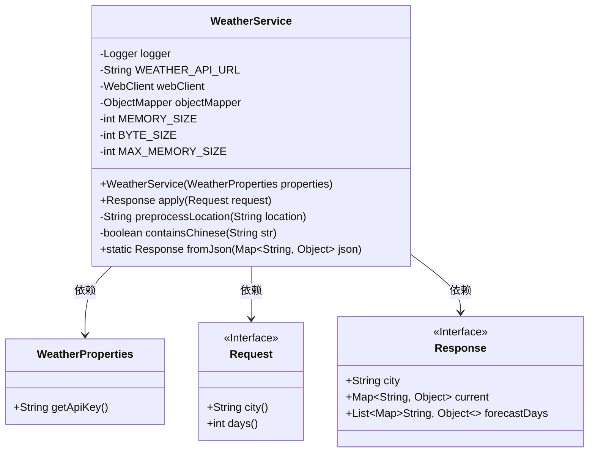
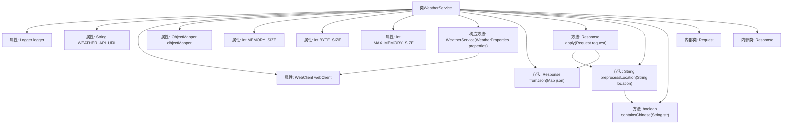
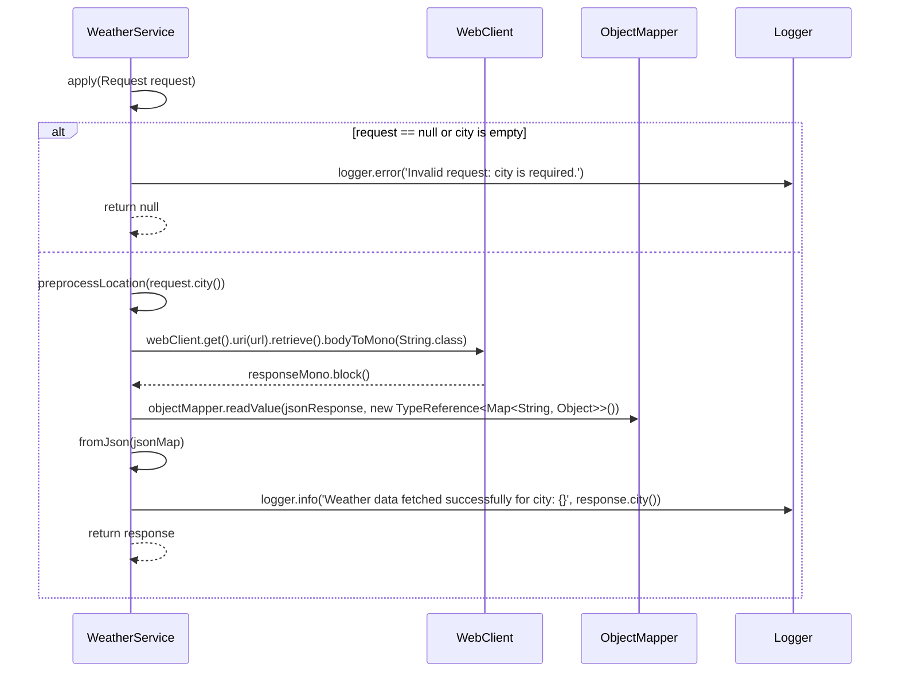

# 基础信息

|      |      |
|------|------|
| 名称 | WeatherService |
| 编码语言 | .java |
| 代码路径 | spring-ai-alibaba/community/tool-calls/spring-ai-alibaba-starter-tool-calling-weather/src/main/java/com/alibaba/cloud/ai/toolcalling/weather/WeatherService.java |
| 包名 | com.alibaba.cloud.ai.toolcalling.weather |
| 依赖项 | ['cn.hutool.extra.pinyin.PinyinUtil', 'com.fasterxml.jackson.annotation.JsonClassDescription', 'com.fasterxml.jackson.annotation.JsonInclude', 'com.fasterxml.jackson.annotation.JsonProperty', 'com.fasterxml.jackson.annotation.JsonPropertyDescription', 'com.fasterxml.jackson.core.type.TypeReference', 'com.fasterxml.jackson.databind.ObjectMapper', 'net.sourceforge.pinyin4j.PinyinHelper', 'org.slf4j.Logger', 'org.slf4j.LoggerFactory', 'org.springframework.http.HttpHeaders', 'org.springframework.http.MediaType', 'org.springframework.util.StringUtils', 'org.springframework.web.reactive.function.client.WebClient', 'org.springframework.web.util.UriComponentsBuilder', 'reactor.core.publisher.Mono', 'java.util.List', 'java.util.Map', 'java.util.function.Function'] |
| 概述说明 | WeatherService类通过API获取天气数据，支持中文转拼音，处理请求并返回响应。 |

# 说明

WeatherService类通过API获取天气数据，支持将中文城市名转换为拼音，处理请求并返回响应。

# 类列表 Class Summary

| 名称   | 类型  | 说明 |
|-------|------|-------------|
| WeatherService | class | WeatherService类通过API获取天气数据，支持中文城市名转拼音，处理请求并返回响应。 |

## 类 WeatherService

|      |      |
|------|------|
| 访问范围 | public |
| 类型 | class |
| 名称 | WeatherService |
| 说明 | WeatherService类通过API获取天气数据，支持中文城市名转拼音，处理请求并返回响应。 |

### UML类图

### 描述
`WeatherService` 类是一个天气服务实现，通过调用外部API获取天气数据。它依赖于 `WeatherProperties` 类来获取API密钥，并定义了 `Request` 和 `Response` 两个内部记录类，分别用于表示API请求和响应。`WeatherService` 类中的 `apply` 方法负责处理请求并返回天气数据，同时包含预处理中文地名的逻辑。`fromJson` 方法用于将JSON数据转换为 `Response` 对象。

### 内部方法调用关系图

这段代码实现了一个天气服务类 `WeatherService`，它通过调用外部API获取天气数据，并将响应转换为内部格式。代码中包含了构造方法、JSON解析方法、请求处理方法以及中文地名转拼音的预处理方法。通过流程图和时序图，可以清晰地看到类的结构和方法之间的调用关系，以及处理请求时的逻辑流程。

### 字段列表 Field List

| 名称  | 类型  | 说明 |
|-------|-------|------|
| WEATHER_API_URL = "https://api.weatherapi.com/v1/forecast.json" | String | 定义了天气API的静态最终URL字符串常量。 |
| objectMapper = new ObjectMapper() | ObjectMapper | 创建了一个私有的ObjectMapper对象实例。 |
| webClient | WebClient | 私有且不可变的WebClient实例。 |
| MEMORY_SIZE = 5 | int | 定义了一个私有的静态常量MEMORY_SIZE，值为5。 |
| BYTE_SIZE = 1024 | int | 定义常量BYTE_SIZE，值为1024。 |
| MAX_MEMORY_SIZE = MEMORY_SIZE * BYTE_SIZE * BYTE_SIZE | int | 定义MAX_MEMORY_SIZE为MEMORY_SIZE乘以BYTE_SIZE的平方。 |
| logger = LoggerFactory.getLogger(WeatherService.class) | Logger | 定义WeatherService类的静态日志记录器实例。 |

### 方法列表 Method List

| 名称  | 类型  | 说明 |
|-------|-------|------|
| containsChinese | boolean | 该方法用于检测字符串是否包含中文字符。 |
| preprocessLocation | String | 方法预处理位置：含中文转拼音，否则返回原位置。 |
| fromJson | Response | 从JSON提取位置、当前和预测数据，生成响应对象。 |
| apply | Response | 处理天气请求，验证城市参数，构建API URL，获取并解析天气数据，记录日志，返回响应。 |

