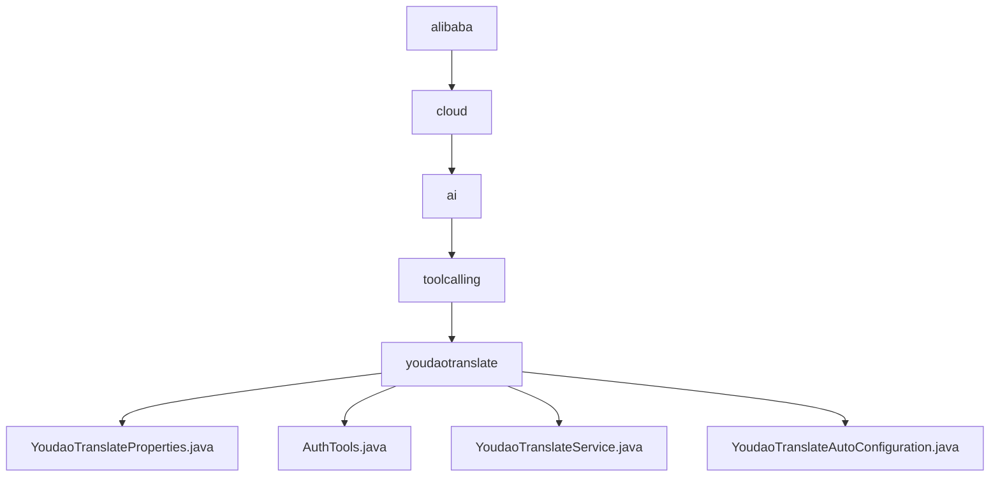

# 基础信息

|      |      |
|------|------|
| 名称 | alibaba |
| 编码语言 | .java |
| 代码路径 | spring-ai-alibaba/community/tool-calls/spring-ai-alibaba-starter-tool-calling-youdaotranslate/src/main/java/com/alibaba |
| 包名 | spring-ai-alibaba.community.tool-calls.spring-ai-alibaba-starter-tool-calling-youdaotranslate.src.main.java.com.alibaba |
| 概述说明 | 有道翻译API配置类管理密钥，AuthTools类计算SHA-256签名，翻译服务类处理请求与响应，配置过程优化翻译服务。 |

# 说明

## 概述

该代码模块主要围绕有道翻译API的集成与调用展开，提供了完整的翻译服务解决方案。模块包括配置管理、签名计算、API调用及响应解析等功能，旨在确保翻译请求的安全性、准确性和高效性。通过该模块，用户可以轻松集成有道翻译服务，并根据需求进行灵活的配置和使用。

## 主要业务场景

1. **API密钥配置与管理**  
   - 通过`YoudaoTranslateProperties`类，用户可以方便地配置和管理有道翻译API的密钥信息。该类支持密钥的存储、验证和更新，确保API调用的安全性和有效性。

2. **签名计算**  
   - `AuthTools`类实现了SHA-256签名计算功能，用于生成请求的安全签名。该类包含输入处理和签名生成两个核心方法，确保签名计算的准确性和完整性，为API请求提供安全保障。

3. **翻译请求处理**  
   - `YoudaoTranslateService`类负责处理翻译请求的全流程，包括API调用、签名计算和响应解析。通过该类，用户可以与有道翻译接口进行通信，发送翻译请求并获取处理后的翻译结果。

4. **服务自动配置**  
   - `YoudaoTranslateAutoConfiguration`类实现了有道翻译服务的自动配置功能。用户可以根据特定条件设置翻译参数、选择目标语言或调整翻译精度，确保翻译服务能够满足需求并高效运行。

该模块适用于需要集成有道翻译服务的应用场景，如多语言翻译工具、国际化应用开发等，能够显著提升翻译功能的安全性和用户体验。

### 包内部结构视图

该流程图展示了`spring-ai-alibaba`项目中与有道翻译相关的模块层级结构。从`alibaba`开始，逐步深入到`cloud`、`ai`、`toolcalling`，最终到`youdaotranslate`模块，并展示了该模块下的四个关键文件：`YoudaoTranslateProperties.java`、`AuthTools.java`、`YoudaoTranslateService.java`和`YoudaoTranslateAutoConfiguration.java`。

# 文件列表 File List

| 名称   | 类型  | 说明 |
|-------|------|-------------|
| [cloud](cloud/_module.md) | package | 有道翻译API配置类管理密钥，AuthTools类计算SHA-256签名，翻译服务类处理请求与响应，配置过程优化翻译服务。 |

