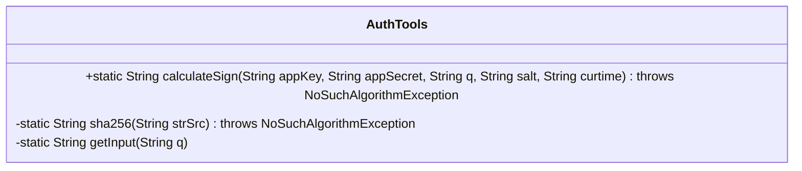
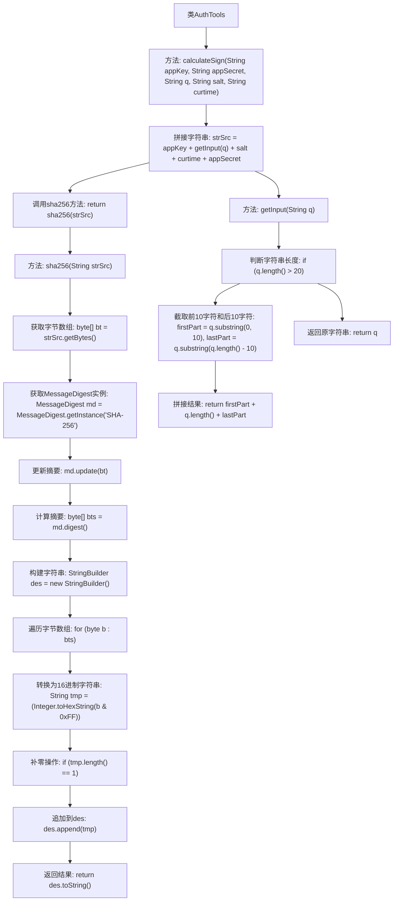

# 基础信息

|      |      |
|------|------|
| 名称 | AuthTools |
| 编码语言 | .java |
| 代码路径 | spring-ai-alibaba/community/tool-calls/spring-ai-alibaba-starter-tool-calling-youdaotranslate/src/main/java/com/alibaba/cloud/ai/toolcalling/youdaotranslate/AuthTools.java |
| 包名 | com.alibaba.cloud.ai.toolcalling.youdaotranslate |
| 依赖项 | ['java.security.MessageDigest', 'java.security.NoSuchAlgorithmException'] |
| 概述说明 | AuthTools类实现SHA-256签名，含输入处理和签名生成方法。 |

# 说明

AuthTools类负责实现SHA-256签名计算功能，主要包含两个核心方法：输入处理和签名生成。输入处理方法负责接收并处理待签名的数据，确保数据格式和内容符合签名要求。签名生成方法则基于处理后的数据，使用SHA-256算法生成相应的签名值。这两个方法共同协作，确保签名计算的准确性和完整性。

# 类列表 Class Summary

| 名称   | 类型  | 说明 |
|-------|------|-------------|
| AuthTools | class | AuthTools类实现SHA-256签名计算，包含输入处理和签名生成方法。 |

## 类 AuthTools

|      |      |
|------|------|
| 访问范围 | public |
| 类型 | class |
| 名称 | AuthTools |
| 说明 | AuthTools类实现SHA-256签名计算，包含输入处理和签名生成方法。 |

### UML类图

这段代码定义了一个 `AuthTools` 类，包含三个方法：`calculateSign`、`sha256` 和 `getInput`。`calculateSign` 方法用于计算签名，它通过拼接 `appKey`、`getInput(q)`、`salt`、`curtime` 和 `appSecret` 生成一个字符串，然后调用 `sha256` 方法对其进行 SHA-256 哈希处理。`sha256` 方法实现了 SHA-256 哈希算法，将输入字符串转换为哈希值。`getInput` 方法对输入字符串 `q` 进行处理，如果 `q` 的长度超过 20，则截取前 10 个字符和后 10 个字符，并在中间插入字符串长度，否则直接返回 `q`。

### 内部方法调用关系图

这段代码的流程图展示了`AuthTools`类中三个主要方法的调用关系。`calculateSign`方法首先调用`getInput`方法处理输入字符串`q`，然后拼接所有参数并调用`sha256`方法进行哈希计算。`sha256`方法将字符串转换为字节数组，使用SHA-256算法计算摘要，并将结果转换为16进制字符串返回。`getInput`方法根据输入字符串的长度决定是否截取部分字符并进行拼接处理。

### 字段列表 Field List

| 名称  | 类型  | 说明 |
|-------|-------|------|

### 方法列表 Method List

| 名称  | 类型  | 说明 |
|-------|-------|------|
| sha256 | String | Java方法实现SHA-256加密，返回十六进制字符串。 |
| getInput | String | 截取字符串前后各10字符，中间插入长度，若长度超20。 |
| calculateSign | String | 计算签名方法：使用appKey、appSecret、q、salt、curtime生成SHA256签名。 |

