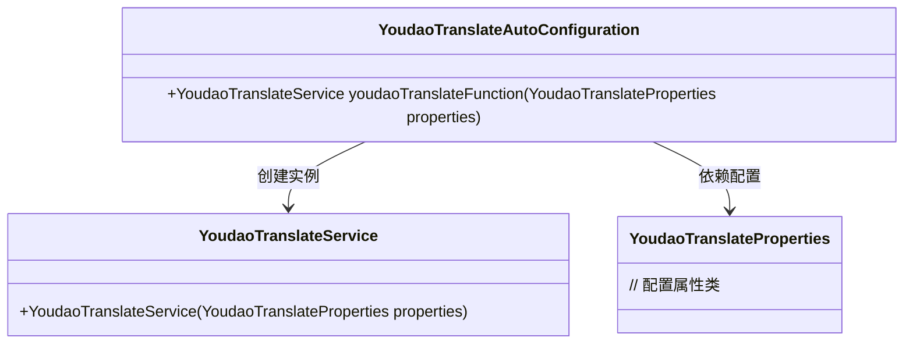
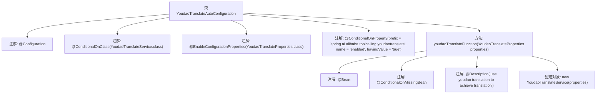

# 基础信息

|      |      |
|------|------|
| 名称 | YoudaoTranslateAutoConfiguration |
| 编码语言 | .java |
| 代码路径 | spring-ai-alibaba/community/tool-calls/spring-ai-alibaba-starter-tool-calling-youdaotranslate/src/main/java/com/alibaba/cloud/ai/toolcalling/youdaotranslate/YoudaoTranslateAutoConfiguration.java |
| 包名 | com.alibaba.cloud.ai.toolcalling.youdaotranslate |
| 依赖项 | ['org.springframework.boot.autoconfigure.condition.ConditionalOnClass', 'org.springframework.boot.autoconfigure.condition.ConditionalOnMissingBean', 'org.springframework.boot.autoconfigure.condition.ConditionalOnProperty', 'org.springframework.boot.context.properties.EnableConfigurationProperties', 'org.springframework.context.annotation.Bean', 'org.springframework.context.annotation.Configuration', 'org.springframework.context.annotation.Description'] |
| 概述说明 | 基于条件配置有道翻译服务。 |

# 说明

该内容描述了如何根据特定条件配置有道翻译服务。配置过程可能涉及设置翻译参数、选择目标语言、调整翻译精度或其他相关设置，以确保翻译服务能够满足用户需求并高效运行。

# 类列表 Class Summary

| 名称   | 类型  | 说明 |
|-------|------|-------------|
| YoudaoTranslateAutoConfiguration | class | 基于条件配置有道翻译服务。 |

## 类 YoudaoTranslateAutoConfiguration

|      |      |
|------|------|
| 访问范围 | @Configuration;@ConditionalOnClass(YoudaoTranslateService.class);@EnableConfigurationProperties(YoudaoTranslateProperties.class);@ConditionalOnProperty(prefix = "spring.ai.alibaba.toolcalling.youdaotranslate", name = "enabled", havingValue = "true");public |
| 类型 | class |
| 名称 | YoudaoTranslateAutoConfiguration |
| 说明 | 基于条件配置有道翻译服务。 |

### UML类图

### 描述
`YoudaoTranslateAutoConfiguration` 是一个自动配置类，用于在满足特定条件时创建 `YoudaoTranslateService` 实例。它依赖于 `YoudaoTranslateProperties` 类来获取配置属性，并通过 `youdaoTranslateFunction` 方法返回 `YoudaoTranslateService` 的实例。该配置类仅在 `YoudaoTranslateService` 类存在且配置属性 `spring.ai.alibaba.toolcalling.youdaotranslate.enabled` 为 `true` 时生效。

### 内部方法调用关系图

这段代码定义了一个名为`YoudaoTranslateAutoConfiguration`的配置类，用于自动配置有道翻译服务。该类通过多个条件注解确保在满足特定条件时创建`YoudaoTranslateService`实例。注解`@ConditionalOnClass`确保`YoudaoTranslateService`类存在，`@ConditionalOnProperty`确保相关属性启用，`@ConditionalOnMissingBean`确保没有其他`YoudaoTranslateService`实例存在。最终，`youdaoTranslateFunction`方法返回一个新的`YoudaoTranslateService`实例。

### 字段列表 Field List

| 名称  | 类型  | 说明 |
|-------|-------|------|

### 方法列表 Method List

| 名称  | 类型  | 说明 |
|-------|-------|------|
| youdaoTranslateFunction | YoudaoTranslateService | 使用有道翻译服务实现翻译功能。 |

