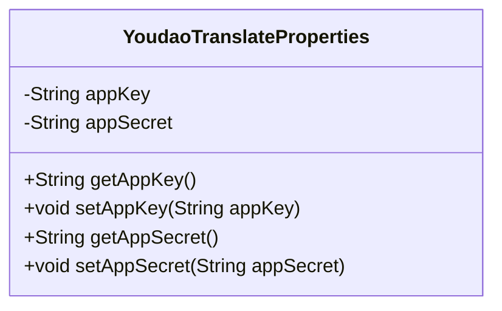
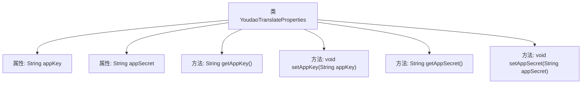

# 基础信息

|      |      |
|------|------|
| 名称 | YoudaoTranslateProperties |
| 编码语言 | .java |
| 代码路径 | spring-ai-alibaba/community/tool-calls/spring-ai-alibaba-starter-tool-calling-youdaotranslate/src/main/java/com/alibaba/cloud/ai/toolcalling/youdaotranslate/YoudaoTranslateProperties.java |
| 包名 | com.alibaba.cloud.ai.toolcalling.youdaotranslate |
| 依赖项 | ['org.springframework.boot.context.properties.ConfigurationProperties'] |
| 概述说明 | 配置类定义有道翻译API密钥及其设置方法。 |

# 说明

该配置类主要用于定义有道翻译API的密钥及其设置方法。通过此类，用户可以方便地管理和配置与有道翻译API相关的密钥信息，确保API调用的安全性和有效性。配置类通常包括密钥的存储、验证和更新等功能，以便在使用API时能够正确地进行身份验证和数据传输。

# 类列表 Class Summary

| 名称   | 类型  | 说明 |
|-------|------|-------------|
| YoudaoTranslateProperties | class | 配置类定义有道翻译API的密钥和密钥设置方法。 |

## 类 YoudaoTranslateProperties

|      |      |
|------|------|
| 访问范围 | @ConfigurationProperties(prefix = "spring.ai.alibaba.toolcalling.youdaotranslate");public |
| 类型 | class |
| 名称 | YoudaoTranslateProperties |
| 说明 | 配置类定义有道翻译API的密钥和密钥设置方法。 |

### UML类图

**描述：**  
`YoudaoTranslateProperties` 类是一个配置属性类，用于管理与有道翻译相关的应用密钥和应用密钥。该类包含两个私有属性 `appKey` 和 `appSecret`，分别用于存储应用密钥和应用密钥。类中提供了这些属性的公有 getter 和 setter 方法，以便外部代码可以访问和修改这些属性。该类的设计符合配置属性类的常见模式，允许通过外部配置文件或环境变量来设置这些属性。

### 内部方法调用关系图

这段代码定义了一个名为`YoudaoTranslateProperties`的类，用于管理有道翻译服务的配置属性。类中包含两个私有属性`appKey`和`appSecret`，分别用于存储应用的密钥和密钥。类中还提供了对应的`getter`和`setter`方法，用于获取和设置这两个属性的值。通过`@ConfigurationProperties`注解，该类可以与Spring Boot的配置属性绑定，方便在应用中进行配置管理。

### 字段列表 Field List

| 名称  | 类型  | 说明 |
|-------|-------|------|
| appKey | String | 定义了一个私有字符串变量appKey。 |
| appSecret | String | 私有字符串变量appSecret用于存储应用程序密钥。 |

### 方法列表 Method List

| 名称  | 类型  | 说明 |
|-------|-------|------|
| setAppKey | void | 该方法用于设置应用密钥。 |
| getAppKey | String | 该方法返回appKey字符串值。 |
| setAppSecret | void | 设置应用密钥的方法，将传入参数赋值给类的成员变量。 |
| getAppSecret | String | 获取应用密钥的方法。 |

