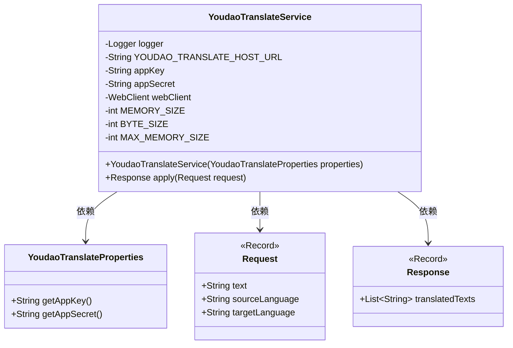
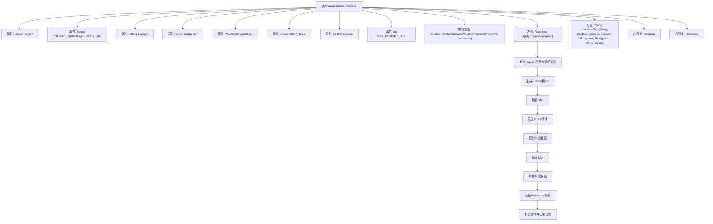

# 基础信息

|      |      |
|------|------|
| 名称 | YoudaoTranslateService |
| 编码语言 | .java |
| 代码路径 | spring-ai-alibaba/community/tool-calls/spring-ai-alibaba-starter-tool-calling-youdaotranslate/src/main/java/com/alibaba/cloud/ai/toolcalling/youdaotranslate/YoudaoTranslateService.java |
| 包名 | com.alibaba.cloud.ai.toolcalling.youdaotranslate |
| 依赖项 | ['com.fasterxml.jackson.annotation.JsonClassDescription', 'com.fasterxml.jackson.annotation.JsonProperty', 'com.fasterxml.jackson.annotation.JsonPropertyDescription', 'com.google.gson.Gson', 'com.google.gson.reflect.TypeToken', 'org.slf4j.Logger', 'org.slf4j.LoggerFactory', 'org.springframework.http.HttpHeaders', 'org.springframework.http.MediaType', 'org.springframework.util.StringUtils', 'org.springframework.web.reactive.function.client.WebClient', 'org.springframework.web.util.UriComponentsBuilder', 'reactor.core.publisher.Mono', 'java.util.List', 'java.util.Map', 'java.util.UUID', 'java.util.function.Function', 'com.alibaba.cloud.ai.toolcalling.youdaotranslate.AuthTools.calculateSign'] |
| 概述说明 | 有道翻译服务类处理翻译请求，含API调用、签名计算和响应解析。 |

# 说明

有道翻译服务类是一个专门处理翻译请求的工具，主要功能包括API调用、签名计算和响应解析。通过API调用，该服务能够与有道翻译的接口进行通信，发送翻译请求并接收返回的数据。签名计算部分负责生成必要的安全签名，以确保请求的合法性和安全性。响应解析则是对接收到的翻译结果进行处理和提取，将其转换为可用的格式。整体上，该类实现了翻译请求的全流程处理，确保翻译服务的准确性和高效性。

# 类列表 Class Summary

| 名称   | 类型  | 说明 |
|-------|------|-------------|
| YoudaoTranslateService | class | 有道翻译服务类，实现翻译请求处理，包含API调用、签名计算及响应解析。 |

## 类 YoudaoTranslateService

|      |      |
|------|------|
| 访问范围 | public |
| 类型 | class |
| 名称 | YoudaoTranslateService |
| 说明 | 有道翻译服务类，实现翻译请求处理，包含API调用、签名计算及响应解析。 |

### UML类图

### 描述
该代码定义了一个`YoudaoTranslateService`类，实现了`Function`接口，用于调用有道翻译API进行文本翻译。类中包含常量、私有成员变量和构造方法，`apply`方法用于处理翻译请求并返回翻译结果。`Request`和`Response`是两个记录类，分别表示翻译请求和响应。`YoudaoTranslateService`依赖于`YoudaoTranslateProperties`类来获取API密钥和密钥。整个设计旨在封装翻译服务的逻辑，确保代码的可维护性和扩展性。

### 内部方法调用关系图

这段代码实现了一个有道翻译服务类 `YoudaoTranslateService`，该类实现了 `Function` 接口，用于将 `Request` 对象转换为 `Response` 对象。代码主要功能包括：初始化服务、构建请求URL、发送HTTP请求、解析响应数据并返回翻译结果。流程图展示了类的主要属性和方法调用关系，以及 `apply` 方法的详细执行步骤。

### 字段列表 Field List

| 名称  | 类型  | 说明 |
|-------|-------|------|
| appKey | String | 定义私有不可变字符串变量appKey。 |
| YOUDAO_TRANSLATE_HOST_URL = "https://openapi.youdao.com/api" | String | 有道翻译API的主机URL设置为私有静态常量。 |
| appSecret | String | 声明了一个私有且不可变的字符串变量appSecret。 |
| webClient | WebClient | WebClient被声明为私有且不可变的实例变量。 |
| logger = LoggerFactory.getLogger(YoudaoTranslateService.class) | Logger | 私有静态日志记录器实例化于有道翻译服务类。 |
| MEMORY_SIZE = 5 | int | 定义常量MEMORY_SIZE，值为5。 |
| MAX_MEMORY_SIZE = MEMORY_SIZE * BYTE_SIZE * BYTE_SIZE | int | 定义最大内存大小为内存大小乘以字节大小的平方。 |
| BYTE_SIZE = 1024 | int | 定义私有静态常量BYTE_SIZE，值为1024。 |

### 方法列表 Method List

| 名称  | 类型  | 说明 |
|-------|-------|------|
| apply | Response | 处理翻译请求，验证参数，调用有道API，返回翻译结果。 |

