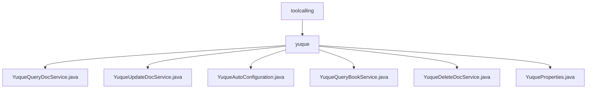

# 基础信息

|      |      |
|------|------|
| 名称 | toolcalling |
| 编码语言 | .java |
| 代码路径 | spring-ai-alibaba/community/tool-calls/spring-ai-alibaba-starter-tool-calling-yuque/src/main/java/com/alibaba/cloud/ai/toolcalling |
| 包名 | spring-ai-alibaba.community.tool-calls.spring-ai-alibaba-starter-tool-calling-yuque.src.main.java.com.alibaba.cloud.ai.toolcalling |
| 概述说明 | Yuque服务类实现文档查询、更新、删除及书籍查询功能，通过WebClient发送HTTP请求，支持自动化配置。 |

# 说明

## 概述
该代码模块是一个基于Spring框架的Yuque API调用工具，旨在简化与Yuque文档管理系统的交互。模块通过使用`WebClient`工具，实现了对Yuque文档的查询、更新、删除以及书籍信息的查询功能。此外，模块还提供了自动配置功能，通过`YuqueAutoConfiguration`类，系统能够根据配置自动启用Yuque API调用，从而减少手动操作，提升用户体验。

## 主要业务场景
1. **文档查询**：通过`YuqueQueryDocService`类，系统能够发送POST请求，查询指定文档的信息，并将结果返回给调用方。
2. **文档更新**：`YuqueUpdateDocService`类负责发送PUT请求，更新指定文档的内容，并返回更新操作的响应结果。
3. **书籍查询**：`YuqueQueryBookService`类通过发送GET请求，查询书籍的相关信息，并将查询结果返回给调用方。
4. **文档删除**：`YuqueDeleteDocService`类负责发送DELETE请求，删除指定文档，并接收并返回服务器的响应。
5. **自动配置**：`YuqueAutoConfiguration`类通过配置自动启用Yuque API调用，简化文档管理流程，提高效率。
6. **属性管理**：`YuqueProperties`类用于管理Yuque API调用的基础URL和认证令牌信息，提供这些属性的getter和setter方法，方便配置和获取。

### 包内部结构视图

该流程图展示了`spring-ai-alibaba-starter-tool-calling-yuque`模块中的路径层级关系。根节点为`toolcalling`，其下包含`yuque`文件夹，`yuque`文件夹中包含了多个服务类文件，如`YuqueQueryDocService.java`、`YuqueUpdateDocService.java`等。这些文件共同构成了该模块的核心功能，用于处理与Yuque相关的工具调用操作。

# 文件列表 File List

| 名称   | 类型  | 说明 |
|-------|------|-------------|
| [yuque](yuque/_module.md) | package | Yuque服务类实现文档查询、更新、删除及书籍查询功能，通过WebClient发送HTTP请求，支持自动化配置。 |

