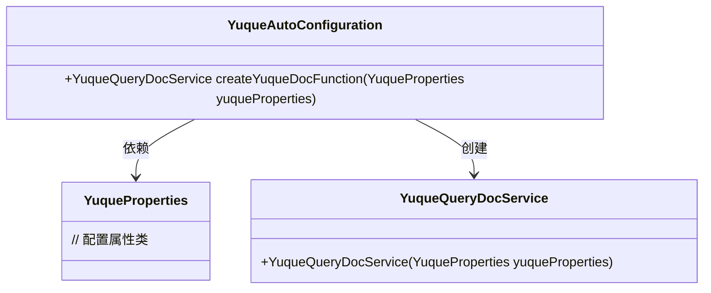
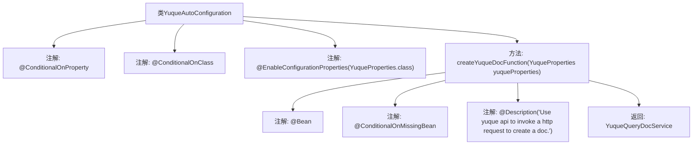

# 基础信息

|      |      |
|------|------|
| 名称 | YuqueAutoConfiguration |
| 编码语言 | .java |
| 代码路径 | spring-ai-alibaba/community/tool-calls/spring-ai-alibaba-starter-tool-calling-yuque/src/main/java/com/alibaba/cloud/ai/toolcalling/yuque/YuqueAutoConfiguration.java |
| 包名 | com.alibaba.cloud.ai.toolcalling.yuque |
| 依赖项 | ['org.springframework.boot.autoconfigure.condition.ConditionalOnClass', 'org.springframework.boot.autoconfigure.condition.ConditionalOnMissingBean', 'org.springframework.boot.autoconfigure.condition.ConditionalOnProperty', 'org.springframework.boot.context.properties.EnableConfigurationProperties', 'org.springframework.context.annotation.Bean', 'org.springframework.context.annotation.Description'] |
| 概述说明 | 基于配置启用Yuque API，自动配置文档查询服务。 |

# 说明

该内容描述了一个基于配置启用Yuque API调用的功能，旨在自动配置Yuque文档查询服务。通过配置，系统能够自动调用Yuque API，实现对Yuque文档的查询功能，从而简化文档管理流程，提高效率。这一功能的核心在于通过配置实现自动化，减少手动操作，提升用户体验。

# 类列表 Class Summary

| 名称   | 类型  | 说明 |
|-------|------|-------------|
| YuqueAutoConfiguration | class | 基于配置启用Yuque API调用，自动配置Yuque文档查询服务。 |

## 类 YuqueAutoConfiguration

|      |      |
|------|------|
| 访问范围 | @ConditionalOnProperty(prefix = "spring.ai.alibaba.toolcalling.yuque", name = "enabled", havingValue = "true");@ConditionalOnClass;@EnableConfigurationProperties(YuqueProperties.class);public |
| 类型 | class |
| 名称 | YuqueAutoConfiguration |
| 说明 | 基于配置启用Yuque API调用，自动配置Yuque文档查询服务。 |

### UML类图

这段代码展示了 `YuqueAutoConfiguration` 类的自动配置过程。`YuqueAutoConfiguration` 类依赖于 `YuqueProperties` 类来获取配置属性，并通过 `createYuqueDocFunction` 方法创建 `YuqueQueryDocService` 实例。`YuqueQueryDocService` 类则通过构造函数接收 `YuqueProperties` 对象，用于处理与语雀API相关的文档查询操作。整个过程通过Spring的条件注解（如 `@ConditionalOnProperty` 和 `@ConditionalOnMissingBean`）确保在特定条件下自动配置生效。

### 内部方法调用关系图

这段代码定义了一个名为 `YuqueAutoConfiguration` 的自动配置类，用于在特定条件下创建 `YuqueQueryDocService` 的实例。该类通过 `@ConditionalOnProperty` 和 `@ConditionalOnClass` 注解确保在满足特定属性或类存在的情况下才会生效。`@EnableConfigurationProperties` 注解启用了 `YuqueProperties` 类的配置属性。`createYuqueDocFunction` 方法是一个 Bean 工厂方法，用于创建 `YuqueQueryDocService` 实例，并通过 `@ConditionalOnMissingBean` 确保只有在没有其他相同类型的 Bean 存在时才会创建。

### 字段列表 Field List

| 名称  | 类型  | 说明 |
|-------|-------|------|

### 方法列表 Method List

| 名称  | 类型  | 说明 |
|-------|-------|------|
| createYuqueDocFunction | YuqueQueryDocService | 使用语雀API创建文档的服务方法，依赖YuqueProperties配置。 |

