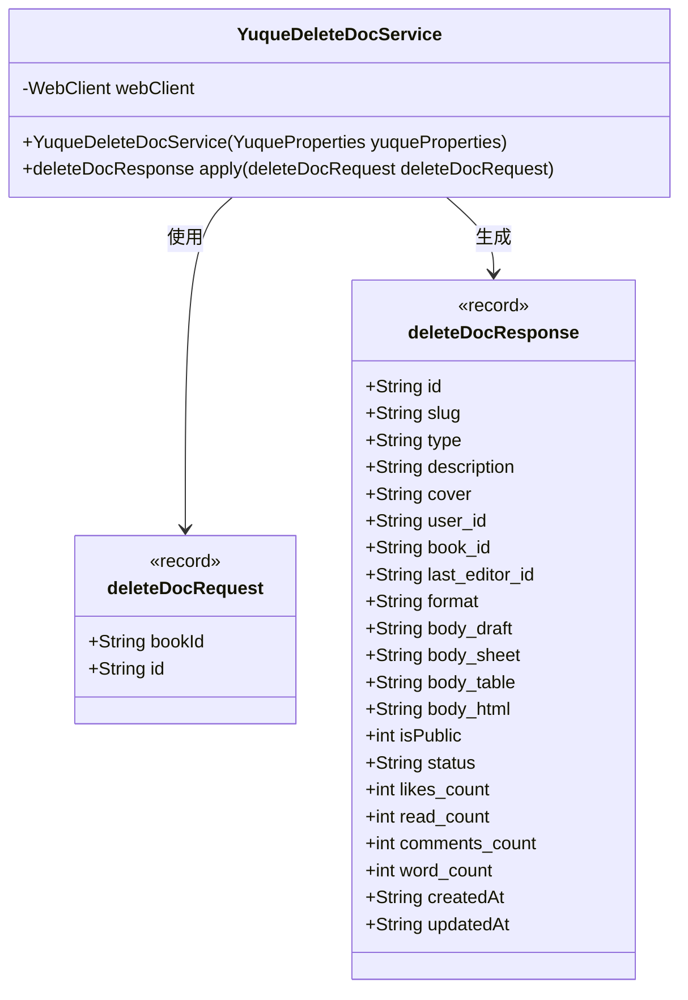
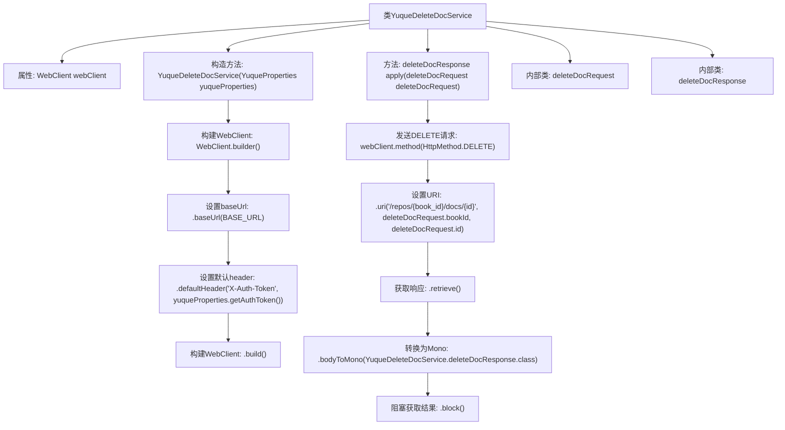

# 基础信息

|      |      |
|------|------|
| 名称 | YuqueDeleteDocService |
| 编码语言 | .java |
| 代码路径 | spring-ai-alibaba/community/tool-calls/spring-ai-alibaba-starter-tool-calling-yuque/src/main/java/com/alibaba/cloud/ai/toolcalling/yuque/YuqueDeleteDocService.java |
| 包名 | com.alibaba.cloud.ai.toolcalling.yuque |
| 依赖项 | ['com.fasterxml.jackson.annotation.JsonProperty', 'org.springframework.http.HttpMethod', 'org.springframework.web.reactive.function.client.WebClient', 'reactor.core.publisher.Mono', 'java.util.function.Function', 'com.alibaba.cloud.ai.toolcalling.yuque.YuqueProperties.BASE_URL'] |
| 概述说明 | YuqueDeleteDocService通过WebClient发送DELETE请求实现文档删除功能并返回响应。 |

# 说明

YuqueDeleteDocService负责实现删除文档的功能。该服务通过WebClient发送DELETE请求到指定端点，并接收并返回服务器的响应。整个过程涉及发送请求和处理响应，确保文档能够被成功删除。

# 类列表 Class Summary

| 名称   | 类型  | 说明 |
|-------|------|-------------|
| YuqueDeleteDocService | class | YuqueDeleteDocService实现删除文档功能，使用WebClient发送DELETE请求并返回响应。 |

## 类 YuqueDeleteDocService

|      |      |
|------|------|
| 访问范围 | public |
| 类型 | class |
| 名称 | YuqueDeleteDocService |
| 说明 | YuqueDeleteDocService实现删除文档功能，使用WebClient发送DELETE请求并返回响应。 |

### UML类图

### 描述
`YuqueDeleteDocService` 是一个服务类，负责处理删除语雀文档的请求。它依赖于 `WebClient` 进行 HTTP 请求，并使用 `deleteDocRequest` 作为输入参数，返回 `deleteDocResponse` 作为响应。`deleteDocRequest` 和 `deleteDocResponse` 是两个记录类，分别用于封装请求和响应的数据结构。`YuqueDeleteDocService` 通过 `apply` 方法执行删除操作，并返回删除后的文档信息。

### 内部方法调用关系图

这段代码定义了一个`YuqueDeleteDocService`类，该类实现了`Function`接口，用于处理删除语雀文档的请求。类中包含一个`WebClient`属性，用于发送HTTP请求。构造方法中初始化了`WebClient`，并设置了基础URL和默认的认证头。`apply`方法通过`WebClient`发送DELETE请求，并阻塞等待响应，最后返回响应结果。类中还定义了两个内部类`deleteDocRequest`和`deleteDocResponse`，分别用于表示请求和响应的数据结构。

### 字段列表 Field List

| 名称  | 类型  | 说明 |
|-------|-------|------|
| webClient | WebClient | 私有且不可变的WebClient实例。 |

### 方法列表 Method List

| 名称  | 类型  | 说明 |
|-------|-------|------|
| apply | YuqueDeleteDocService.deleteDocResponse | 该方法通过HTTP DELETE请求删除指定文档，并返回响应结果。 |

