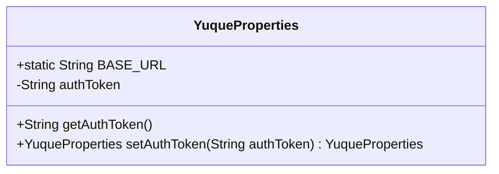
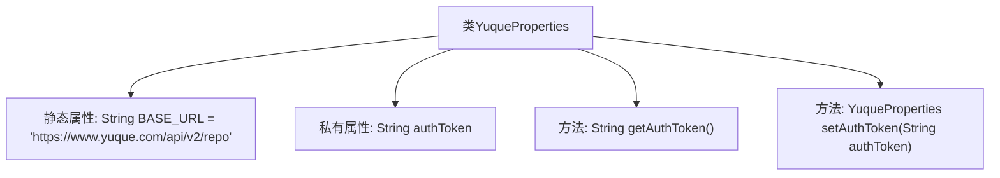

# 基础信息

|      |      |
|------|------|
| 名称 | YuqueProperties |
| 编码语言 | .java |
| 代码路径 | spring-ai-alibaba/community/tool-calls/spring-ai-alibaba-starter-tool-calling-yuque/src/main/java/com/alibaba/cloud/ai/toolcalling/yuque/YuqueProperties.java |
| 包名 | com.alibaba.cloud.ai.toolcalling.yuque |
| 依赖项 | ['org.springframework.boot.context.properties.ConfigurationProperties'] |
| 概述说明 | 定义YuqueProperties类，含BASE_URL和authToken属性及其getter和setter方法。 |

# 说明

YuqueProperties类定义了一个包含BASE_URL和authToken属性的类。该类提供了这两个属性的getter和setter方法，用于获取和设置BASE_URL和authToken的值。BASE_URL通常表示基础URL地址，而authToken用于存储认证令牌信息。通过getter方法可以获取这些属性的当前值，通过setter方法可以更新这些属性的值。

# 类列表 Class Summary

| 名称   | 类型  | 说明 |
|-------|------|-------------|
| YuqueProperties | class | 定义YuqueProperties类，包含BASE_URL和authToken属性及其getter和setter方法。 |

## 类 YuqueProperties

|      |      |
|------|------|
| 访问范围 | @ConfigurationProperties(prefix = "spring.ai.alibaba.toolcalling.yuque");public |
| 类型 | class |
| 名称 | YuqueProperties |
| 说明 | 定义YuqueProperties类，包含BASE_URL和authToken属性及其getter和setter方法。 |

### UML类图

这段代码定义了一个名为 `YuqueProperties` 的类，用于配置与语雀（Yuque）API 相关的属性。类中包含一个静态常量 `BASE_URL`，表示语雀API的基础URL，以及一个私有成员变量 `authToken`，用于存储认证令牌。类提供了 `getAuthToken` 方法用于获取 `authToken`，以及 `setAuthToken` 方法用于设置 `authToken`，并返回当前对象以支持链式调用。这个类通常用于Spring Boot的配置属性绑定，通过 `@ConfigurationProperties` 注解将配置文件中的属性注入到类的实例中。

### 内部方法调用关系图

这段代码定义了一个名为`YuqueProperties`的类，用于配置与语雀API相关的属性。类中包含一个静态属性`BASE_URL`，用于存储API的基础URL，以及一个私有属性`authToken`，用于存储认证令牌。类中还提供了`getAuthToken`方法用于获取`authToken`的值，以及`setAuthToken`方法用于设置`authToken`并返回当前对象实例。

### 字段列表 Field List

| 名称  | 类型  | 说明 |
|-------|-------|------|
| BASE_URL = "https://www.yuque.com/api/v2/repo" | String | 定义静态字符串变量BASE_URL，值为语雀API基础地址。 |
| authToken | String | 私有字符串变量authToken。 |

### 方法列表 Method List

| 名称  | 类型  | 说明 |
|-------|-------|------|
| getAuthToken | String | 获取认证令牌的方法，返回authToken变量。 |
| setAuthToken | YuqueProperties | 该方法设置认证令牌并返回当前对象。 |

