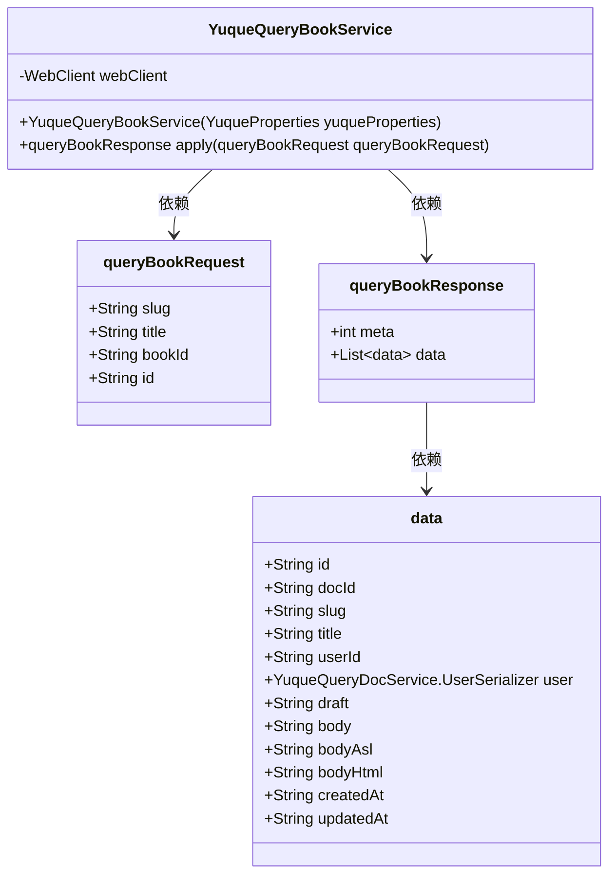
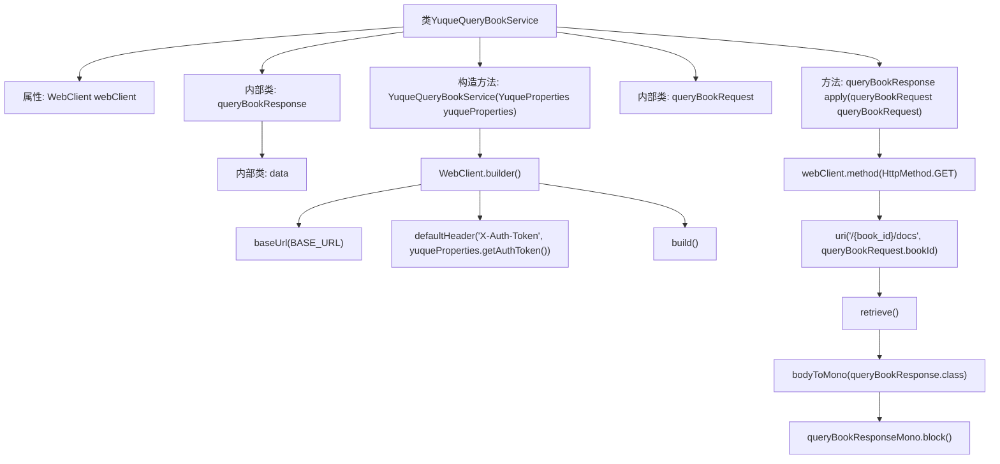

# 基础信息

|      |      |
|------|------|
| 名称 | YuqueQueryBookService |
| 编码语言 | .java |
| 代码路径 | spring-ai-alibaba/community/tool-calls/spring-ai-alibaba-starter-tool-calling-yuque/src/main/java/com/alibaba/cloud/ai/toolcalling/yuque/YuqueQueryBookService.java |
| 包名 | com.alibaba.cloud.ai.toolcalling.yuque |
| 依赖项 | ['com.fasterxml.jackson.annotation.JsonProperty', 'org.springframework.http.HttpMethod', 'org.springframework.web.reactive.function.client.WebClient', 'reactor.core.publisher.Mono', 'java.util.List', 'java.util.function.Function', 'com.alibaba.cloud.ai.toolcalling.yuque.YuqueProperties.BASE_URL'] |
| 概述说明 | YuqueQueryBookService使用WebClient进行GET请求，查询并返回书籍信息。 |

# 说明

YuqueQueryBookService利用WebClient工具发起GET请求，通过该请求查询书籍相关信息，并最终返回查询结果。这一过程涉及使用WebClient进行网络通信，以获取所需书籍数据，并将响应结果传递给调用方。

# 类列表 Class Summary

| 名称   | 类型  | 说明 |
|-------|------|-------------|
| YuqueQueryBookService | class | YuqueQueryBookService通过WebClient实现GET请求，查询书籍信息并返回响应。 |

## 类 YuqueQueryBookService

|      |      |
|------|------|
| 访问范围 | public |
| 类型 | class |
| 名称 | YuqueQueryBookService |
| 说明 | YuqueQueryBookService通过WebClient实现GET请求，查询书籍信息并返回响应。 |

### UML类图

类图描述：  
`YuqueQueryBookService` 类实现了 `Function` 接口，用于处理查询书籍的请求和响应。它依赖于 `queryBookRequest` 和 `queryBookResponse` 两个内部记录类。`queryBookResponse` 包含了一个 `data` 类型的列表，`data` 类则包含了书籍文档的详细信息。整个类图展示了如何通过 `WebClient` 发送请求并处理响应的过程。

### 内部方法调用关系图

这段代码定义了一个名为 `YuqueQueryBookService` 的类，该类实现了 `Function` 接口，用于处理与语雀书籍查询相关的请求和响应。类中包含一个 `WebClient` 属性，用于发送 HTTP 请求。构造方法初始化了 `WebClient`，并通过 `apply` 方法处理具体的查询请求，返回查询结果。代码中还定义了三个内部类 `queryBookRequest`、`queryBookResponse` 和 `data`，分别用于封装请求参数、响应数据以及具体的数据结构。整个流程通过 `WebClient` 发送 GET 请求，并阻塞等待响应结果。

### 字段列表 Field List

| 名称  | 类型  | 说明 |
|-------|-------|------|
| webClient | WebClient | 定义了一个私有的不可变的WebClient实例。 |

### 方法列表 Method List

| 名称  | 类型  | 说明 |
|-------|-------|------|
| apply | queryBookResponse | 重写方法，通过WebClient发送GET请求获取书籍信息并返回响应。 |

