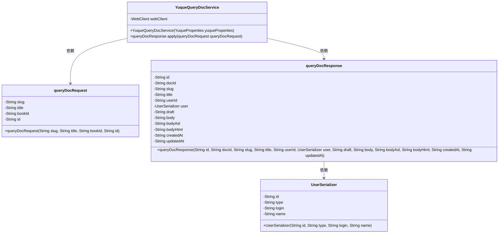
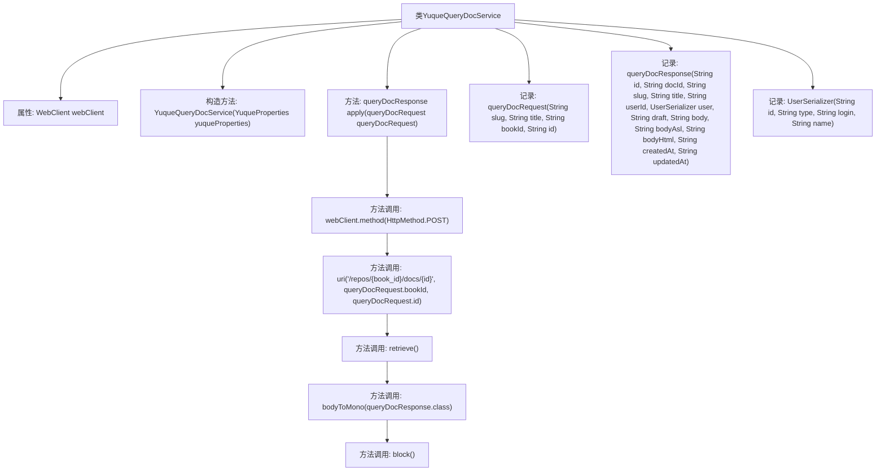

# 基础信息

|      |      |
|------|------|
| 名称 | YuqueQueryDocService |
| 编码语言 | .java |
| 代码路径 | spring-ai-alibaba/community/tool-calls/spring-ai-alibaba-starter-tool-calling-yuque/src/main/java/com/alibaba/cloud/ai/toolcalling/yuque/YuqueQueryDocService.java |
| 包名 | com.alibaba.cloud.ai.toolcalling.yuque |
| 依赖项 | ['com.fasterxml.jackson.annotation.JsonProperty', 'org.springframework.http.HttpMethod', 'org.springframework.web.reactive.function.client.WebClient', 'reactor.core.publisher.Mono', 'java.util.function.Function', 'com.alibaba.cloud.ai.toolcalling.yuque.YuqueProperties.BASE_URL'] |
| 概述说明 | YuqueQueryDocService实现Function接口，使用WebClient发送POST请求查询文档信息。 |

# 说明

YuqueQueryDocService实现了Function接口，利用WebClient工具发送POST请求来查询文档信息。该服务通过HTTP请求与外部系统交互，以获取所需的文档数据。

# 类列表 Class Summary

| 名称   | 类型  | 说明 |
|-------|------|-------------|
| YuqueQueryDocService | class | YuqueQueryDocService实现Function接口，通过WebClient发送POST请求查询文档信息。 |

## 类 YuqueQueryDocService

|      |      |
|------|------|
| 访问范围 | public |
| 类型 | class |
| 名称 | YuqueQueryDocService |
| 说明 | YuqueQueryDocService实现Function接口，通过WebClient发送POST请求查询文档信息。 |

### UML类图

这段代码定义了一个名为 `YuqueQueryDocService` 的类，该类实现了 `Function` 接口，用于处理 `queryDocRequest` 并返回 `queryDocResponse`。`YuqueQueryDocService` 类依赖于 `WebClient` 来发送 HTTP 请求，并包含两个内部记录类 `queryDocRequest` 和 `queryDocResponse`，分别用于封装请求和响应数据。`queryDocResponse` 类进一步包含一个 `UserSerializer` 类，用于序列化用户信息。整个类图展示了这些类之间的依赖关系和数据结构。

### 内部方法调用关系图

**描述：**
该代码定义了一个名为 `YuqueQueryDocService` 的类，该类实现了 `Function` 接口，用于处理查询文档的请求和响应。类中包含一个 `WebClient` 属性，通过构造方法初始化，并提供了一个 `apply` 方法来执行 HTTP POST 请求以获取文档信息。代码还定义了三个记录类 `queryDocRequest`、`queryDocResponse` 和 `UserSerializer`，分别用于封装请求参数、响应数据和用户信息。整个流程通过 `WebClient` 发起请求，最终返回查询结果。

### 字段列表 Field List

| 名称  | 类型  | 说明 |
|-------|-------|------|
| webClient | WebClient | 私有且不可变的WebClient实例。 |

### 方法列表 Method List

| 名称  | 类型  | 说明 |
|-------|-------|------|
| apply | queryDocResponse | 重写方法通过POST请求获取文档响应并返回。 |

