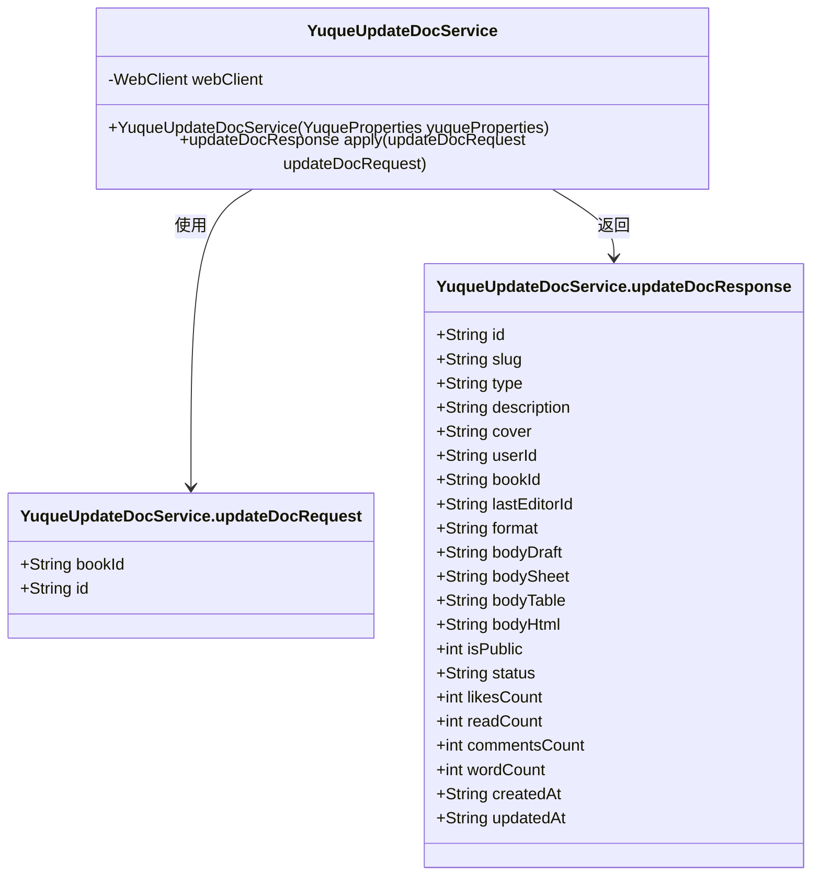
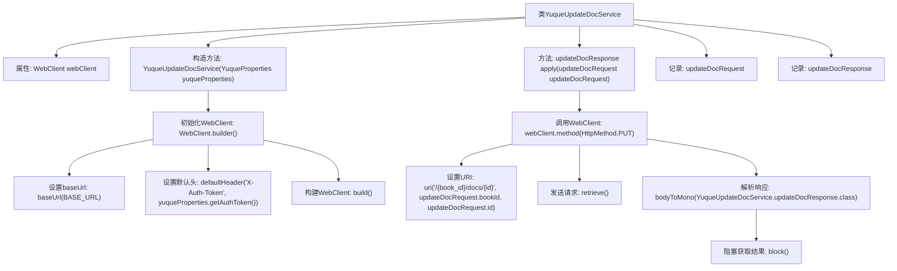

# 基础信息

|      |      |
|------|------|
| 名称 | YuqueUpdateDocService |
| 编码语言 | .java |
| 代码路径 | spring-ai-alibaba/community/tool-calls/spring-ai-alibaba-starter-tool-calling-yuque/src/main/java/com/alibaba/cloud/ai/toolcalling/yuque/YuqueUpdateDocService.java |
| 包名 | com.alibaba.cloud.ai.toolcalling.yuque |
| 依赖项 | ['com.fasterxml.jackson.annotation.JsonProperty', 'org.springframework.http.HttpMethod', 'org.springframework.web.reactive.function.client.WebClient', 'reactor.core.publisher.Mono', 'java.util.function.Function', 'com.alibaba.cloud.ai.toolcalling.yuque.YuqueProperties.BASE_URL'] |
| 概述说明 | YuqueUpdateDocService类通过WebClient发送PUT请求实现文档更新并返回响应。 |

# 说明

YuqueUpdateDocService类负责实现文档更新功能，通过WebClient发送PUT请求，以更新指定文档内容，并返回更新操作的响应结果。该服务类专注于处理文档更新流程，确保请求的准确发送和响应的有效接收。

# 类列表 Class Summary

| 名称   | 类型  | 说明 |
|-------|------|-------------|
| YuqueUpdateDocService | class | YuqueUpdateDocService类实现文档更新功能，使用WebClient发送PUT请求，返回更新响应。 |

## 类 YuqueUpdateDocService

|      |      |
|------|------|
| 访问范围 | public |
| 类型 | class |
| 名称 | YuqueUpdateDocService |
| 说明 | YuqueUpdateDocService类实现文档更新功能，使用WebClient发送PUT请求，返回更新响应。 |

### UML类图

**描述：**  
`YuqueUpdateDocService` 是一个服务类，负责通过 `WebClient` 向语雀 API 发送更新文档的请求。它包含两个内部记录类 `updateDocRequest` 和 `updateDocResponse`，分别用于封装请求和响应的数据结构。`YuqueUpdateDocService` 通过 `apply` 方法处理请求并返回响应，依赖于 `WebClient` 进行 HTTP 请求。

### 内部方法调用关系图

这段代码定义了一个名为`YuqueUpdateDocService`的类，该类实现了`Function`接口，用于处理更新语雀文档的请求。类中包含一个`WebClient`属性，用于发送HTTP请求。构造方法初始化了`WebClient`，设置了基础URL和默认的认证头。`apply`方法通过`WebClient`发送PUT请求，更新指定文档，并返回响应结果。代码中还定义了两个记录类型`updateDocRequest`和`updateDocResponse`，分别用于封装请求和响应数据。

### 字段列表 Field List

| 名称  | 类型  | 说明 |
|-------|-------|------|
| webClient | WebClient | 类中定义了一个私有的WebClient类型变量webClient。 |

### 方法列表 Method List

| 名称  | 类型  | 说明 |
|-------|-------|------|
| apply | YuqueUpdateDocService.updateDocResponse | 该方法通过PUT请求更新文档，并返回响应结果。 |

