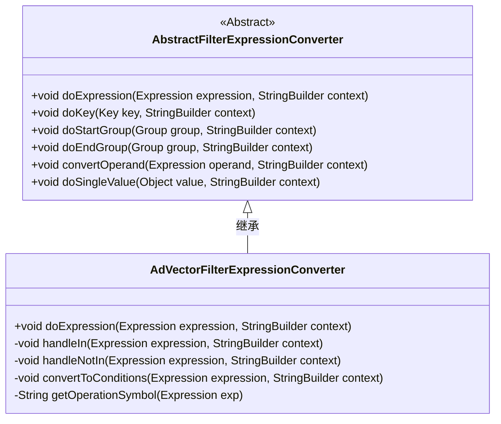
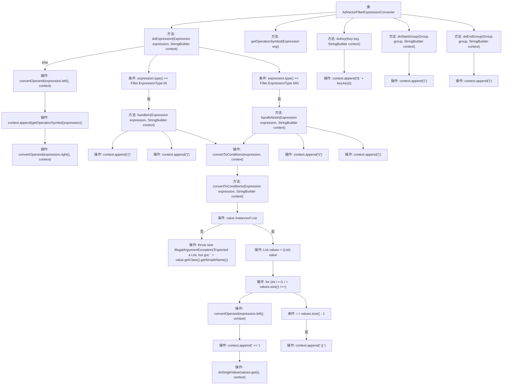

# 基础信息

|      |      |
|------|------|
| 名称 | AdVectorFilterExpressionConverter |
| 编码语言 | .java |
| 代码路径 | spring-ai-alibaba/community/vector-stores/spring-ai-alibaba-starter-analyticdb-store/src/main/java/com/alibaba/cloud/ai/vectorstore/analyticdb/AdVectorFilterExpressionConverter.java |
| 包名 | com.alibaba.cloud.ai.vectorstore.analyticdb |
| 依赖项 | ['org.springframework.ai.vectorstore.filter.Filter', 'org.springframework.ai.vectorstore.filter.Filter.Expression', 'org.springframework.ai.vectorstore.filter.Filter.Group', 'org.springframework.ai.vectorstore.filter.Filter.Key', 'org.springframework.ai.vectorstore.filter.converter.AbstractFilterExpressionConverter', 'java.util.List'] |
| 概述说明 | AdVectorFilterExpressionConverter类支持IN、NIN操作，生成条件语句。 |

# 说明

AdVectorFilterExpressionConverter类专门用于处理表达式转换，支持IN和NIN等操作，能够生成相应的条件语句。该类的核心功能是将输入的表达式转换为适合特定上下文的条件语句，从而满足查询或过滤需求。通过支持IN和NIN操作，它能够处理包含在指定集合内或不在指定集合内的条件判断，适用于多种数据过滤场景。

# 类列表 Class Summary

| 名称   | 类型  | 说明 |
|-------|------|-------------|
| AdVectorFilterExpressionConverter | class | AdVectorFilterExpressionConverter类处理表达式转换，支持IN、NIN等操作，生成相应条件语句。 |

## 类 AdVectorFilterExpressionConverter

|      |      |
|------|------|
| 访问范围 | public |
| 类型 | class |
| 名称 | AdVectorFilterExpressionConverter |
| 说明 | AdVectorFilterExpressionConverter类处理表达式转换，支持IN、NIN等操作，生成相应条件语句。 |

### UML类图

### 描述
`AdVectorFilterExpressionConverter` 是一个继承自 `AbstractFilterExpressionConverter` 的类，用于将过滤表达式转换为特定格式的字符串。它重写了父类的 `doExpression` 方法，根据表达式的类型（如 `IN`、`NIN` 等）进行不同的处理。类中还包含了一些私有方法，如 `handleIn`、`handleNotIn` 和 `convertToConditions`，用于处理特定的表达式类型。`getOperationSymbol` 方法用于获取表达式对应的操作符符号。该类的主要功能是将复杂的过滤表达式转换为可执行的字符串形式。

### 内部方法调用关系图

该流程图描述了`AdVectorFilterExpressionConverter`类中的主要方法及其调用关系。`doExpression`方法根据表达式的类型调用不同的处理方法，如`handleIn`和`handleNotIn`，并处理条件表达式。`convertToConditions`方法将表达式转换为条件语句，并在循环中处理每个值。`getOperationSymbol`方法返回操作符的字符串表示。`doKey`、`doStartGroup`和`doEndGroup`方法分别处理键、组的开始和结束。整个流程展示了如何将复杂的表达式转换为字符串表示。

### 字段列表 Field List

| 名称  | 类型  | 说明 |
|-------|-------|------|

### 方法列表 Method List

| 名称  | 类型  | 说明 |
|-------|-------|------|
| getOperationSymbol | String | 根据表达式类型返回对应操作符号。 |
| doExpression | void | 根据表达式类型处理IN、NIN或普通操作。 |
| handleNotIn | void | 处理非包含表达式，追加否定条件到上下文中。 |
| handleIn | void | 处理表达式并转换为条件，用括号包裹结果。 |
| doKey | void | 重写doKey方法，将键名附加到上下文中。 |
| doStartGroup | void | 在doStartGroup方法中，向context添加左括号。 |
| doEndGroup | void | 在`doEndGroup`方法中，向`context`追加右括号。 |
| convertToConditions | void | 将表达式转换为条件，确保值为列表，逐个处理并拼接条件语句。 |

