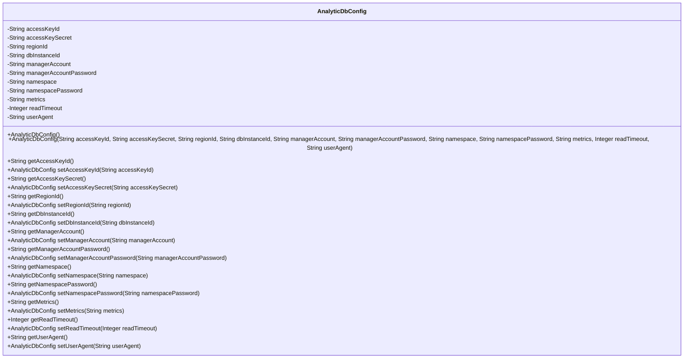

# 基础信息

|      |      |
|------|------|
| 名称 | AnalyticDbConfig |
| 编码语言 | .java |
| 代码路径 | spring-ai-alibaba/community/vector-stores/spring-ai-alibaba-starter-analyticdb-store/src/main/java/com/alibaba/cloud/ai/vectorstore/analyticdb/AnalyticDbConfig.java |
| 包名 | com.alibaba.cloud.ai.vectorstore.analyticdb |
| 依赖项 | [] |
| 概述说明 | AnalyticDbConfig类包含数据库密钥、区域、实例ID等配置参数。 |

# 说明

AnalyticDbConfig类用于存储数据库的配置参数，这些参数包括密钥、区域、实例ID、账户、命名空间、超时设置以及用户代理信息。该类提供了对数据库连接和操作所需的关键配置项的管理和访问。

# 类列表 Class Summary

| 名称   | 类型  | 说明 |
|-------|------|-------------|
| AnalyticDbConfig | class | AnalyticDbConfig类包含数据库配置参数，如密钥、区域、实例ID、账户、命名空间、超时和用户代理。 |

## 类 AnalyticDbConfig

|      |      |
|------|------|
| 访问范围 | public |
| 类型 | class |
| 名称 | AnalyticDbConfig |
| 说明 | AnalyticDbConfig类包含数据库配置参数，如密钥、区域、实例ID、账户、命名空间、超时和用户代理。 |

### UML类图

### 描述
`AnalyticDbConfig` 类用于配置分析数据库的连接和操作参数。它包含多个私有字段，如 `accessKeyId`、`accessKeySecret`、`regionId` 等，用于存储数据库的访问凭证、区域信息、实例ID等。类提供了两个构造函数，一个无参构造函数和一个带参构造函数，用于初始化这些字段。此外，类还提供了每个字段的 `getter` 和 `setter` 方法，`setter` 方法返回 `AnalyticDbConfig` 实例，支持链式调用。这个类的主要作用是封装和管理分析数据库的配置信息。

### 内部方法调用关系图

```mermaid
graph TD
    A["类AnalyticDbConfig"]
    B["属性: String accessKeyId"]
    C["属性: String accessKeySecret"]
    D["属性: String regionId"]
    E["属性: String dbInstanceId"]
    F["属性: String managerAccount"]
    G["属性: String managerAccountPassword"]
    H["属性: String namespace"]
    I["属性: String namespacePassword"]
    J["属性: String metrics = 'cosine'"]
    K["属性: Integer readTimeout = 60000"]
    L["属性: String userAgent = 'index'"]
    M["构造方法: AnalyticDbConfig()"]
    N["构造方法: AnalyticDbConfig(String accessKeyId, String accessKeySecret, String regionId, String dbInstanceId, String managerAccount, String managerAccountPassword, String namespace, String namespacePassword, String metrics, Integer readTimeout, String userAgent)"]
    O["方法: String getAccessKeyId()"]
    P["方法: AnalyticDbConfig setAccessKeyId(String accessKeyId)"]
    Q["方法: String getAccessKeySecret()"]
    R["方法: AnalyticDbConfig setAccessKeySecret(String accessKeySecret)"]
    S["方法: String getRegionId()"]
    T["方法: AnalyticDbConfig setRegionId(String regionId)"]
    U["方法: String getDbInstanceId()"]
    V["方法: AnalyticDbConfig setDbInstanceId(String dbInstanceId)"]
    W["方法: String getManagerAccount()"]
    X["方法: AnalyticDbConfig setManagerAccount(String managerAccount)"]
    Y["方法: String getManagerAccountPassword()"]
    Z["方法: AnalyticDbConfig setManagerAccountPassword(String managerAccountPassword)"]
    AA["方法: String getNamespace()"]
    AB["方法: AnalyticDbConfig setNamespace(String namespace)"]
    AC["方法: String getNamespacePassword()"]
    AD["方法: AnalyticDbConfig setNamespacePassword(String namespacePassword)"]
    AE["方法: String getMetrics()"]
    AF["方法: AnalyticDbConfig setMetrics(String metrics)"]
    AG["方法: Integer getReadTimeout()"]
    AH["方法: AnalyticDbConfig setReadTimeout(Integer readTimeout)"]
    AI["方法: String getUserAgent()"]
    AJ["方法: AnalyticDbConfig setUserAgent(String userAgent)"]

    A --> B
    A --> C
    A --> D
    A --> E
    A --> F
    A --> G
    A --> H
    A --> I
    A --> J
    A --> K
    A --> L
    A --> M
    A --> N
    A --> O
    A --> P
    A --> Q
    A --> R
    A --> S
    A --> T
    A --> U
    A --> V
    A --> W
    A --> X
    A --> Y
    A --> Z
    A --> AA
    A --> AB
    A --> AC
    A --> AD
    A --> AE
    A --> AF
    A --> AG
    A --> AH
    A --> AI
    A --> AJ
```

这段代码定义了一个名为 `AnalyticDbConfig` 的类，用于配置分析数据库的连接参数。类中包含多个私有属性，如 `accessKeyId`、`accessKeySecret`、`regionId` 等，并提供了相应的 `getter` 和 `setter` 方法。类中有两个构造方法，一个无参构造方法和一个带参构造方法，用于初始化类的实例。每个 `setter` 方法都返回当前对象，支持链式调用。整体设计旨在提供灵活且可扩展的配置选项，适用于多种数据库连接场景。

### 字段列表 Field List

| 名称  | 类型  | 说明 |
|-------|-------|------|
| managerAccount | String | 私有字符串变量managerAccount。 |
| regionId | String | 定义私有字符串变量regionId。 |
| accessKeyId | String | 定义私有字符串变量accessKeyId。 |
| metrics = "cosine" | String | 使用余弦相似度作为度量标准。 |
| managerAccountPassword | String | 私有字符串变量存储管理员账户密码。 |
| readTimeout = 60000 | Integer | 私有整型变量readTimeout默认值为60000毫秒。 |
| userAgent = "index" | String | 定义私有字符串变量userAgent并初始化为"index"。 |
| accessKeySecret | String | 定义了一个私有字符串变量accessKeySecret。 |
| namespacePassword | String | 定义私有字符串变量namespacePassword。 |
| namespace | String | 定义了一个私有字符串变量`namespace`。 |
| dbInstanceId | String | 定义私有字符串变量dbInstanceId。 |

### 方法列表 Method List

| 名称  | 类型  | 说明 |
|-------|-------|------|
| setNamespacePassword | AnalyticDbConfig | 设置命名空间密码并返回配置对象。 |
| setReadTimeout | AnalyticDbConfig | 设置读取超时并返回当前对象。 |
| setMetrics | AnalyticDbConfig | 方法setMetrics设置metrics并返回当前对象。 |
| setManagerAccountPassword | AnalyticDbConfig | 方法设置管理员账户密码并返回当前对象。 |
| getDbInstanceId | String | 该方法返回数据库实例ID。 |
| getMetrics | String | 该方法返回字符串类型的metrics变量。 |
| getNamespacePassword | String | 获取命名空间密码的方法。 |
| getAccessKeySecret | String | 获取accessKeySecret的字符串值。 |
| getManagerAccount | String | 获取经理账户的字符串方法。 |
| setDbInstanceId | AnalyticDbConfig | 设置数据库实例ID并返回当前对象。 |
| getAccessKeyId | String | 获取accessKeyId的方法。 |
| getManagerAccountPassword | String | 获取经理账户密码的方法。 |
| getNamespace | String | 该方法返回命名空间字符串。 |
| setUserAgent | AnalyticDbConfig | 方法设置用户代理并返回当前对象。 |
| setManagerAccount | AnalyticDbConfig | 设置管理账户并返回当前对象实例。 |
| setAccessKeyId | AnalyticDbConfig | 设置AnalyticDbConfig的accessKeyId并返回当前对象。 |
| setRegionId | AnalyticDbConfig | AnalyticDbConfig类中的setRegionId方法用于设置regionId并返回当前对象。 |
| getRegionId | String | 获取区域ID的Java方法。 |
| setAccessKeySecret | AnalyticDbConfig | 设置AnalyticDbConfig的accessKeySecret并返回当前实例。 |
| getReadTimeout | Integer | 获取读取超时时间的整数值。 |
| setNamespace | AnalyticDbConfig | 设置命名空间并返回当前对象。 |
| getUserAgent | String | 该方法返回用户代理字符串。 |

