# 基础信息

|      |      |
|------|------|
| 名称 | AnalyticDbVectorStore |
| 编码语言 | .java |
| 代码路径 | spring-ai-alibaba/community/vector-stores/spring-ai-alibaba-starter-analyticdb-store/src/main/java/com/alibaba/cloud/ai/vectorstore/analyticdb/AnalyticDbVectorStore.java |
| 包名 | com.alibaba.cloud.ai.vectorstore.analyticdb |
| 依赖项 | ['java.util.ArrayList', 'java.util.HashMap', 'java.util.List', 'java.util.Map', 'java.util.Objects', 'java.util.stream.Collectors', 'java.util.stream.IntStream', 'com.aliyun.gpdb20160503.Client', 'com.aliyun.gpdb20160503.models.CreateCollectionRequest', 'com.aliyun.gpdb20160503.models.CreateNamespaceRequest', 'com.aliyun.gpdb20160503.models.DeleteCollectionDataRequest', 'com.aliyun.gpdb20160503.models.DeleteCollectionDataResponse', 'com.aliyun.gpdb20160503.models.DescribeCollectionRequest', 'com.aliyun.gpdb20160503.models.DescribeNamespaceRequest', 'com.aliyun.gpdb20160503.models.InitVectorDatabaseRequest', 'com.aliyun.gpdb20160503.models.InitVectorDatabaseResponse', 'com.aliyun.gpdb20160503.models.QueryCollectionDataRequest', 'com.aliyun.gpdb20160503.models.QueryCollectionDataResponse', 'com.aliyun.gpdb20160503.models.QueryCollectionDataResponseBody', 'com.aliyun.gpdb20160503.models.UpsertCollectionDataRequest', 'com.aliyun.tea.TeaException', 'com.fasterxml.jackson.core.JsonProcessingException', 'com.fasterxml.jackson.core.type.TypeReference', 'com.fasterxml.jackson.databind.ObjectMapper', 'com.fasterxml.jackson.databind.json.JsonMapper', 'com.fasterxml.jackson.databind.node.ObjectNode', 'org.slf4j.Logger', 'org.slf4j.LoggerFactory', 'org.springframework.ai.document.Document', 'org.springframework.ai.embedding.EmbeddingModel', 'org.springframework.ai.embedding.EmbeddingOptionsBuilder', 'org.springframework.ai.util.JacksonUtils', 'org.springframework.ai.vectorstore.AbstractVectorStoreBuilder', 'org.springframework.ai.vectorstore.SearchRequest', 'org.springframework.ai.vectorstore.filter.Filter', 'org.springframework.ai.vectorstore.filter.FilterExpressionConverter', 'org.springframework.ai.vectorstore.observation.AbstractObservationVectorStore', 'org.springframework.ai.vectorstore.observation.VectorStoreObservationContext', 'org.springframework.beans.factory.InitializingBean', 'org.springframework.util.Assert', 'org.springframework.util.CollectionUtils'] |
| 概述说明 | AnalyticDbVectorStore类管理向量数据库，支持初始化、命名空间、集合及文档操作。 |

# 说明

AnalyticDbVectorStore类是一个用于管理向量数据库的工具，主要功能包括初始化数据库、创建命名空间和集合，以及对文档进行增加、删除和查询操作。该类提供了全面的向量数据库管理能力，支持用户高效地组织和操作向量数据。

# 类列表 Class Summary

| 名称   | 类型  | 说明 |
|-------|------|-------------|
| AnalyticDbVectorStore | class | AnalyticDbVectorStore类用于管理向量数据库，支持初始化、创建命名空间和集合，以及文档的增删查操作。 |


## 类 AnalyticDbVectorStore

|      |      |
|------|------|
| 访问范围 | public |
| 类型 | class |
| 名称 | AnalyticDbVectorStore |
| 说明 | AnalyticDbVectorStore类用于管理向量数据库，支持初始化、创建命名空间和集合，以及文档的增删查操作。 |


### UML类图

```mermaid
classDiagram
    class AnalyticDbVectorStore {
        -Logger logger
        -String DATA_BASE_SYSTEM
        -String REF_DOC_NAME
        -String METADATA_FIELD_NAME
        -String CONTENT_FIELD_NAME
        -String DOC_NAME
        -int DEFAULT_TOP_K
        -Double DEFAULT_SIMILARITY_THRESHOLD
        +FilterExpressionConverter filterExpressionConverter
        -String collectionName
        -AnalyticDbConfig config
        -Client client
        -ObjectMapper objectMapper
        -Integer defaultTopK
        -Double defaultSimilarityThreshold
        +AnalyticDbVectorStore(Builder builder) throws Exception
        +static Builder builder(String collectionName, AnalyticDbConfig config, Client client, EmbeddingModel embeddingModel)
        -void initialize() throws Exception
        -void initializeVectorDataBase() throws Exception
        -void createNameSpaceIfNotExists() throws Exception
        -void createCollectionIfNotExists(Long embeddingDimension) throws Exception
        +void doAdd(List~Document~ documents)
        +void doDelete(List~String~ ids)
        +void doDelete(Filter.Expression filterExpression)
        +List~Document~ similaritySearch(String query)
        +List~Document~ doSimilaritySearch(SearchRequest searchRequest)
        +void afterPropertiesSet() throws Exception
        +VectorStoreObservationContext.Builder createObservationContextBuilder(String operationName)
    }

    class Builder {
        -String collectionName
        -AnalyticDbConfig config
        -Client client
        -int defaultTopK
        -Double defaultSimilarityThreshold
        +Builder(String collectionName, AnalyticDbConfig config, Client client, EmbeddingModel embeddingModel)
        +Builder defaultTopK(int defaultTopK)
        +Builder defaultSimilarityThreshold(Double defaultSimilarityThreshold)
        +AnalyticDbVectorStore build()
    }

    class AbstractObservationVectorStore {
        <<Interface>>
    }

    class InitializingBean {
        <<Interface>>
    }

    class FilterExpressionConverter {
        <<Interface>>
    }

    class AdVectorFilterExpressionConverter {
        +String convertExpression(Filter.Expression filterExpression)
    }

    class Document {
        +String getId()
        +String getText()
        +Map~String, Object~ getMetadata()
    }

    class EmbeddingModel {
        <<Interface>>
        +List~float[]~ embed(List~Document~ documents, EmbeddingOptionsBuilder options, BatchingStrategy strategy)
    }

    class Client {
        +InitVectorDatabaseResponse initVectorDatabase(InitVectorDatabaseRequest request)
        +DescribeNamespaceResponse describeNamespace(DescribeNamespaceRequest request)
        +CreateNamespaceResponse createNamespace(CreateNamespaceRequest request)
        +DescribeCollectionResponse describeCollection(DescribeCollectionRequest request)
        +CreateCollectionResponse createCollection(CreateCollectionRequest request)
        +UpsertCollectionDataResponse upsertCollectionData(UpsertCollectionDataRequest request)
        +DeleteCollectionDataResponse deleteCollectionData(DeleteCollectionDataRequest request)
        +QueryCollectionDataResponse queryCollectionData(QueryCollectionDataRequest request)
    }

    class AnalyticDbConfig {
        +String getDbInstanceId()
        +String getRegionId()
        +String getManagerAccount()
        +String getManagerAccountPassword()
        +String getNamespace()
        +String getNamespacePassword()
        +String getMetrics()
    }

    class ObjectMapper {
        +ObjectNode createObjectNode()
        +String writeValueAsString(Object value)
        +~T~ readValue(String content, TypeReference~T~ typeRef)
    }

    class VectorStoreObservationContext {
        +static Builder builder(String databaseSystem, String operationName)
    }

    class BatchingStrategy {
        <<Interface>>
    }

    class EmbeddingOptionsBuilder {
        +static Builder builder()
    }

    class SearchRequest {
        +static Builder builder()
        +String getQuery()
        +int getTopK()
        +double getSimilarityThreshold()
        +boolean hasFilterExpression()
        +Filter.Expression getFilterExpression()
    }

    class TeaException {
        +int getStatusCode()
        +String getMessage()
    }

    class JsonProcessingException {
        +String getMessage()
    }

    class RuntimeException {
        +RuntimeException(String message, Throwable cause)
    }

    class InitVectorDatabaseRequest {
        +InitVectorDatabaseRequest setDBInstanceId(String dbInstanceId)
        +InitVectorDatabaseRequest setRegionId(String regionId)
        +InitVectorDatabaseRequest setManagerAccount(String managerAccount)
        +InitVectorDatabaseRequest setManagerAccountPassword(String managerAccountPassword)
    }

    class InitVectorDatabaseResponse {
        +String getBody()
    }

    class DescribeNamespaceRequest {
        +DescribeNamespaceRequest setDBInstanceId(String dbInstanceId)
        +DescribeNamespaceRequest setRegionId(String regionId)
        +DescribeNamespaceRequest setNamespace(String namespace)
        +DescribeNamespaceRequest setManagerAccount(String managerAccount)
        +DescribeNamespaceRequest setManagerAccountPassword(String managerAccountPassword)
    }

    class CreateNamespaceRequest {
        +CreateNamespaceRequest setDBInstanceId(String dbInstanceId)
        +CreateNamespaceRequest setRegionId(String regionId)
        +CreateNamespaceRequest setNamespace(String namespace)
        +CreateNamespaceRequest setManagerAccount(String managerAccount)
        +CreateNamespaceRequest setManagerAccountPassword(String managerAccountPassword)
        +CreateNamespaceRequest setNamespacePassword(String namespacePassword)
    }

    class DescribeCollectionRequest {
        +DescribeCollectionRequest setDBInstanceId(String dbInstanceId)
        +DescribeCollectionRequest setRegionId(String regionId)
        +DescribeCollectionRequest setNamespace(String namespace)
        +DescribeCollectionRequest setNamespacePassword(String namespacePassword)
        +DescribeCollectionRequest setCollection(String collection)
    }

    class CreateCollectionRequest {
        +CreateCollectionRequest setDBInstanceId(String dbInstanceId)
        +CreateCollectionRequest setRegionId(String regionId)
        +CreateCollectionRequest setManagerAccount(String managerAccount)
        +CreateCollectionRequest setManagerAccountPassword(String managerAccountPassword)
        +CreateCollectionRequest setNamespace(String namespace)
        +CreateCollectionRequest setCollection(String collection)
        +CreateCollectionRequest setDimension(Long dimension)
        +CreateCollectionRequest setMetrics(String metrics)
        +CreateCollectionRequest setMetadata(String metadata)
        +CreateCollectionRequest setFullTextRetrievalFields(String fullTextRetrievalFields)
    }

    class UpsertCollectionDataRequest {
        +UpsertCollectionDataRequest setDBInstanceId(String dbInstanceId)
        +UpsertCollectionDataRequest setRegionId(String regionId)
        +UpsertCollectionDataRequest setNamespace(String namespace)
        +UpsertCollectionDataRequest setNamespacePassword(String namespacePassword)
        +UpsertCollectionDataRequest setCollection(String collection)
        +UpsertCollectionDataRequest setRows(List~UpsertCollectionDataRequestRows~ rows)
    }

    class UpsertCollectionDataRequestRows {
        +UpsertCollectionDataRequestRows setVector(List~Double~ vector)
        +UpsertCollectionDataRequestRows setMetadata(Map~String, String~ metadata)
    }

    class DeleteCollectionDataRequest {
        +DeleteCollectionDataRequest setDBInstanceId(String dbInstanceId)
        +DeleteCollectionDataRequest setRegionId(String regionId)
        +DeleteCollectionDataRequest setNamespace(String namespace)
        +DeleteCollectionDataRequest setNamespacePassword(String namespacePassword)
        +DeleteCollectionDataRequest setCollection(String collection)
        +DeleteCollectionDataRequest setCollectionData(String collectionData)
        +DeleteCollectionDataRequest setCollectionDataFilter(String collectionDataFilter)
    }

    class DeleteCollectionDataResponse {
        +String getBody()
    }

    class QueryCollectionDataRequest {
        +QueryCollectionDataRequest setDBInstanceId(String dbInstanceId)
        +QueryCollectionDataRequest setRegionId(String regionId)
        +QueryCollectionDataRequest setNamespace(String namespace)
        +QueryCollectionDataRequest setNamespacePassword(String namespacePassword)
        +QueryCollectionDataRequest setCollection(String collection)
        +QueryCollectionDataRequest setIncludeValues(boolean includeValues)
        +QueryCollectionDataRequest setMetrics(String metrics)
        +QueryCollectionDataRequest setVector(List~Double~ vector)
        +QueryCollectionDataRequest setContent(String content)
        +QueryCollectionDataRequest setTopK(Long topK)
        +QueryCollectionDataRequest setFilter(String filter)
    }

    class QueryCollectionDataResponse {
        +QueryCollectionDataResponseBody getBody()
    }

    class QueryCollectionDataResponseBody {
        +QueryCollectionDataResponseBodyMatches getMatches()
    }

    class QueryCollectionDataResponseBodyMatches {
        +List~QueryCollectionDataResponseBodyMatchesMatch~ getMatch()
    }

    class QueryCollectionDataResponseBodyMatchesMatch {
        +Double getScore()
        +Map~String, String~ getMetadata()
    }

    class JacksonUtils {
        +static List~Module~ instantiateAvailableModules()
    }

    class Module {
        <<Interface>>
    }

    class TypeReference~T~ {
        <<Interface>>
    }

    class Assert {
        +static void notNull(Object object, String message)
        +static void isTrue(boolean expression, String message)
    }

    class CollectionUtils {
        +static boolean isEmpty(Collection~?~ collection)
    }

    class IntStream {
        +static IntStream range(int startInclusive, int endExclusive)
        +Stream~Double~ mapToObj(IntFunction~? extends Double~ mapper)
    }

    class Stream~T~ {
        +List~T~ toList()
    }

    class IntFunction~R~ {
        <<Interface>>
    }

    class Collectors {
        +static Collector~CharSequence, ?, String~ joining(CharSequence delimiter, CharSequence prefix, CharSequence suffix)
    }

    class Collector~T, A, R~ {
        <<Interface>>
    }

    class CharSequence {
        <<Interface>>
    }

    class HashMap~K, V~ {
        +void put(K key, V value)
    }

    class ArrayList~E~ {
        +ArrayList(int initialCapacity)
    }

    class Map~K, V~ {
        <<Interface>>
        +V get(Object key)
    }

    class List~E~ {
        <<Interface>>
        +E get(int index)
        +int size()
    }

    class AbstractVectorStoreBuilder~T~ {
        +T build()
    }

    class BatchingStrategy {
        <<Interface>>
    }

    class EmbeddingOptionsBuilder {
        +static Builder builder()
    }

    class SearchRequest {
        +static Builder builder()
        +String getQuery()
        +int getTopK()
        +double getSimilarityThreshold()
        +boolean hasFilterExpression()
        +Filter.Expression getFilterExpression()
    }

    class TeaException {
        +int getStatusCode()
        +String getMessage()
    }

    class JsonProcessingException {
        +String getMessage()
    }

    class RuntimeException {
        +RuntimeException(String message, Throwable cause)
    }

    class InitVectorDatabaseRequest {
        +InitVectorDatabaseRequest setDBInstanceId(String dbInstanceId)
        +InitVectorDatabaseRequest setRegionId(String regionId)
        +InitVectorDatabaseRequest setManagerAccount(String managerAccount)
        +InitVectorDatabaseRequest setManagerAccountPassword(String managerAccountPassword)
    }

    class InitVectorDatabaseResponse {
        +String getBody()
    }

    class DescribeNamespaceRequest {
        +DescribeNamespaceRequest setDBInstanceId(String dbInstanceId)
        +DescribeNamespaceRequest setRegionId(String regionId)
        +DescribeNamespaceRequest setNamespace(String namespace)
        +DescribeNamespaceRequest setManagerAccount(String managerAccount)
        +DescribeNamespaceRequest setManagerAccountPassword(String managerAccountPassword)
    }

    class CreateNamespaceRequest {
        +CreateNamespaceRequest setDBInstanceId(String dbInstanceId)
        +CreateNamespaceRequest setRegionId(String regionId)
        +CreateNamespaceRequest setNamespace(String namespace)
        +CreateNamespaceRequest setManagerAccount(String managerAccount)
        +CreateNamespaceRequest setManagerAccountPassword(String managerAccountPassword)
        +CreateNamespaceRequest setNamespacePassword(String namespacePassword)
    }

    class DescribeCollectionRequest {
        +DescribeCollectionRequest setDBInstanceId(String dbInstanceId)
        +DescribeCollectionRequest setRegionId(String regionId)
        +DescribeCollectionRequest setNamespace(String namespace)
        +DescribeCollectionRequest setNamespacePassword(String namespacePassword)
        +DescribeCollectionRequest setCollection(String collection)
    }

    class CreateCollectionRequest {
        +CreateCollectionRequest setDBInstanceId(String dbInstanceId)
        +CreateCollectionRequest setRegionId(String regionId)
        +CreateCollectionRequest setManagerAccount(String managerAccount)
        +CreateCollectionRequest setManagerAccountPassword(String managerAccountPassword)
        +CreateCollectionRequest setNamespace(String namespace)
        +CreateCollectionRequest setCollection(String collection)
        +CreateCollectionRequest setDimension(Long dimension)
        +CreateCollectionRequest setMetrics(String metrics)
        +CreateCollectionRequest setMetadata(String metadata)
        +CreateCollectionRequest setFullTextRetrievalFields(String fullTextRetrievalFields)
    }

    class UpsertCollectionDataRequest {
        +UpsertCollectionDataRequest setDBInstanceId(String dbInstanceId)
        +UpsertCollectionDataRequest setRegionId(String regionId)
        +UpsertCollectionDataRequest setNamespace(String namespace)
        +UpsertCollectionDataRequest setNamespacePassword(String namespacePassword)
        +UpsertCollectionDataRequest setCollection(String collection)
        +UpsertCollectionDataRequest setRows(List~UpsertCollectionDataRequestRows~ rows)
    }

    class UpsertCollectionDataRequestRows {
        +UpsertCollectionDataRequestRows setVector(List~Double~ vector)
        +UpsertCollectionDataRequestRows setMetadata(Map~String, String~ metadata)
    }

    class DeleteCollectionDataRequest {
        +DeleteCollectionDataRequest setDBInstanceId(String dbInstanceId)
        +DeleteCollectionDataRequest setRegionId(String regionId)
        +DeleteCollectionDataRequest setNamespace(String namespace)
        +DeleteCollectionDataRequest setNamespacePassword(String namespacePassword)
        +DeleteCollectionDataRequest setCollection(String collection)
        +DeleteCollectionDataRequest setCollectionData(String collectionData)
        +DeleteCollectionDataRequest setCollectionDataFilter(String collectionDataFilter)
    }

    class DeleteCollectionDataResponse {
        +String getBody()
    }

    class QueryCollectionDataRequest {
        +QueryCollectionDataRequest setDBInstanceId(String dbInstanceId)
        +QueryCollectionDataRequest setRegionId(String regionId)
        +QueryCollectionDataRequest setNamespace(String namespace)
        +QueryCollectionDataRequest setNamespacePassword(String namespacePassword)
        +QueryCollectionDataRequest setCollection(String collection)
        +QueryCollectionDataRequest setIncludeValues(boolean includeValues)
        +QueryCollectionDataRequest setMetrics(String metrics)
        +QueryCollectionDataRequest setVector(List~Double~ vector)
        +QueryCollectionDataRequest setContent(String content)
        +QueryCollectionDataRequest setTopK(Long topK)
        +QueryCollectionDataRequest setFilter(String filter)
    }

    class QueryCollectionDataResponse {
        +QueryCollectionDataResponseBody getBody()
    }

    class QueryCollectionDataResponseBody {
        +QueryCollectionDataResponseBodyMatches getMatches()
    }

    class QueryCollectionDataResponseBodyMatches {
        +List~QueryCollectionDataResponseBodyMatchesMatch~ getMatch()
    }

    class QueryCollectionDataResponseBodyMatchesMatch {
        +Double getScore()
        +Map~String, String~ getMetadata()
    }

    class JacksonUtils {
        +static List~Module~ instantiateAvailableModules()
    }

    class Module {
        <<Interface>>
    }

    class TypeReference~T~ {
        <<Interface>>
    }

    class Assert {
        +static void notNull(Object object, String message)
        +static void isTrue(boolean expression, String message)
    }

    class CollectionUtils {
        +static boolean isEmpty(Collection~?~ collection)
    }

    class IntStream {
        +static IntStream range(int startInclusive, int endExclusive)
        +Stream~Double~ mapToObj(IntFunction~? extends Double~ mapper)
    }

    class Stream~T~ {
        +List~T~ toList()
    }

    class IntFunction~R~ {
        <<Interface>>
    }

    class Collectors {
        +static Collector~CharSequence, ?, String~ joining(CharSequence delimiter, CharSequence prefix, CharSequence suffix)
    }

    class Collector~T, A, R~ {
        <<Interface>>
    }

    class CharSequence {
        <<Interface>>
    }

    class HashMap~K, V~ {
        +void put(K key, V value)
    }

    class ArrayList~E~ {
        +ArrayList(int initialCapacity)
    }

    class Map~K, V~ {
        <<Interface>>
        +V get(Object key)
    }

    class List~E~ {
        <<Interface>>
        +E get(int index)
        +int size()
    }

    class AbstractVectorStoreBuilder~T~ {
        +T build()
    }

    class BatchingStrategy {
        <<Interface>>
    }

    class EmbeddingOptionsBuilder {
        +static Builder builder()
    }

    class SearchRequest {
        +static Builder builder()
        +String getQuery()
        +int getTopK()
        +double getSimilarityThreshold()
        +boolean hasFilterExpression()
        +Filter.Expression getFilterExpression()
    }

    class TeaException {
        +int getStatusCode()
        +String getMessage()
    }

    class JsonProcessingException {
        +String getMessage()
    }

    class RuntimeException {
        +RuntimeException(String message, Throwable cause)
    }

    class InitVectorDatabaseRequest {
        +InitVectorDatabaseRequest setDBInstanceId(String dbInstanceId)
        +InitVectorDatabaseRequest setRegionId(String regionId)
        +InitVectorDatabaseRequest setManagerAccount(String managerAccount)
        +InitVectorDatabaseRequest setManagerAccountPassword(String managerAccountPassword)
    }

    class InitVectorDatabaseResponse {
        +String getBody()
    }

    class DescribeNamespaceRequest {
        +DescribeNamespaceRequest setDBInstanceId(String dbInstanceId)
        +DescribeNamespaceRequest setRegionId(String regionId)
        +DescribeNamespaceRequest setNamespace(String namespace)
        +DescribeNamespaceRequest setManagerAccount(String managerAccount)
        +DescribeNamespaceRequest setManagerAccountPassword(String managerAccountPassword)
    }

    class CreateNamespaceRequest {
        +CreateNamespaceRequest setDBInstanceId(String dbInstanceId)
        +CreateNamespaceRequest setRegionId(String regionId)
        +CreateNamespaceRequest setNamespace(String namespace)
        +CreateNamespaceRequest setManagerAccount(String managerAccount)
        +CreateNamespaceRequest setManagerAccountPassword(String managerAccountPassword)
        +CreateNamespaceRequest setNamespacePassword(String namespacePassword)
    }

    class DescribeCollectionRequest {
        +DescribeCollectionRequest setDBInstanceId(String dbInstanceId)
        +DescribeCollectionRequest setRegionId(String regionId)
        +DescribeCollectionRequest setNamespace(String namespace)
        +DescribeCollectionRequest setNamespacePassword(String namespacePassword)
        +DescribeCollectionRequest setCollection(String collection)
    }

    class CreateCollectionRequest {
        +CreateCollectionRequest setDBInstanceId(String dbInstanceId)
        +CreateCollectionRequest setRegionId(String regionId)
        +CreateCollectionRequest setManagerAccount(String managerAccount)
        +CreateCollectionRequest setManagerAccountPassword(String managerAccountPassword)
        +CreateCollectionRequest setNamespace(String namespace)
        +CreateCollectionRequest setCollection(String collection)
        +CreateCollectionRequest setDimension(Long dimension)
        +CreateCollectionRequest setMetrics(String metrics)
        +CreateCollectionRequest setMetadata(String metadata)
        +CreateCollectionRequest setFullText


### 内部方法调用关系图

```mermaid
graph TD
    A["类AnalyticDbVectorStore"]
    B["属性: Logger logger"]
    C["属性: String DATA_BASE_SYSTEM"]
    D["属性: String REF_DOC_NAME"]
    E["属性: String METADATA_FIELD_NAME"]
    F["属性: String CONTENT_FIELD_NAME"]
    G["属性: String DOC_NAME"]
    H["属性: int DEFAULT_TOP_K"]
    I["属性: Double DEFAULT_SIMILARITY_THRESHOLD"]
    J["属性: FilterExpressionConverter filterExpressionConverter"]
    K["属性: String collectionName"]
    L["属性: AnalyticDbConfig config"]
    M["属性: Client client"]
    N["属性: ObjectMapper objectMapper"]
    O["属性: Integer defaultTopK"]
    P["属性: Double defaultSimilarityThreshold"]
    Q["构造方法: AnalyticDbVectorStore(Builder builder)"]
    R["方法: static Builder builder(String collectionName, AnalyticDbConfig config, Client client, EmbeddingModel embeddingModel)"]
    S["方法: private void initialize()"]
    T["方法: private void initializeVectorDataBase()"]
    U["方法: private void createNameSpaceIfNotExists()"]
    V["方法: private void createCollectionIfNotExists(Long embeddingDimension)"]
    W["方法: public void doAdd(List<Document> documents)"]
    X["方法: public void doDelete(List<String> ids)"]
    Y["方法: public void doDelete(Filter.Expression filterExpression)"]
    Z["方法: public List<Document> similaritySearch(String query)"]
    AA["方法: public List<Document> doSimilaritySearch(SearchRequest searchRequest)"]
    AB["方法: public void afterPropertiesSet()"]
    AC["方法: public VectorStoreObservationContext.Builder createObservationContextBuilder(String operationName)"]
    AD["内部类: Builder"]
    AE["方法: Builder defaultTopK(int defaultTopK)"]
    AF["方法: Builder defaultSimilarityThreshold(Double defaultSimilarityThreshold)"]
    AG["方法: AnalyticDbVectorStore build()"]

    A --> B
    A --> C
    A --> D
    A --> E
    A --> F
    A --> G
    A --> H
    A --> I
    A --> J
    A --> K
    A --> L
    A --> M
    A --> N
    A --> O
    A --> P
    A --> Q
    A --> R
    A --> S
    S --> T
    S --> U
    S --> V
    A --> W
    A --> X
    A --> Y
    A --> Z
    Z --> AA
    A --> AB
    A --> AC
    A --> AD
    AD --> AE
    AD --> AF
    AD --> AG
```



**描述：**  
`AnalyticDbVectorStore` 类是一个用于管理和操作向量存储的类，继承自 `AbstractObservationVectorStore` 并实现了 `InitializingBean` 接口。该类包含多个私有属性和方法，用于初始化向量数据库、创建命名空间和集合、添加和删除文档、以及执行相似性搜索。内部类 `Builder` 提供了流畅的 API 用于配置和构建 `AnalyticDbVectorStore` 实例。该类的主要功能包括文档的增删改查操作，以及与向量数据库的交互。

### 字段列表 Field List

| 名称  | 类型  | 说明 |
|-------|-------|------|
| defaultTopK | Integer | 私有整数类型变量defaultTopK。 |
| DEFAULT_TOP_K = 4 | int | 默认TOP K值为4。 |
| objectMapper | ObjectMapper | 私有对象映射器实例声明。 |
| defaultSimilarityThreshold | Double | 私有常量默认相似度阈值类型为Double。 |
| collectionName | String | 私有字符串变量collectionName。 |
| DEFAULT_SIMILARITY_THRESHOLD = 0.0 | Double | 默认相似度阈值为0.0。 |
| client | Client | 私有且不可变的客户端实例。 |
| config | AnalyticDbConfig | 私有且不可变的AnalyticDbConfig配置对象。 |
| CONTENT_FIELD_NAME = "content" | String | 定义私有静态常量CONTENT_FIELD_NAME，值为"content"。 |
| DOC_NAME = "docId" | String | 定义私有静态常量DOC_NAME，值为"docId"。 |
| filterExpressionConverter = new AdVectorFilterExpressionConverter() | FilterExpressionConverter | 创建并初始化了最终的过滤器表达式转换器实例。 |
| logger = LoggerFactory.getLogger(AnalyticDbVectorStore.class) | Logger | AnalyticDbVectorStore类中定义了一个私有的静态日志记录器。 |
| REF_DOC_NAME = "refDocId" | String | 定义常量REF_DOC_NAME，值为"refDocId"。 |
| DATA_BASE_SYSTEM = "analytic_db" | String | 定义私有静态常量DATA_BASE_SYSTEM为"analytic_db"。 |
| METADATA_FIELD_NAME = "metadata" | String | 定义私有静态常量METADATA_FIELD_NAME，值为"metadata"。 |

### 方法列表 Method List

| 名称  | 类型  | 说明 |
|-------|-------|------|
| doDelete | void | 该方法根据传入ID列表删除集合数据，若列表为空则直接返回。 |
| initialize | void | 初始化向量数据库，检查并创建命名空间和集合。 |
| createCollectionIfNotExists | void | 检查集合是否存在，不存在则创建，包含维度和元数据设置。 |
| initializeVectorDataBase | void | 初始化向量数据库，设置实例ID、区域ID、管理员账户及密码，记录响应日志。 |
| afterPropertiesSet | void | 重写afterPropertiesSet方法，初始化并记录AnalyticdbVector客户端创建成功。 |
| builder | Builder | 创建Builder对象，需传入集合名、配置、客户端和嵌入模型。 |
| doDelete | void | 该方法根据过滤表达式删除集合数据，转换表达式后构建请求并执行删除操作，捕获异常并抛出。 |
| doSimilaritySearch | List<Document> | 方法执行相似性搜索，根据阈值、过滤表达式和topK参数返回符合条件的文档列表。 |
| createNameSpaceIfNotExists | void | 方法检查命名空间是否存在，若不存在则创建。 |
| doAdd | void | 处理文档列表，生成嵌入向量，构建元数据，请求更新集合数据。 |
| similaritySearch | List<Document> | 重写相似度搜索方法，使用默认参数构建请求并返回结果。 |
| createObservationContextBuilder | VectorStoreObservationContext.Builder | 创建观察上下文构建器，包含数据库系统、操作名、集合名、维度、命名空间和相似度指标。 |


