# 基础信息

|      |      |
|------|------|
| 名称 | AnalyticDbVectorStoreAutoConfiguration |
| 编码语言 | .java |
| 代码路径 | spring-ai-alibaba/community/vector-stores/spring-ai-alibaba-starter-analyticdb-store/src/main/java/com/alibaba/cloud/ai/vectorstore/analyticdb/AnalyticDbVectorStoreAutoConfiguration.java |
| 包名 | com.alibaba.cloud.ai.vectorstore.analyticdb |
| 依赖项 | ['com.aliyun.gpdb20160503.Client', 'com.aliyun.teaopenapi.models.Config', 'io.micrometer.observation.ObservationRegistry', 'org.springframework.ai.embedding.BatchingStrategy', 'org.springframework.ai.embedding.EmbeddingModel', 'org.springframework.ai.embedding.TokenCountBatchingStrategy', 'org.springframework.ai.vectorstore.observation.VectorStoreObservationConvention', 'org.springframework.beans.factory.ObjectProvider', 'org.springframework.boot.autoconfigure.AutoConfiguration', 'org.springframework.boot.autoconfigure.condition.ConditionalOnClass', 'org.springframework.boot.autoconfigure.condition.ConditionalOnMissingBean', 'org.springframework.boot.autoconfigure.condition.ConditionalOnProperty', 'org.springframework.boot.context.properties.EnableConfigurationProperties', 'org.springframework.context.annotation.Bean'] |
| 概述说明 | AnalyticDbVectorStoreAutoConfiguration类自动配置Client、BatchingStrategy和VectorStore的Bean及属性。 |

# 说明

AnalyticDbVectorStoreAutoConfiguration类负责自动配置AnalyticDbVectorStore，包括创建Client、BatchingStrategy和VectorStore的Bean，并设置相关属性。

# 类列表 Class Summary

| 名称   | 类型  | 说明 |
|-------|------|-------------|
| AnalyticDbVectorStoreAutoConfiguration | class | AnalyticDbVectorStoreAutoConfiguration类配置了AnalyticDbVectorStore的自动配置，包括Client、BatchingStrategy和VectorStore的Bean创建及属性设置。 |

## 类 AnalyticDbVectorStoreAutoConfiguration

|      |      |
|------|------|
| 访问范围 | @AutoConfiguration;@ConditionalOnClass({ EmbeddingModel.class, Client.class, AnalyticDbVectorStore.class });@EnableConfigurationProperties({ AnalyticDbVectorStoreProperties.class });@ConditionalOnProperty(prefix = "spring.ai.vectorstore.analytic");public |
| 类型 | class |
| 名称 | AnalyticDbVectorStoreAutoConfiguration |
| 说明 | AnalyticDbVectorStoreAutoConfiguration类配置了AnalyticDbVectorStore的自动配置，包括Client、BatchingStrategy和VectorStore的Bean创建及属性设置。 |

### UML类图

```mermaid
classDiagram
    class AnalyticDbVectorStoreAutoConfiguration {
        +Client client(AnalyticDbVectorStoreProperties properties) Client
        +BatchingStrategy batchingStrategy() BatchingStrategy
        +AnalyticDbVectorStore vectorStore(Client client, EmbeddingModel embeddingModel, AnalyticDbVectorStoreProperties properties, ObjectProvider~ObservationRegistry~ observationRegistry, ObjectProvider~VectorStoreObservationConvention~ customObservationConvention, BatchingStrategy batchingStrategy) AnalyticDbVectorStore
    }

    class Client {
        +Client(Config config)
    }

    class BatchingStrategy {
        <<Interface>>
    }

    class TokenCountBatchingStrategy {
        +TokenCountBatchingStrategy()
    }

    class AnalyticDbVectorStore {
        +AnalyticDbVectorStore.builder(String collectName, AnalyticDbConfig config, Client client, EmbeddingModel embeddingModel) AnalyticDbVectorStore.Builder
    }

    class AnalyticDbVectorStoreProperties {
        +String getAccessKeyId()
        +String getAccessKeySecret()
        +String getRegionId()
        +String getDbInstanceId()
        +String getManagerAccount()
        +String getManagerAccountPassword()
        +String getNamespace()
        +String getNamespacePassword()
        +Map~String, String~ getMetrics()
        +Integer getReadTimeout()
        +String getUserAgent()
        +int getDefaultTopK()
        +double getDefaultSimilarityThreshold()
    }

    class AnalyticDbConfig {
        +setAccessKeyId(String accessKeyId) AnalyticDbConfig
        +setAccessKeySecret(String accessKeySecret) AnalyticDbConfig
        +setRegionId(String regionId) AnalyticDbConfig
        +setDbInstanceId(String dbInstanceId) AnalyticDbConfig
        +setManagerAccount(String managerAccount) AnalyticDbConfig
        +setManagerAccountPassword(String managerAccountPassword) AnalyticDbConfig
        +setNamespace(String namespace) AnalyticDbConfig
        +setNamespacePassword(String namespacePassword) AnalyticDbConfig
        +setMetrics(Map~String, String~ metrics) AnalyticDbConfig
        +setReadTimeout(Integer readTimeout) AnalyticDbConfig
        +setUserAgent(String userAgent) AnalyticDbConfig
    }

    class EmbeddingModel {
        <<Interface>>
    }

    class ObservationRegistry {
        <<Interface>>
    }

    class VectorStoreObservationConvention {
        <<Interface>>
    }

    AnalyticDbVectorStoreAutoConfiguration --> Client : 依赖
    AnalyticDbVectorStoreAutoConfiguration --> BatchingStrategy : 依赖
    AnalyticDbVectorStoreAutoConfiguration --> AnalyticDbVectorStore : 依赖
    AnalyticDbVectorStoreAutoConfiguration --> AnalyticDbVectorStoreProperties : 依赖
    AnalyticDbVectorStoreAutoConfiguration --> EmbeddingModel : 依赖
    AnalyticDbVectorStoreAutoConfiguration --> ObservationRegistry : 依赖
    AnalyticDbVectorStoreAutoConfiguration --> VectorStoreObservationConvention : 依赖
    TokenCountBatchingStrategy ..|> BatchingStrategy : 实现
```

### 描述
`AnalyticDbVectorStoreAutoConfiguration` 是一个自动配置类，用于在Spring应用中配置 `AnalyticDbVectorStore`。它依赖于 `Client`、`BatchingStrategy`、`AnalyticDbVectorStoreProperties` 等类，并通过条件注解来控制Bean的创建。`Client` 类用于创建客户端实例，`BatchingStrategy` 是一个接口，其实现类 `TokenCountBatchingStrategy` 提供了批处理策略。`AnalyticDbVectorStore` 类用于构建向量存储实例，`AnalyticDbVectorStoreProperties` 类提供了配置属性。整个配置过程通过条件注解确保只有在特定条件下才会创建相应的Bean。

### 内部方法调用关系图

```mermaid
graph TD
    A["类AnalyticDbVectorStoreAutoConfiguration"]
    B["注解: @AutoConfiguration"]
    C["注解: @ConditionalOnClass({ EmbeddingModel.class, Client.class, AnalyticDbVectorStore.class })"]
    D["注解: @EnableConfigurationProperties({ AnalyticDbVectorStoreProperties.class })"]
    E["注解: @ConditionalOnProperty(prefix = 'spring.ai.vectorstore.analytic')"]
    F["方法: Client client(AnalyticDbVectorStoreProperties properties)"]
    G["方法: BatchingStrategy batchingStrategy()"]
    H["方法: AnalyticDbVectorStore vectorStore(Client client, EmbeddingModel embeddingModel, AnalyticDbVectorStoreProperties properties, ObjectProvider<ObservationRegistry> observationRegistry, ObjectProvider<VectorStoreObservationConvention> customObservationConvention, BatchingStrategy batchingStrategy)"]
    I["创建: Config clientConfig"]
    J["返回: new Client(clientConfig)"]
    K["返回: new TokenCountBatchingStrategy()"]
    L["创建: AnalyticDbConfig config"]
    M["设置: config.setAccessKeyId(properties.getAccessKeyId())"]
    N["设置: config.setAccessKeySecret(properties.getAccessKeySecret())"]
    O["设置: config.setRegionId(properties.getRegionId())"]
    P["设置: config.setDbInstanceId(properties.getDbInstanceId())"]
    Q["设置: config.setManagerAccount(properties.getManagerAccount())"]
    R["设置: config.setManagerAccountPassword(properties.getManagerAccountPassword())"]
    S["设置: config.setNamespace(properties.getNamespace())"]
    T["设置: config.setNamespacePassword(properties.getNamespacePassword())"]
    U["设置: config.setMetrics(properties.getMetrics())"]
    V["设置: config.setReadTimeout(properties.getReadTimeout())"]
    W["设置: config.setUserAgent(properties.getUserAgent())"]
    X["创建: AnalyticDbVectorStore.builder(properties.getCollectName(), config, client, embeddingModel)"]
    Y["设置: builder.batchingStrategy(batchingStrategy)"]
    Z["设置: builder.observationRegistry(observationRegistry.getIfUnique(() -> ObservationRegistry.NOOP))"]
    AA["设置: builder.customObservationConvention(customObservationConvention.getIfAvailable(() -> null))"]
    AB["设置: builder.defaultTopK(properties.getDefaultTopK())"]
    AC["设置: builder.defaultSimilarityThreshold(properties.getDefaultSimilarityThreshold())"]
    AD["返回: builder.build()"]

    A --> B
    A --> C
    A --> D
    A --> E
    A --> F
    A --> G
    A --> H
    F --> I
    F --> J
    G --> K
    H --> L
    L --> M
    L --> N
    L --> O
    L --> P
    L --> Q
    L --> R
    L --> S
    L --> T
    H --> U
    H --> V
    H --> W
    H --> X
    X --> Y
    X --> Z
    X --> AA
    H --> AB
    H --> AC
    H --> AD
```

这段代码是一个Spring Boot自动配置类，用于配置和初始化`AnalyticDbVectorStore`。它通过`@ConditionalOnClass`和`@ConditionalOnProperty`注解确保在特定条件下自动配置生效。类中定义了三个Bean方法：`client`用于创建`Client`实例，`batchingStrategy`用于创建批处理策略，`vectorStore`用于构建并返回`AnalyticDbVectorStore`实例。`vectorStore`方法通过`AnalyticDbConfig`配置对象设置各种属性，并使用`AnalyticDbVectorStore.builder`构建最终实例。

### 字段列表 Field List

| 名称  | 类型  | 说明 |
|-------|-------|------|

### 方法列表 Method List

| 名称  | 类型  | 说明 |
|-------|-------|------|
| client | Client | 基于配置创建缺失的客户端Bean。 |
| batchingStrategy | BatchingStrategy | 在缺少BatchingStrategy时，使用TokenCountBatchingStrategy作为默认实现。 |
| vectorStore | AnalyticDbVectorStore | 创建AnalyticDbVectorStore实例，配置访问密钥、区域、数据库实例等信息，支持批处理策略和观察注册。 |

