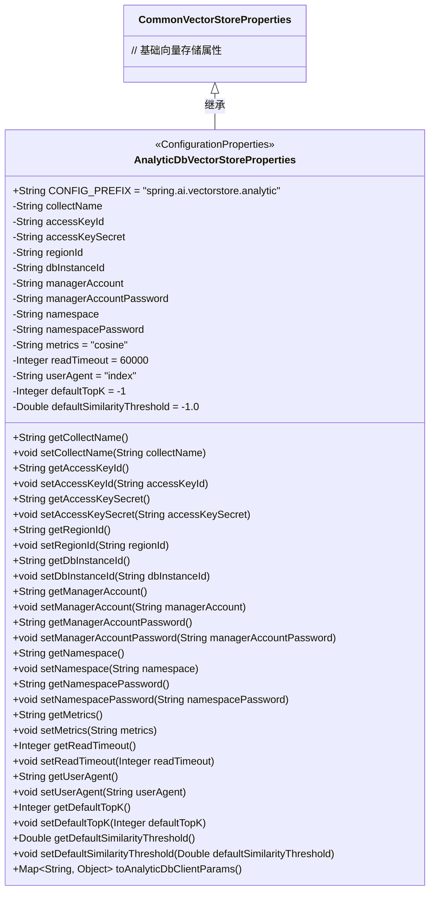

# 基础信息

|      |      |
|------|------|
| 名称 | AnalyticDbVectorStoreProperties |
| 编码语言 | .java |
| 代码路径 | spring-ai-alibaba/community/vector-stores/spring-ai-alibaba-starter-analyticdb-store/src/main/java/com/alibaba/cloud/ai/vectorstore/analyticdb/AnalyticDbVectorStoreProperties.java |
| 包名 | com.alibaba.cloud.ai.vectorstore.analyticdb |
| 依赖项 | ['org.springframework.ai.autoconfigure.vectorstore.CommonVectorStoreProperties', 'org.springframework.boot.context.properties.ConfigurationProperties', 'java.util.HashMap', 'java.util.Map'] |
| 概述说明 | AnalyticDbVectorStoreProperties类配置连接AnalyticDB的参数，如访问密钥、区域ID和超时设置。 |

# 说明

AnalyticDbVectorStoreProperties类用于配置连接AnalyticDB所需的参数，包括访问密钥、区域ID和超时设置等关键信息，确保与AnalyticDB的有效连接和操作。

# 类列表 Class Summary

| 名称   | 类型  | 说明 |
|-------|------|-------------|
| AnalyticDbVectorStoreProperties | class | AnalyticDbVectorStoreProperties类包含配置参数，用于连接AnalyticDB，提供访问密钥、区域ID、超时等设置。 |

## 类 AnalyticDbVectorStoreProperties

|      |      |
|------|------|
| 访问范围 | @ConfigurationProperties(AnalyticDbVectorStoreProperties.CONFIG_PREFIX);public |
| 类型 | class |
| 名称 | AnalyticDbVectorStoreProperties |
| 说明 | AnalyticDbVectorStoreProperties类包含配置参数，用于连接AnalyticDB，提供访问密钥、区域ID、超时等设置。 |

### UML类图

**描述：**  
`AnalyticDbVectorStoreProperties` 类继承自 `CommonVectorStoreProperties`，用于配置与分析数据库相关的向量存储属性。该类包含多个私有属性，如 `collectName`、`accessKeyId` 等，并提供了相应的 getter 和 setter 方法。此外，`toAnalyticDbClientParams` 方法将部分属性转换为 Map 格式，便于传递给分析数据库客户端。该类通过 `@ConfigurationProperties` 注解与配置文件绑定，配置前缀为 `spring.ai.vectorstore.analytic`。

### 内部方法调用关系图

```mermaid
graph TD
    A["类AnalyticDbVectorStoreProperties"]
    B["继承自CommonVectorStoreProperties"]
    C["属性: String collectName"]
    D["属性: String accessKeyId"]
    E["属性: String accessKeySecret"]
    F["属性: String regionId"]
    G["属性: String dbInstanceId"]
    H["属性: String managerAccount"]
    I["属性: String managerAccountPassword"]
    J["属性: String namespace"]
    K["属性: String namespacePassword"]
    L["属性: String metrics = 'cosine'"]
    M["属性: Integer readTimeout = 60000"]
    N["属性: String userAgent = 'index'"]
    O["属性: Integer defaultTopK = -1"]
    P["属性: Double defaultSimilarityThreshold = -1.0"]
    Q["方法: String getCollectName()"]
    R["方法: void setCollectName(String collectName)"]
    S["方法: String getAccessKeyId()"]
    T["方法: void setAccessKeyId(String accessKeyId)"]
    U["方法: String getAccessKeySecret()"]
    V["方法: void setAccessKeySecret(String accessKeySecret)"]
    W["方法: String getRegionId()"]
    X["方法: void setRegionId(String regionId)"]
    Y["方法: String getDbInstanceId()"]
    Z["方法: void setDbInstanceId(String dbInstanceId)"]
    AA["方法: String getManagerAccount()"]
    AB["方法: void setManagerAccount(String managerAccount)"]
    AC["方法: String getManagerAccountPassword()"]
    AD["方法: void setManagerAccountPassword(String managerAccountPassword)"]
    AE["方法: String getNamespace()"]
    AF["方法: void setNamespace(String namespace)"]
    AG["方法: String getNamespacePassword()"]
    AH["方法: void setNamespacePassword(String namespacePassword)"]
    AI["方法: String getMetrics()"]
    AJ["方法: void setMetrics(String metrics)"]
    AK["方法: Integer getReadTimeout()"]
    AL["方法: void setReadTimeout(Integer readTimeout)"]
    AM["方法: String getUserAgent()"]
    AN["方法: void setUserAgent(String userAgent)"]
    AO["方法: Integer getDefaultTopK()"]
    AP["方法: void setDefaultTopK(Integer defaultTopK)"]
    AQ["方法: Double getDefaultSimilarityThreshold()"]
    AR["方法: void setDefaultSimilarityThreshold(Double defaultSimilarityThreshold)"]
    AS["方法: Map<String, Object> toAnalyticDbClientParams()"]

    A --> B
    A --> C
    A --> D
    A --> E
    A --> F
    A --> G
    A --> H
    A --> I
    A --> J
    A --> K
    A --> L
    A --> M
    A --> N
    A --> O
    A --> P
    A --> Q
    A --> R
    A --> S
    A --> T
    A --> U
    A --> V
    A --> W
    A --> X
    A --> Y
    A --> Z
    A --> AA
    A --> AB
    A --> AC
    A --> AD
    A --> AE
    A --> AF
    A --> AG
    A --> AH
    A --> AI
    A --> AJ
    A --> AK
    A --> AL
    A --> AM
    A --> AN
    A --> AO
    A --> AP
    A --> AQ
    A --> AR
    A --> AS
```

这段代码定义了一个名为`AnalyticDbVectorStoreProperties`的类，继承自`CommonVectorStoreProperties`。该类包含多个属性，如`collectName`、`accessKeyId`、`accessKeySecret`等，并为每个属性提供了相应的getter和setter方法。此外，该类还包含一个`toAnalyticDbClientParams()`方法，用于将部分属性转换为`Map<String, Object>`类型。这段代码主要用于配置和管理与向量存储相关的参数。

### 字段列表 Field List

| 名称  | 类型  | 说明 |
|-------|-------|------|
| CONFIG_PREFIX = "spring.ai.vectorstore.analytic" | String | 配置前缀为"spring.ai.vectorstore.analytic"。 |
| dbInstanceId | String | 私有字符串类型变量dbInstanceId。 |
| metrics = "cosine" | String | 使用余弦相似度作为度量标准。 |
| readTimeout = 60000 | Integer | 读取超时时间设置为60000毫秒。 |
| regionId | String | 定义了一个私有字符串变量regionId。 |
| namespacePassword | String | 私有字符串变量命名空间密码。 |
| userAgent = "index" | String | 私有字符串变量userAgent初始化为"index"。 |
| namespace | String | 定义了一个私有的字符串变量`namespace`。 |
| managerAccountPassword | String | 管理账户密码为私有字符串类型。 |
| accessKeySecret | String | 定义了一个私有字符串变量accessKeySecret。 |
| collectName | String | 定义私有字符串变量collectName。 |
| accessKeyId | String | 声明一个私有字符串变量accessKeyId。 |
| managerAccount | String | 定义了一个私有字符串变量managerAccount。 |
| defaultSimilarityThreshold = -1.0 | Double | 默认相似度阈值为-1.0。 |
| defaultTopK = -1 | Integer | 默认TopK值设为-1。 |

### 方法列表 Method List

| 名称  | 类型  | 说明 |
|-------|-------|------|
| setReadTimeout | void | 设置读取超时时间为指定值。 |
| getNamespace | String | 该方法返回命名空间字符串。 |
| getAccessKeyId | String | 获取accessKeyId的方法。 |
| setManagerAccountPassword | void | 设置管理员账户密码的方法。 |
| getUserAgent | String | 获取用户代理字符串的方法。 |
| getManagerAccount | String | 获取经理账户的字符串方法。 |
| setDefaultSimilarityThreshold | void | 设置默认相似度阈值方法。 |
| getDbInstanceId | String | 获取数据库实例ID的方法。 |
| getManagerAccountPassword | String | 获取管理员账户密码的方法。 |
| getReadTimeout | Integer | 获取读取超时时间的整数值。 |
| setNamespacePassword | void | 设置命名空间密码的方法。 |
| getAccessKeySecret | String | 获取访问密钥的私有方法。 |
| setAccessKeyId | void | 设置访问密钥ID的方法。 |
| setDefaultTopK | void | 设置默认TopK值的方法。 |
| getCollectName | String | 获取collectName属性的字符串值。 |
| setUserAgent | void | 设置用户代理字符串的方法。 |
| getMetrics | String | 获取metrics字符串的方法。 |
| toAnalyticDbClientParams | Map<String, Object> | 将对象属性转换为分析数据库客户端参数。 |
| setDbInstanceId | void | 设置数据库实例ID的方法。 |
| getNamespacePassword | String | 获取命名空间密码的方法。 |
| setManagerAccount | void | 设置经理账户的方法。 |
| setRegionId | void | 设置区域ID的方法。 |
| getDefaultTopK | Integer | 该方法返回默认的TopK值。 |
| setNamespace | void | 设置命名空间的方法，接受字符串参数并赋值给类成员变量。 |
| getRegionId | String | 获取regionId的公共方法。 |
| setCollectName | void | 设置收集名称的方法，将传入的collectName赋值给当前对象的collectName属性。 |
| setMetrics | void | 设置metrics属性的方法，将传入的metrics赋值给当前对象的metrics。 |
| setAccessKeySecret | void | 设置访问密钥的方法。 |
| getDefaultSimilarityThreshold | Double | 获取默认相似度阈值的方法。 |

