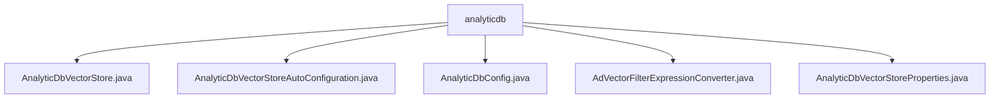

# 基础信息

|      |      |
|------|------|
| 名称 | analyticdb |
| 编码语言 | .java |
| 代码路径 | spring-ai-alibaba/community/vector-stores/spring-ai-alibaba-starter-analyticdb-store/src/main/java/com/alibaba/cloud/ai/vectorstore/analyticdb |
| 包名 | spring-ai-alibaba.community.vector-stores.spring-ai-alibaba-starter-analyticdb-store.src.main.java.com.alibaba.cloud.ai.vectorstore.analyticdb |
| 概述说明 | AnalyticDbVectorStore类管理向量数据库，支持初始化、命名空间创建、文档增删查。AutoConfiguration类自动配置相关Bean。Config类存储数据库连接参数。FilterExpressionConverter类处理表达式转换。Properties类配置连接参数。 |

# 说明

## 概述

该代码模块是一个用于管理向量数据库的工具集，主要围绕`AnalyticDbVectorStore`类展开。模块提供了从数据库配置、自动配置、表达式转换到向量数据库操作的全套功能。通过`AnalyticDbVectorStore`类，用户可以高效地进行向量数据的增加、删除和查询操作。同时，模块通过`AnalyticDbVectorStoreAutoConfiguration`类实现了自动配置，简化了使用流程。其他辅助类如`AnalyticDbConfig`、`AdVectorFilterExpressionConverter`和`AnalyticDbVectorStoreProperties`则分别负责数据库配置、表达式转换和连接参数的配置管理，确保模块的灵活性和可扩展性。

## 主要业务场景

1. **向量数据库管理**：通过`AnalyticDbVectorStore`类，用户可以初始化数据库、创建命名空间和集合，并对文档进行增删查操作。适用于需要高效管理和操作大规模向量数据的场景，如推荐系统、相似性搜索等。

2. **自动配置与集成**：`AnalyticDbVectorStoreAutoConfiguration`类负责自动创建和管理`AnalyticDbVectorStore`所需的Bean，包括Client、BatchingStrategy和VectorStore等。适用于需要快速集成向量数据库功能的Spring Boot应用。

3. **数据库配置管理**：`AnalyticDbConfig`和`AnalyticDbVectorStoreProperties`类提供了对数据库连接和操作所需的关键配置项的管理，如访问密钥、区域ID、超时设置等。适用于需要灵活配置数据库连接参数的场景。

4. **表达式转换与过滤**：`AdVectorFilterExpressionConverter`类支持将表达式转换为适合特定上下文的条件语句，特别适用于需要处理包含在指定集合内或不在指定集合内的条件判断的场景，如复杂查询和数据过滤。

该模块通过以上功能，能够满足从数据库配置到数据操作的完整需求，适用于需要高效管理和查询向量数据的应用场景。

### 包内部结构视图

该流程图展示了`analyticdb`目录下的文件结构。`analyticdb`作为根节点，包含了五个文件：`AnalyticDbVectorStore.java`、`AnalyticDbVectorStoreAutoConfiguration.java`、`AnalyticDbConfig.java`、`AdVectorFilterExpressionConverter.java`和`AnalyticDbVectorStoreProperties.java`。这些文件都属于同一个目录，没有进一步的子目录层级。

# 文件列表 File List

| 名称   | 类型  | 说明 |
|-------|------|-------------|
| [AnalyticDbVectorStoreProperties.java](AnalyticDbVectorStoreProperties.md) | file | AnalyticDbVectorStoreProperties类配置连接AnalyticDB的参数，如访问密钥、区域ID和超时设置。 |
| [AnalyticDbConfig.java](AnalyticDbConfig.md) | file | AnalyticDbConfig类包含数据库密钥、区域、实例ID等配置参数。 |
| [AnalyticDbVectorStoreAutoConfiguration.java](AnalyticDbVectorStoreAutoConfiguration.md) | file | AnalyticDbVectorStoreAutoConfiguration类自动配置Client、BatchingStrategy和VectorStore的Bean及属性。 |
| [AdVectorFilterExpressionConverter.java](AdVectorFilterExpressionConverter.md) | file | AdVectorFilterExpressionConverter类支持IN、NIN操作，生成条件语句。 |
| [AnalyticDbVectorStore.java](AnalyticDbVectorStore.md) | file | AnalyticDbVectorStore类管理向量数据库，支持初始化、命名空间、集合及文档操作。 |

