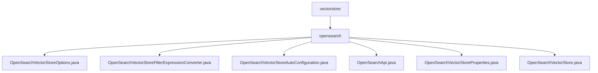

# 基础信息

|      |      |
|------|------|
| 名称 | vectorstore |
| 编码语言 | .java |
| 代码路径 | spring-ai-alibaba/community/vector-stores/spring-ai-alibaba-starter-opensearch-store/src/main/java/com/alibaba/cloud/ai/vectorstore |
| 包名 | spring-ai-alibaba.community.vector-stores.spring-ai-alibaba-starter-opensearch-store.src.main.java.com.alibaba.cloud.ai.vectorstore |
| 概述说明 | OpenSearch向量存储类及配置，支持索引管理、文档操作和相似性搜索。 |

# 说明

## 概述
该代码模块是一个基于Spring AI Alibaba的OpenSearch向量存储实现，旨在提供高效、灵活的向量存储和检索功能。模块通过多个类协同工作，实现了向量存储的配置、过滤表达式转换、自动配置、API操作、属性管理以及文档存储与检索等功能。整体设计注重性能优化和可扩展性，确保用户能够便捷地管理和操作OpenSearch服务中的向量数据。

## 主要业务场景
1. **向量存储配置**：通过`OpenSearchVectorStoreOptions`类，用户可以定义向量存储的索引结构，包括索引名称、主键字段、输出字段和向量维度，确保数据的高效存储和检索。
2. **过滤表达式转换**：`OpenSearchVectorStoreFilterExpressionConverter`类支持灵活转换过滤表达式，特别是日期格式的处理，确保在OpenSearch环境中准确解析和应用各种过滤条件。
3. **自动配置与优化**：`OpenSearchVectorStoreAutoConfiguration`类实现了OpenSearch向量存储的自动配置，涵盖批处理策略、客户端和API的集成，优化数据处理效率并简化部署。
4. **API操作**：`OpenSearchApi`类提供了与OpenSearch服务的连接和操作功能，支持创建索引、上传和删除文档，以及执行搜索查询，方便用户管理数据。
5. **属性管理**：`OpenSearchVectorStoreProperties`类用于存储和管理OpenSearch服务的配置信息，包括实例ID、端点、用户名和密码，确保连接和操作的安全性与准确性。
6. **文档存储与检索**：`OpenSearchVectorStore`类提供了文档的添加、删除以及相似性搜索功能，支持用户高效管理和查询文档，适用于需要快速检索相关文档的场景。

该模块适用于需要高效存储和检索向量数据的应用场景，如推荐系统、自然语言处理、图像识别等领域。

### 包内部结构视图

该流程图展示了`vectorstore`目录下的层级结构，`vectorstore`包含`opensearch`子目录，`opensearch`目录下包含多个与OpenSearch相关的Java文件，如`OpenSearchVectorStoreOptions.java`、`OpenSearchVectorStore.java`等。这些文件共同构成了OpenSearch向量存储模块的核心功能。

# 文件列表 File List

| 名称   | 类型  | 说明 |
|-------|------|-------------|
| [opensearch](opensearch/_module.md) | package | OpenSearch向量存储类及配置，支持索引管理、文档操作和相似性搜索。 |

