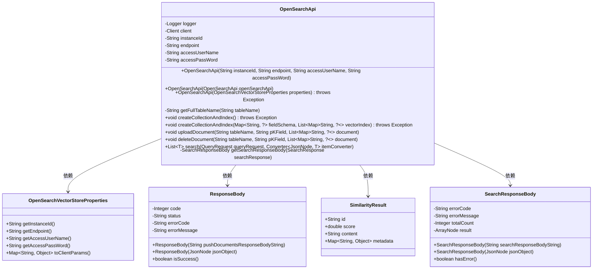

# 基础信息

|      |      |
|------|------|
| 名称 | OpenSearchApi |
| 编码语言 | .java |
| 代码路径 | spring-ai-alibaba/community/vector-stores/spring-ai-alibaba-starter-opensearch-store/src/main/java/com/alibaba/cloud/ai/vectorstore/opensearch/OpenSearchApi.java |
| 包名 | com.alibaba.cloud.ai.vectorstore.opensearch |
| 依赖项 | ['com.aliyun.ha3engine.vector.Client', 'com.aliyun.ha3engine.vector.models', 'com.aliyun.teautil.models.RuntimeOptions', 'com.fasterxml.jackson.core.JsonProcessingException', 'com.fasterxml.jackson.databind.JsonNode', 'com.fasterxml.jackson.databind.ObjectMapper', 'com.fasterxml.jackson.databind.node.ArrayNode', 'org.slf4j.Logger', 'org.slf4j.LoggerFactory', 'org.springframework.core.convert.converter.Converter', 'java.util'] |
| 概述说明 | OpenSearchApi类用于连接和操作OpenSearch服务，支持索引、文档及搜索操作。 |

# 说明

OpenSearchApi类是一个用于连接和操作OpenSearch服务的工具，支持多种操作，包括创建索引、上传和删除文档，以及执行搜索查询。通过该类，用户可以方便地管理与OpenSearch服务相关的各种任务，确保数据的高效存储和检索。

# 类列表 Class Summary

| 名称   | 类型  | 说明 |
|-------|------|-------------|
| OpenSearchApi | class | OpenSearchApi类用于连接和操作OpenSearch服务，支持创建索引、上传删除文档及执行搜索查询。 |

## 类 OpenSearchApi

|      |      |
|------|------|
| 访问范围 | public |
| 类型 | class |
| 名称 | OpenSearchApi |
| 说明 | OpenSearchApi类用于连接和操作OpenSearch服务，支持创建索引、上传删除文档及执行搜索查询。 |

### UML类图

### 描述
`OpenSearchApi` 类用于与 OpenSearch 服务进行交互，提供了创建索引、上传文档、删除文档和搜索文档等功能。它依赖于 `OpenSearchVectorStoreProperties` 类来获取配置信息，并通过 `ResponseBody` 和 `SearchResponseBody` 类处理响应数据。`SimilarityResult` 类用于存储搜索结果的相关信息。该类的设计旨在简化与 OpenSearch 服务的集成，并提供清晰的错误处理和日志记录机制。

### 内部方法调用关系图

```mermaid
graph TD
    A["类OpenSearchApi"]
    B["属性: Logger logger"]
    C["属性: Client client"]
    D["属性: String instanceId"]
    E["属性: String endpoint"]
    F["属性: String accessUserName"]
    G["属性: String accessPassWord"]
    H["构造方法: OpenSearchApi(String instanceId, String endpoint, String accessUserName, String accessPassWord)"]
    I["构造方法: OpenSearchApi(OpenSearchApi openSearchApi)"]
    J["构造方法: OpenSearchApi(OpenSearchVectorStoreProperties properties)"]
    K["方法: String getFullTableName(String tableName)"]
    L["方法: void createCollectionAndIndex()"]
    M["方法: void createCollectionAndIndex(Map<String, ?> fieldSchema, List<Map<String, ?>> vectorIndex)"]
    N["方法: void uploadDocument(String tableName, String pKField, List<Map<String, ?>> document)"]
    O["方法: void deleteDocument(String tableName, String pKField, List<Map<String, ?>> document)"]
    P["方法: List<T> search(QueryRequest queryRequest, Converter<JsonNode, T> itemConverter)"]
    Q["方法: SearchResponseBody getSearchResponseBody(SearchResponse searchResponse)"]
    R["内部类: ResponseBody"]
    S["内部类: SimilarityResult"]
    T["内部类: SearchResponseBody"]

    A --> B
    A --> C
    A --> D
    A --> E
    A --> F
    A --> G
    A --> H
    A --> I
    A --> J
    A --> K
    A --> L
    A --> M
    A --> N
    A --> O
    A --> P
    A --> Q
    A --> R
    A --> S
    A --> T
```

**描述：**  
该流程图展示了`OpenSearchApi`类的结构，包括其属性、构造方法、主要方法以及内部类。`OpenSearchApi`类用于与OpenSearch服务进行交互，提供了创建集合和索引、上传和删除文档、执行搜索查询等功能。流程图清晰地展示了类的各个组成部分及其相互关系，帮助理解类的整体设计和工作流程。

### 字段列表 Field List

| 名称  | 类型  | 说明 |
|-------|-------|------|
| client | Client | 声明一个不可变的客户端对象。 |
| endpoint | String | 定义了一个私有不可变的字符串变量endpoint。 |
| accessPassWord | String | 私有字符串变量accessPassWord。 |
| logger = LoggerFactory.getLogger(OpenSearchApi.class) | Logger | 定义私有静态日志记录器，用于OpenSearchApi类的日志记录。 |
| instanceId | String | 私有字符串变量instanceId。 |
| accessUserName | String | 私有字符串变量accessUserName用于存储访问用户名。 |

### 方法列表 Method List

| 名称  | 类型  | 说明 |
|-------|-------|------|
| search | List<T> | 搜索方法处理查询请求，转换结果并返回文档列表。 |
| deleteDocument | void | 删除OpenSearch文档，处理响应并抛出异常。 |
| createCollectionAndIndex | void | 创建集合和索引，处理字段模式和向量索引，发送请求并检查结果。 |
| uploadDocument | void | 方法上传文档至OpenSearch，处理成功或失败响应，异常时抛出错误信息。 |
| getFullTableName | String | 该方法返回拼接实例ID和表名的完整表名。 |
| getSearchResponseBody | SearchResponseBody | 方法提取搜索响应体，检查错误并抛出异常，否则返回响应体。 |
| createCollectionAndIndex | void | 创建OpenSearch表并初始化索引，检查请求ID，失败抛出异常，成功记录日志。 |

