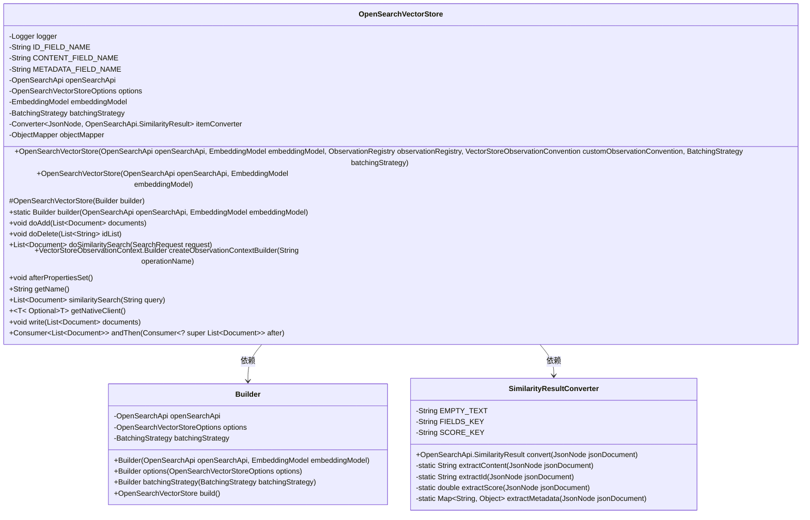

# 基础信息

|      |      |
|------|------|
| 名称 | OpenSearchVectorStore |
| 编码语言 | .java |
| 代码路径 | spring-ai-alibaba/community/vector-stores/spring-ai-alibaba-starter-opensearch-store/src/main/java/com/alibaba/cloud/ai/vectorstore/opensearch/OpenSearchVectorStore.java |
| 包名 | com.alibaba.cloud.ai.vectorstore.opensearch |
| 依赖项 | ['com.aliyun.ha3engine.vector.models.QueryRequest', 'com.fasterxml.jackson.core.JsonProcessingException', 'com.fasterxml.jackson.databind.JsonNode', 'com.fasterxml.jackson.databind.ObjectMapper', 'io.micrometer.observation.ObservationRegistry', 'org.jetbrains.annotations.NotNull', 'org.slf4j.Logger', 'org.slf4j.LoggerFactory', 'org.springframework.ai.document.Document', 'org.springframework.ai.embedding.BatchingStrategy', 'org.springframework.ai.embedding.EmbeddingModel', 'org.springframework.ai.embedding.TokenCountBatchingStrategy', 'org.springframework.ai.vectorstore.AbstractVectorStoreBuilder', 'org.springframework.ai.vectorstore.SearchRequest', 'org.springframework.ai.vectorstore.observation.AbstractObservationVectorStore', 'org.springframework.ai.vectorstore.observation.VectorStoreObservationContext', 'org.springframework.ai.vectorstore.observation.VectorStoreObservationConvention', 'org.springframework.beans.factory.InitializingBean', 'org.springframework.core.convert.converter.Converter', 'org.springframework.util.Assert', 'java.util', 'java.util.function.Consumer', 'java.util.stream.Collectors'] |
| 概述说明 | OpenSearchVectorStore类管理文档存储，支持增删和相似性搜索。 |

# 说明

OpenSearchVectorStore类是一种用于管理文档存储的工具，提供了文档的添加、删除以及相似性搜索功能。该类能够高效地处理文档的存储和检索，支持用户通过相似性搜索快速找到相关文档，适用于需要高效管理和查询文档的场景。

# 类列表 Class Summary

| 名称   | 类型  | 说明 |
|-------|------|-------------|
| OpenSearchVectorStore | class | OpenSearchVectorStore类用于管理文档存储，支持添加、删除和相似性搜索操作。 |

## 类 OpenSearchVectorStore

|      |      |
|------|------|
| 访问范围 | public |
| 类型 | class |
| 名称 | OpenSearchVectorStore |
| 说明 | OpenSearchVectorStore类用于管理文档存储，支持添加、删除和相似性搜索操作。 |

### UML类图

### 描述：
`OpenSearchVectorStore` 类是一个用于与 OpenSearch 进行交互的向量存储实现，继承自 `AbstractObservationVectorStore` 并实现了 `InitializingBean` 接口。它通过 `OpenSearchApi` 与 OpenSearch 进行通信，并使用 `EmbeddingModel` 进行向量操作。`Builder` 类用于构建 `OpenSearchVectorStore` 实例，而 `SimilarityResultConverter` 类用于将 JSON 文档转换为 `SimilarityResult` 对象。该类支持文档的添加、删除和相似性搜索操作，并通过 `afterPropertiesSet` 方法在初始化时创建集合和索引。

### 内部方法调用关系图

```mermaid
graph TD
    A["类OpenSearchVectorStore"]
    B["属性: Logger logger"]
    C["属性: String ID_FIELD_NAME"]
    D["属性: String CONTENT_FIELD_NAME"]
    E["属性: String METADATA_FIELD_NAME"]
    F["属性: OpenSearchApi openSearchApi"]
    G["属性: OpenSearchVectorStoreOptions options"]
    H["属性: EmbeddingModel embeddingModel"]
    I["属性: BatchingStrategy batchingStrategy"]
    J["属性: Converter<JsonNode, SimilarityResult> itemConverter"]
    K["属性: ObjectMapper objectMapper"]
    L["构造方法: OpenSearchVectorStore(OpenSearchApi, EmbeddingModel, ObservationRegistry, VectorStoreObservationConvention, BatchingStrategy)"]
    M["构造方法: OpenSearchVectorStore(OpenSearchApi, EmbeddingModel)"]
    N["构造方法: OpenSearchVectorStore(Builder)"]
    O["方法: Builder builder(OpenSearchApi, EmbeddingModel)"]
    P["方法: void doAdd(List<Document>)"]
    Q["方法: void doDelete(List<String>)"]
    R["方法: List<Document> doSimilaritySearch(SearchRequest)"]
    S["方法: VectorStoreObservationContext.Builder createObservationContextBuilder(String)"]
    T["方法: void afterPropertiesSet()"]
    U["方法: String getName()"]
    V["方法: List<Document> similaritySearch(String)"]
    W["方法: <T> Optional<T> getNativeClient()"]
    X["方法: void write(List<Document>)"]
    Y["方法: Consumer<List<Document>> andThen(Consumer<? super List<Document>>)"]
    Z["类Builder"]
    AA["属性: OpenSearchApi openSearchApi"]
    AB["属性: OpenSearchVectorStoreOptions options"]
    AC["属性: BatchingStrategy batchingStrategy"]
    AD["构造方法: Builder(OpenSearchApi, EmbeddingModel)"]
    AE["方法: Builder options(OpenSearchVectorStoreOptions)"]
    AF["方法: Builder batchingStrategy(BatchingStrategy)"]
    AG["方法: OpenSearchVectorStore build()"]
    AH["类SimilarityResultConverter"]
    AI["方法: String extractContent(JsonNode)"]
    AJ["方法: String extractId(JsonNode)"]
    AK["方法: double extractScore(JsonNode)"]
    AL["方法: Map<String, Object> extractMetadata(JsonNode)"]
    AM["方法: SimilarityResult convert(JsonNode)"]

    A --> B
    A --> C
    A --> D
    A --> E
    A --> F
    A --> G
    A --> H
    A --> I
    A --> J
    A --> K
    A --> L
    A --> M
    A --> N
    A --> O
    A --> P
    A --> Q
    A --> R
    A --> S
    A --> T
    A --> U
    A --> V
    A --> W
    A --> X
    A --> Y
    A --> Z
    Z --> AA
    Z --> AB
    Z --> AC
    Z --> AD
    Z --> AE
    Z --> AF
    Z --> AG
    A --> AH
    AH --> AI
    AH --> AJ
    AH --> AK
    AH --> AL
    AH --> AM
```

这段代码描述了一个名为 `OpenSearchVectorStore` 的类，它继承自 `AbstractObservationVectorStore` 并实现了 `InitializingBean` 接口。该类主要用于与 OpenSearch 进行交互，处理文档的添加、删除和相似性搜索等操作。代码中还包含了一个内部类 `Builder`，用于构建 `OpenSearchVectorStore` 实例，以及一个 `SimilarityResultConverter` 类，用于将 JSON 数据转换为 `SimilarityResult` 对象。整体代码结构清晰，功能明确，适合用于处理大规模文档的存储和检索任务。

### 字段列表 Field List

| 名称  | 类型  | 说明 |
|-------|-------|------|
| embeddingModel | EmbeddingModel | 私有且不可变的嵌入模型实例。 |
| logger = LoggerFactory.getLogger(OpenSearchVectorStore.class) | Logger | 定义OpenSearchVectorStore类的私有静态日志记录器。 |
| batchingStrategy | BatchingStrategy | 私有最终变量batchingStrategy表示批处理策略。 |
| options | OpenSearchVectorStoreOptions | 私有且不可变的OpenSearch向量存储选项对象。 |
| CONTENT_FIELD_NAME = "content" | String | 定义私有静态常量CONTENT_FIELD_NAME，值为"content"。 |
| METADATA_FIELD_NAME = "metadata" | String | 定义私有静态常量字符串变量"metadata"。 |
| openSearchApi | com.alibaba.cloud.ai.vectorstore.opensearch.OpenSearchApi | 私有OpenSearchApi实例用于向量存储操作。 |
| objectMapper = new ObjectMapper() | ObjectMapper | 创建私有ObjectMapper对象实例。 |
| itemConverter = new SimilarityResultConverter() | Converter<JsonNode, com.alibaba.cloud.ai.vectorstore.opensearch.OpenSearchApi.SimilarityResult> | 私有转换器将JsonNode转为OpenSearchApi的SimilarityResult。 |
| ID_FIELD_NAME = "id" | String | 定义了一个私有静态常量字符串变量，名为ID_FIELD_NAME，值为"id"。 |

### 方法列表 Method List

| 名称  | 类型  | 说明 |
|-------|-------|------|
| getName | String | 重写getName方法，返回父类的getName结果。 |
| similaritySearch | List<Document> | 重写相似度搜索方法，调用父类实现。 |
| doSimilaritySearch | List<Document> | 执行相似性搜索，过滤结果并返回符合阈值的文档列表。 |
| andThen | Consumer<List<Document>> | 重写方法，返回父类的andThen结果。 |
| doAdd | void | 方法doAdd遍历文档列表，将每个文档的ID、内容和元数据转换为JSON，并上传至OpenSearch。 |
| write | void | 重写write方法，调用父类方法处理文档列表。 |
| getNativeClient | Optional<T> | 重写方法返回父类的原生客户端对象。 |
| doDelete | void | 方法`doDelete`遍历ID列表，构建删除文档并调用API删除。 |
| createObservationContextBuilder | VectorStoreObservationContext.Builder | 重写方法，返回空观察上下文构建器。 |
| builder | Builder | 静态方法`builder`接收`OpenSearchApi`和`EmbeddingModel`参数，返回`Builder`实例。 |
| afterPropertiesSet | void | 重写方法，初始化后调用openSearchApi创建集合和索引。 |

