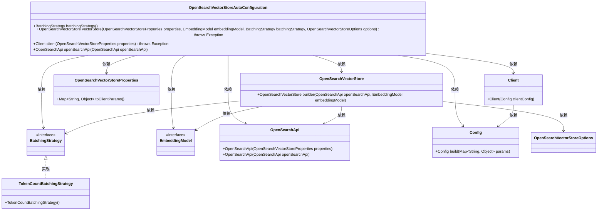
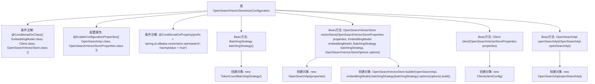

# 基础信息

|      |      |
|------|------|
| 名称 | OpenSearchVectorStoreAutoConfiguration |
| 编码语言 | .java |
| 代码路径 | spring-ai-alibaba/community/vector-stores/spring-ai-alibaba-starter-opensearch-store/src/main/java/com/alibaba/cloud/ai/vectorstore/opensearch/OpenSearchVectorStoreAutoConfiguration.java |
| 包名 | com.alibaba.cloud.ai.vectorstore.opensearch |
| 依赖项 | ['com.aliyun.ha3engine.vector.Client', 'com.aliyun.ha3engine.vector.models.Config', 'org.springframework.ai.embedding.BatchingStrategy', 'org.springframework.ai.embedding.EmbeddingModel', 'org.springframework.ai.embedding.TokenCountBatchingStrategy', 'org.springframework.boot.autoconfigure.AutoConfiguration', 'org.springframework.boot.autoconfigure.condition.ConditionalOnClass', 'org.springframework.boot.autoconfigure.condition.ConditionalOnMissingBean', 'org.springframework.boot.autoconfigure.condition.ConditionalOnProperty', 'org.springframework.boot.context.properties.EnableConfigurationProperties', 'org.springframework.context.annotation.Bean', 'org.springframework.context.annotation.DependsOn'] |
| 概述说明 | 自动配置OpenSearch向量存储，支持批处理、客户端和API。 |

# 说明

自动配置OpenSearch向量存储，涵盖批处理策略、客户端和API的集成。通过批处理策略优化数据处理效率，客户端实现与OpenSearch的连接与交互，API提供便捷的接口调用。整体配置旨在简化向量存储的部署与管理，提升系统性能与可扩展性。

# 类列表 Class Summary

| 名称   | 类型  | 说明 |
|-------|------|-------------|
| OpenSearchVectorStoreAutoConfiguration | class | 自动配置OpenSearch向量存储，包含批处理策略、客户端和API。 |

## 类 OpenSearchVectorStoreAutoConfiguration

|      |      |
|------|------|
| 访问范围 | @AutoConfiguration;@ConditionalOnClass({ EmbeddingModel.class, Client.class, OpenSearchVectorStore.class });@EnableConfigurationProperties({ OpenSearchApi.class, OpenSearchVectorStoreProperties.class });@ConditionalOnProperty(prefix = "spring.ai.alibaba.vectorstore.opensearch", havingValue = "true");public |
| 类型 | class |
| 名称 | OpenSearchVectorStoreAutoConfiguration |
| 说明 | 自动配置OpenSearch向量存储，包含批处理策略、客户端和API。 |

### UML类图

**描述：**  
`OpenSearchVectorStoreAutoConfiguration` 是一个自动配置类，用于在 Spring 应用中配置 OpenSearch 向量存储相关的 Bean。它依赖于多个接口和类，如 `BatchingStrategy`、`OpenSearchVectorStore`、`OpenSearchVectorStoreProperties`、`EmbeddingModel`、`OpenSearchApi`、`Client` 和 `Config`。该类通过条件注解确保在特定条件下创建这些 Bean，并管理它们之间的依赖关系。`TokenCountBatchingStrategy` 是 `BatchingStrategy` 接口的一个具体实现，用于批处理策略的管理。

### 内部方法调用关系图

**描述：**  
该流程图展示了`OpenSearchVectorStoreAutoConfiguration`类的结构和内部方法调用关系。该类通过多个条件注解和配置属性来控制Bean的创建，包括`BatchingStrategy`、`OpenSearchVectorStore`、`Client`和`OpenSearchApi`等。每个Bean方法在满足特定条件时创建相应的对象，并且部分Bean依赖于其他Bean的存在。

### 字段列表 Field List

| 名称  | 类型  | 说明 |
|-------|-------|------|

### 方法列表 Method List

| 名称  | 类型  | 说明 |
|-------|-------|------|
| client | Client | 基于属性配置创建OpenSearch客户端实例。 |
| openSearchApi | OpenSearchApi | 条件缺失时，依赖client创建OpenSearchApi实例。 |
| vectorStore | OpenSearchVectorStore | 创建OpenSearchVectorStore，依赖embeddingModel和openSearchApi，支持批处理和选项配置。 |
| batchingStrategy | BatchingStrategy | 在缺少BatchingStrategy时，默认使用TokenCountBatchingStrategy。 |

