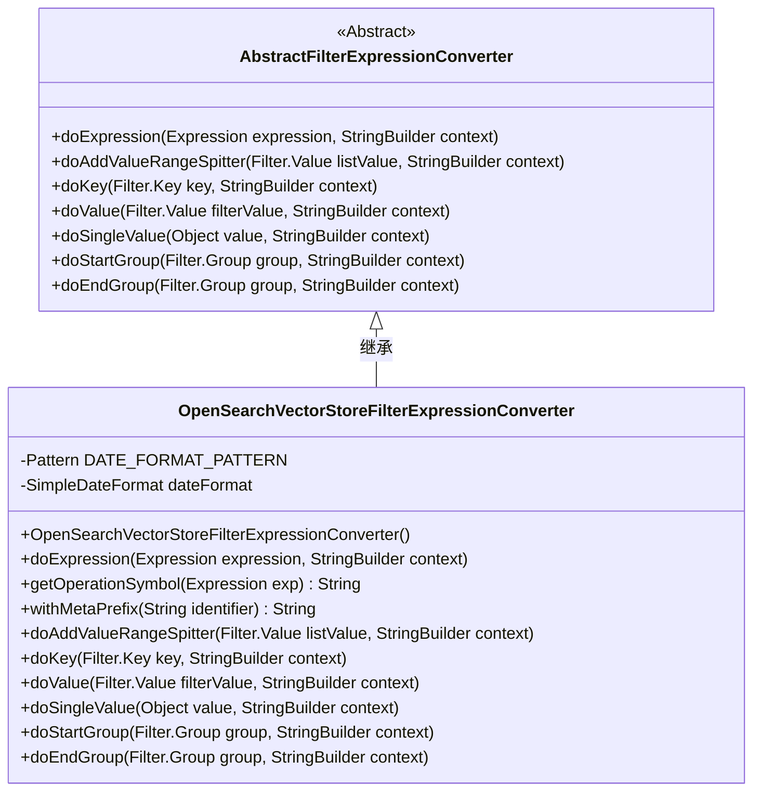

# 基础信息

|      |      |
|------|------|
| 名称 | OpenSearchVectorStoreFilterExpressionConverter |
| 编码语言 | .java |
| 代码路径 | spring-ai-alibaba/community/vector-stores/spring-ai-alibaba-starter-opensearch-store/src/main/java/com/alibaba/cloud/ai/vectorstore/opensearch/OpenSearchVectorStoreFilterExpressionConverter.java |
| 包名 | com.alibaba.cloud.ai.vectorstore.opensearch |
| 依赖项 | ['org.springframework.ai.vectorstore.filter.Filter', 'org.springframework.ai.vectorstore.filter.Filter.Expression', 'org.springframework.ai.vectorstore.filter.converter.AbstractFilterExpressionConverter', 'java.text.ParseException', 'java.text.SimpleDateFormat', 'java.time.ZoneId', 'java.time.ZoneOffset', 'java.util.Date', 'java.util.List', 'java.util.TimeZone', 'java.util.regex.Pattern'] |
| 概述说明 | OpenSearchVectorStoreFilterExpressionConverter类转换过滤表达式，支持日期格式和多种操作符。 |

# 说明

OpenSearchVectorStoreFilterExpressionConverter类的主要功能是转换过滤表达式，特别支持日期格式的处理，并兼容多种操作符的使用。该类的设计旨在提供灵活的过滤表达式转换能力，确保在OpenSearch环境中能够准确解析和应用各种过滤条件。

# 类列表 Class Summary

| 名称   | 类型  | 说明 |
|-------|------|-------------|
| OpenSearchVectorStoreFilterExpressionConverter | class | OpenSearchVectorStoreFilterExpressionConverter类用于转换过滤表达式，支持日期格式和多种操作符。 |

## 类 OpenSearchVectorStoreFilterExpressionConverter

|      |      |
|------|------|
| 访问范围 | public |
| 类型 | class |
| 名称 | OpenSearchVectorStoreFilterExpressionConverter |
| 说明 | OpenSearchVectorStoreFilterExpressionConverter类用于转换过滤表达式，支持日期格式和多种操作符。 |

### UML类图

### 描述
`OpenSearchVectorStoreFilterExpressionConverter` 类继承自 `AbstractFilterExpressionConverter`，用于将过滤表达式转换为 OpenSearch 可识别的格式。该类包含日期格式的正则表达式和日期格式化工具，并重写了父类的多个方法，如 `doExpression`、`doKey`、`doValue` 等，以处理不同类型的过滤条件和值。通过 `withMetaPrefix` 方法，可以为标识符添加前缀，确保生成的查询语句符合 OpenSearch 的元数据格式要求。

### 内部方法调用关系图

```mermaid
graph TD
    A["类OpenSearchVectorStoreFilterExpressionConverter"]
    B["属性: Pattern DATE_FORMAT_PATTERN"]
    C["属性: SimpleDateFormat dateFormat"]
    D["构造方法: OpenSearchVectorStoreFilterExpressionConverter()"]
    E["方法: void doExpression(Expression expression, StringBuilder context)"]
    F["方法: String getOperationSymbol(Expression exp)"]
    G["方法: String withMetaPrefix(String identifier)"]
    H["方法: void doAddValueRangeSpitter(Filter.Value listValue, StringBuilder context)"]
    I["方法: void doKey(Filter.Key key, StringBuilder context)"]
    J["方法: void doValue(Filter.Value filterValue, StringBuilder context)"]
    K["方法: void doSingleValue(Object value, StringBuilder context)"]
    L["方法: void doStartGroup(Filter.Group group, StringBuilder context)"]
    M["方法: void doEndGroup(Filter.Group group, StringBuilder context)"]

    A --> B
    A --> C
    A --> D
    A --> E
    A --> F
    A --> G
    A --> H
    A --> I
    A --> J
    A --> K
    A --> L
    A --> M
```

这段代码定义了一个名为 `OpenSearchVectorStoreFilterExpressionConverter` 的类，它继承自 `AbstractFilterExpressionConverter`。该类主要用于将过滤表达式转换为特定的格式，支持多种操作符（如 `AND`、`OR`、`EQ` 等）和数据类型（如日期、字符串、列表等）。代码通过多个方法实现了表达式的解析、操作符的获取、值的处理以及分组的开始和结束标记。每个方法都有明确的职责，确保过滤表达式能够被正确转换和处理。

### 字段列表 Field List

| 名称  | 类型  | 说明 |
|-------|-------|------|
| dateFormat | SimpleDateFormat | 私有且不可变的日期格式化对象。 |
| DATE_FORMAT_PATTERN = Pattern		.compile("\\d{4}-\\d{2}-\\d{2}T\\d" + "{2}:\\d{2}:\\d{2}Z") | Pattern | 定义日期格式的正则表达式模式。 |

### 方法列表 Method List

| 名称  | 类型  | 说明 |
|-------|-------|------|
| doStartGroup | void | 方法doStartGroup在组开始时向上下文添加左括号。 |
| getOperationSymbol | String | 根据表达式类型返回对应操作符字符串。 |
| doAddValueRangeSpitter | void | 重写方法，在过滤值列表中添加"OR"分隔符。 |
| doKey | void | 处理键值，去引号加前缀并追加到上下文。 |
| doSingleValue | void | 处理单个值，格式化日期或直接追加其他类型值。 |
| doExpression | void | 根据表达式类型处理IN和NIN操作，追加符号和操作数。 |
| doEndGroup | void | 在doEndGroup方法中，向context追加右括号。 |
| withMetaPrefix | String | 该方法为给定标识符添加"metadata."前缀并返回。 |
| doValue | void | 方法处理过滤器值，列表值逐个添加，非列表值单独处理。 |

