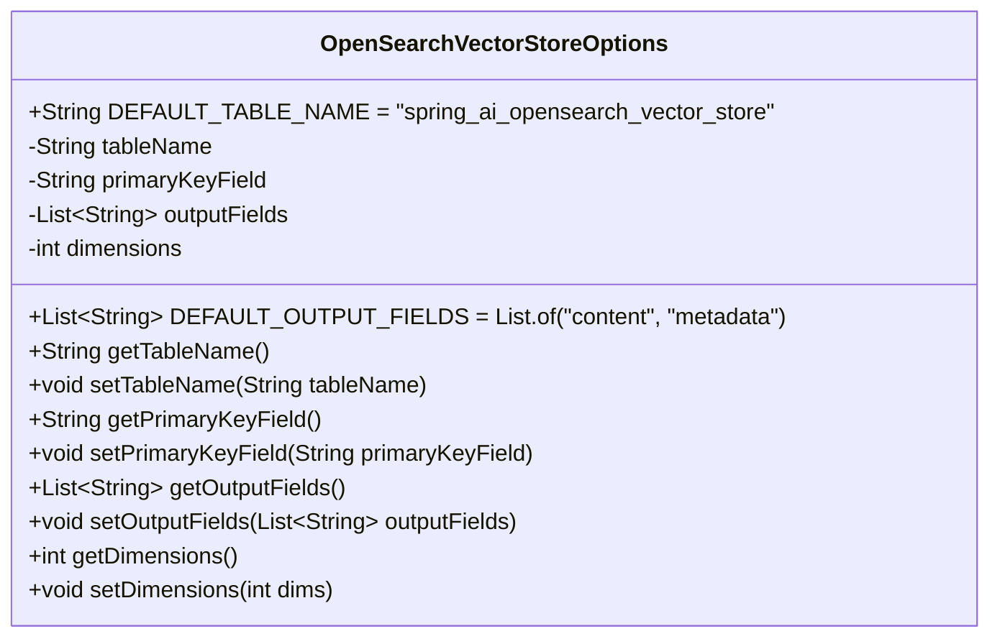

# 基础信息

|      |      |
|------|------|
| 名称 | OpenSearchVectorStoreOptions |
| 编码语言 | .java |
| 代码路径 | spring-ai-alibaba/community/vector-stores/spring-ai-alibaba-starter-opensearch-store/src/main/java/com/alibaba/cloud/ai/vectorstore/opensearch/OpenSearchVectorStoreOptions.java |
| 包名 | com.alibaba.cloud.ai.vectorstore.opensearch |
| 依赖项 | ['java.util.List'] |
| 概述说明 | OpenSearchVectorStoreOptions定义索引名称、主键、输出字段及向量维度。 |

# 说明

OpenSearchVectorStoreOptions类用于定义向量存储的相关配置，包括索引名称、主键字段、输出字段和向量维度。通过这些配置，用户可以指定存储向量的索引结构，确保数据的高效存储和检索。索引名称用于标识特定的向量存储索引，主键字段用于唯一标识每条记录，输出字段定义了存储和检索时返回的数据项，向量维度则指定了向量的长度和结构。这些配置共同确保了向量存储的准确性和可扩展性。

# 类列表 Class Summary

| 名称   | 类型  | 说明 |
|-------|------|-------------|
| OpenSearchVectorStoreOptions | class | OpenSearchVectorStoreOptions类定义向量存储索引名称、主键字段、输出字段和向量维度。 |

## 类 OpenSearchVectorStoreOptions

|      |      |
|------|------|
| 访问范围 | public |
| 类型 | class |
| 名称 | OpenSearchVectorStoreOptions |
| 说明 | OpenSearchVectorStoreOptions类定义向量存储索引名称、主键字段、输出字段和向量维度。 |

### UML类图

**描述：**  
`OpenSearchVectorStoreOptions` 类用于配置 OpenSearch 向量存储的选项。它包含默认的表名和输出字段列表，以及可配置的表名、主键字段、输出字段和向量维度。通过 getter 和 setter 方法，用户可以获取和修改这些配置选项。该类主要用于管理 OpenSearch 向量存储的索引和查询参数。

### 内部方法调用关系图

```mermaid
graph TD
    A["类OpenSearchVectorStoreOptions"]
    B["常量: DEFAULT_TABLE_NAME = 'spring_ai_opensearch_vector_store'"]
    C["常量: DEFAULT_OUTPUT_FIELDS = List.of('content', 'metadata')"]
    D["属性: String tableName = DEFAULT_TABLE_NAME"]
    E["属性: String primaryKeyField = 'id'"]
    F["属性: List<String> outputFields = DEFAULT_OUTPUT_FIELDS"]
    G["属性: int dimensions = 1536"]
    H["方法: String getTableName()"]
    I["方法: void setTableName(String tableName)"]
    J["方法: String getPrimaryKeyField()"]
    K["方法: void setPrimaryKeyField(String primaryKeyField)"]
    L["方法: List<String> getOutputFields()"]
    M["方法: void setOutputFields(List<String> outputFields)"]
    N["方法: int getDimensions()"]
    O["方法: void setDimensions(int dims)"]

    A --> B
    A --> C
    A --> D
    A --> E
    A --> F
    A --> G
    A --> H
    A --> I
    A --> J
    A --> K
    A --> L
    A --> M
    A --> N
    A --> O
```

这段代码定义了一个名为 `OpenSearchVectorStoreOptions` 的类，用于配置与OpenSearch向量存储相关的选项。类中包含多个属性，如表名、主键字段、输出字段和向量维度，并提供了相应的getter和setter方法。这些方法允许用户获取和设置这些属性的值。代码中还定义了两个常量，分别表示默认的表名和输出字段。整体结构清晰，便于扩展和维护。

### 字段列表 Field List

| 名称  | 类型  | 说明 |
|-------|-------|------|
| primaryKeyField = "id" | String | 主键字段设置为"id"。 |
| outputFields = DEFAULT_OUTPUT_FIELDS | List<String> | 默认输出字段初始化为私有列表。 |
| dimensions = 1536 | int | 维度变量设置为1536。 |
| DEFAULT_TABLE_NAME = "spring_ai_opensearch_vector_store" | String | 默认表名为“spring_ai_opensearch_vector_store”。 |
| DEFAULT_OUTPUT_FIELDS = List.of("content", "metadata") | List<String> | 定义默认输出字段为“content”和“metadata”。 |
| tableName = DEFAULT_TABLE_NAME | String | 定义私有字符串变量tableName并初始化为DEFAULT_TABLE_NAME。 |

### 方法列表 Method List

| 名称  | 类型  | 说明 |
|-------|-------|------|
| getPrimaryKeyField | String | 获取主键字段的方法。 |
| getTableName | String | 获取表名的Java方法。 |
| getDimensions | int | 该方法返回当前对象的维度值。 |
| setOutputFields | void | 设置输出字段列表的方法。 |
| setPrimaryKeyField | void | 设置主键字段方法，用于指定主键字段值。 |
| getOutputFields | List<String> | 返回输出字段列表。 |
| setDimensions | void | 设置对象的维度属性。 |
| setTableName | void | 设置表名的方法，将输入参数赋值给类的表名属性。 |

