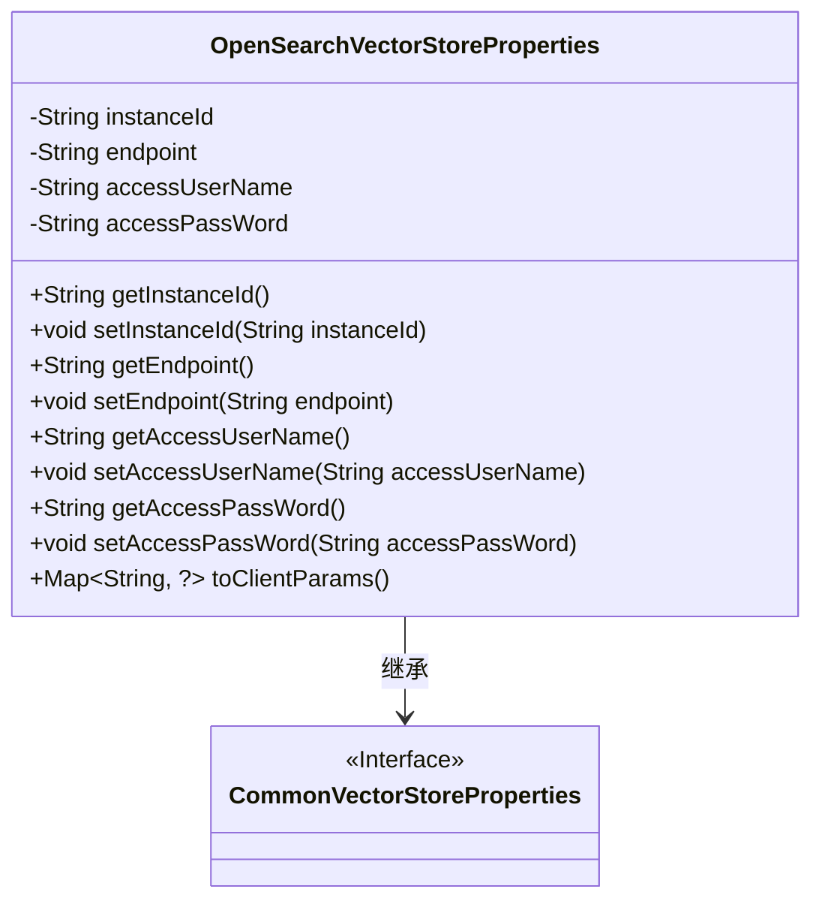
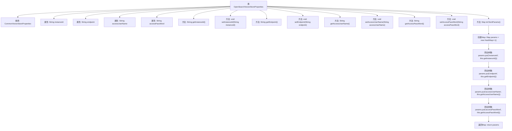

# 基础信息

|      |      |
|------|------|
| 名称 | OpenSearchVectorStoreProperties |
| 编码语言 | .java |
| 代码路径 | spring-ai-alibaba/community/vector-stores/spring-ai-alibaba-starter-opensearch-store/src/main/java/com/alibaba/cloud/ai/vectorstore/opensearch/OpenSearchVectorStoreProperties.java |
| 包名 | com.alibaba.cloud.ai.vectorstore.opensearch |
| 依赖项 | ['com.fasterxml.jackson.annotation.JsonInclude', 'org.springframework.ai.autoconfigure.vectorstore.CommonVectorStoreProperties', 'org.springframework.boot.context.properties.ConfigurationProperties', 'java.util.HashMap', 'java.util.Map'] |
| 概述说明 | OpenSearch配置类包含实例ID、端点、用户名和密码。 |

# 说明

OpenSearch向量存储配置类用于存储和管理与OpenSearch相关的配置信息。该类包含四个关键属性：实例ID、端点、用户名和密码。实例ID用于唯一标识OpenSearch实例，端点是OpenSearch服务的访问地址，用户名和密码用于身份验证和授权访问。通过这些配置，可以确保与OpenSearch服务的连接和操作的安全性及准确性。

# 类列表 Class Summary

| 名称   | 类型  | 说明 |
|-------|------|-------------|
| OpenSearchVectorStoreProperties | class | OpenSearch向量存储配置类，包含实例ID、端点、用户名和密码。 |

## 类 OpenSearchVectorStoreProperties

|      |      |
|------|------|
| 访问范围 | @ConfigurationProperties(prefix = "spring.ai.alibaba.vectorstore.opensearch");@JsonInclude(JsonInclude.Include.NON_NULL);public |
| 类型 | class |
| 名称 | OpenSearchVectorStoreProperties |
| 说明 | OpenSearch向量存储配置类，包含实例ID、端点、用户名和密码。 |

### UML类图

这段代码定义了一个 `OpenSearchVectorStoreProperties` 类，该类继承自 `CommonVectorStoreProperties` 接口。`OpenSearchVectorStoreProperties` 类包含了与 OpenSearch 向量存储相关的属性，如 `instanceId`、`endpoint`、`accessUserName` 和 `accessPassWord`，并提供了相应的 getter 和 setter 方法。此外，该类还提供了一个 `toClientParams` 方法，用于将这些属性转换为客户端参数。通过继承 `CommonVectorStoreProperties` 接口，该类具备了与向量存储相关的通用属性。

### 内部方法调用关系图

**描述：**  
`OpenSearchVectorStoreProperties`类继承自`CommonVectorStoreProperties`，用于管理OpenSearch向量存储的配置属性。类中包含四个私有属性：`instanceId`、`endpoint`、`accessUserName`和`accessPassWord`，分别用于存储实例ID、端点地址、访问用户名和访问密码。类提供了这些属性的getter和setter方法，以及一个`toClientParams`方法，该方法将这些属性封装到一个`Map`中并返回，方便后续使用。

### 字段列表 Field List

| 名称  | 类型  | 说明 |
|-------|-------|------|
| accessUserName | String | 定义私有字符串变量accessUserName。 |
| endpoint | String | 定义了一个私有字符串变量endpoint。 |
| instanceId | String | 定义了一个私有字符串变量instanceId。 |
| accessPassWord | String | 声明了一个私有的字符串类型变量accessPassWord。 |

### 方法列表 Method List

| 名称  | 类型  | 说明 |
|-------|-------|------|
| getEndpoint | String | 该方法返回一个字符串类型的端点值。 |
| setInstanceId | void | 设置实例ID的方法。 |
| setEndpoint | void | 设置端点属性的方法。 |
| getAccessUserName | String | 获取访问用户名的方法。 |
| setAccessUserName | void | 设置访问用户名的Java方法。 |
| getAccessPassWord | String | 获取访问密码的方法。 |
| toClientParams | Map<String, ?> | 将实例ID、端点、用户名和密码封装为客户端参数映射。 |
| setAccessPassWord | void | 设置访问密码的方法，将输入密码赋值给类变量。 |
| getInstanceId | String | 获取实例ID的方法。 |

