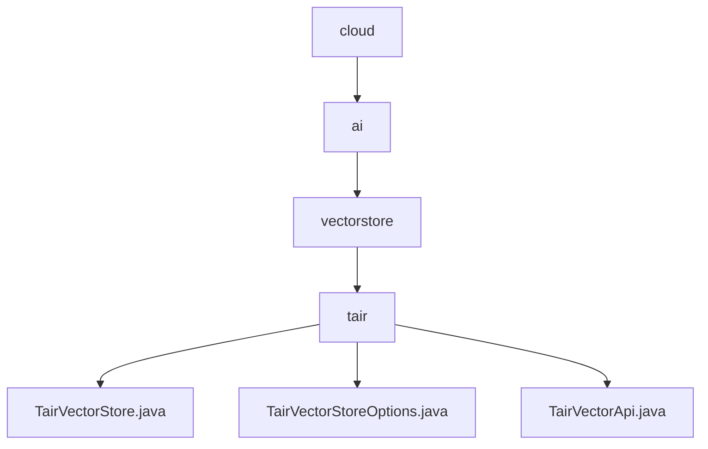

# 基础信息

|      |      |
|------|------|
| 名称 | cloud |
| 编码语言 | .java |
| 代码路径 | spring-ai-alibaba/community/vector-stores/spring-ai-alibaba-starter-tair-store/src/main/java/com/alibaba/cloud |
| 包名 | spring-ai-alibaba.community.vector-stores.spring-ai-alibaba-starter-tair-store.src.main.java.com.alibaba.cloud |
| 概述说明 | TairVectorStore类管理向量存储，支持文档添加、相似性搜索和嵌入模型操作。TairVectorStoreOptions类定义向量存储参数，包括索引名、向量维度和算法等。TairVectorApi类扩展TairVector功能，支持单个Jedis实例或连接池初始化。 |

# 说明

## 概述
该代码模块是一个用于管理Tair向量存储的工具集，旨在简化向量数据的存储、检索和处理流程。模块的核心功能包括文档的添加、相似性搜索、嵌入模型操作以及向量存储的配置管理。通过提供灵活的API和配置选项，该模块能够高效地处理向量数据，并支持基于向量相似度的搜索操作。模块的设计注重资源管理和性能优化，能够适应不同的应用场景和资源需求。

## 主要业务场景
1. **向量数据存储与检索**：通过`TairVectorStore`类，用户可以高效地存储和检索向量数据，支持基于向量相似度的搜索操作，适用于需要快速查找相似数据的场景，如推荐系统、语义搜索等。
2. **向量存储配置管理**：`TairVectorStoreOptions`类提供了向量存储的默认参数配置，包括索引名、向量维度、算法选择、距离计算方法和过期时间等，确保存储系统能够高效运行并满足不同业务需求。
3. **资源管理与性能优化**：`TairVectorApi`类支持通过单个Jedis实例或Jedis连接池进行初始化，能够灵活适应不同的资源管理需求，提升系统的资源利用率和性能表现，适用于高并发或资源受限的环境。
4. **嵌入模型操作**：模块支持与嵌入模型相关的任务，能够处理嵌入向量的生成和管理，适用于需要结合嵌入模型进行数据处理的场景，如自然语言处理、图像识别等。

### 包内部结构视图

该流程图展示了`spring-ai-alibaba`项目中与向量存储相关的模块层级关系。从`cloud`开始，依次经过`ai`、`vectorstore`，最终到达`tair`目录，并在`tair`目录下包含了三个Java文件：`TairVectorStore.java`、`TairVectorStoreOptions.java`和`TairVectorApi.java`。这些文件共同构成了该项目的向量存储功能模块。

# 文件列表 File List

| 名称   | 类型  | 说明 |
|-------|------|-------------|
| [ai](ai/_module.md) | package | TairVectorStore类管理向量存储，支持文档添加、相似性搜索和嵌入模型操作。TairVectorStoreOptions类定义向量存储参数，包括索引名、向量维度和算法等。TairVectorApi类扩展TairVector功能，支持单个Jedis实例或连接池初始化。 |

