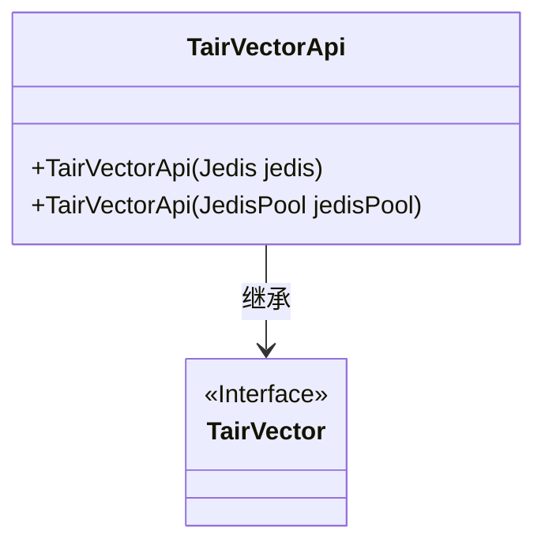
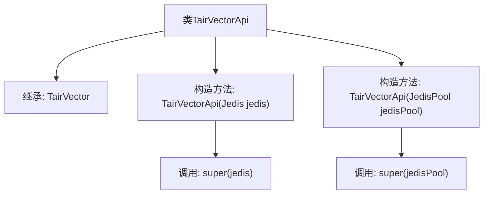

# 基础信息

|      |      |
|------|------|
| 名称 | TairVectorApi |
| 编码语言 | .java |
| 代码路径 | spring-ai-alibaba/community/vector-stores/spring-ai-alibaba-starter-tair-store/src/main/java/com/alibaba/cloud/ai/vectorstore/tair/TairVectorApi.java |
| 包名 | com.alibaba.cloud.ai.vectorstore.tair |
| 依赖项 | ['com.aliyun.tair.tairvector.TairVector', 'redis.clients.jedis.Jedis', 'redis.clients.jedis.JedisPool'] |
| 概述说明 | TairVectorApi类扩展TairVector，支持单Jedis实例或连接池初始化。 |

# 说明

TairVectorApi类扩展了TairVector功能，支持通过单个Jedis实例或Jedis连接池进行初始化。这一设计使得TairVectorApi能够灵活适应不同的资源管理需求，无论是直接使用单个Jedis实例还是通过连接池管理多个Jedis实例，都能有效提升系统的资源利用率和性能表现。

# 类列表 Class Summary

| 名称   | 类型  | 说明 |
|-------|------|-------------|
| TairVectorApi | class | TairVectorApi类扩展TairVector，支持单Jedis实例或Jedis连接池初始化。 |

## 类 TairVectorApi

|      |      |
|------|------|
| 访问范围 | public |
| 类型 | class |
| 名称 | TairVectorApi |
| 说明 | TairVectorApi类扩展TairVector，支持单Jedis实例或Jedis连接池初始化。 |

### UML类图

类图描述：`TairVectorApi`类继承自`TairVector`接口，提供了两种构造函数，分别接受`Jedis`实例和`JedisPool`连接池作为参数。该类用于与Tair Vector服务进行交互，通过继承`TairVector`接口，确保了一致的接口规范。

### 内部方法调用关系图

这段代码定义了一个名为 `TairVectorApi` 的类，该类继承自 `TairVector`。它提供了两个构造方法：一个接受 `Jedis` 实例作为参数，另一个接受 `JedisPool` 连接池作为参数。在构造方法中，分别调用了父类 `TairVector` 的相应构造方法。这段代码主要用于初始化与 Tair Vector 服务的连接，支持单实例和连接池两种方式。

### 字段列表 Field List

| 名称  | 类型  | 说明 |
|-------|-------|------|

### 方法列表 Method List

| 名称  | 类型  | 说明 |
|-------|-------|------|

