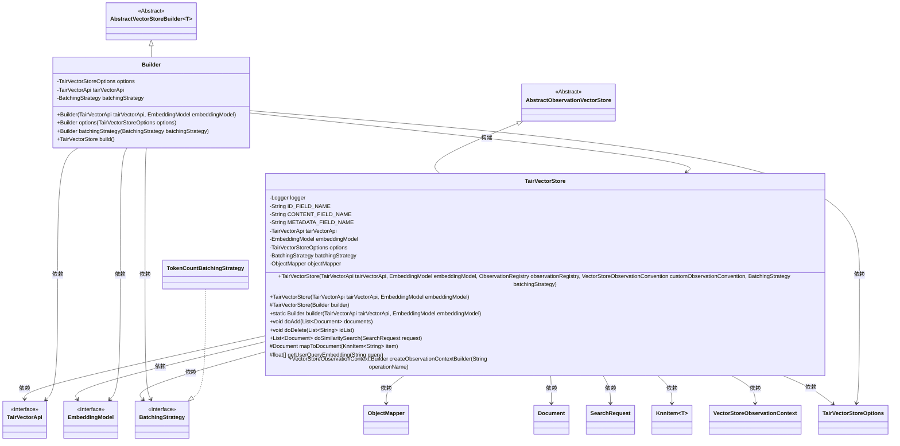

# 基础信息

|      |      |
|------|------|
| 名称 | TairVectorStore |
| 编码语言 | .java |
| 代码路径 | spring-ai-alibaba/community/vector-stores/spring-ai-alibaba-starter-tair-store/src/main/java/com/alibaba/cloud/ai/vectorstore/tair/TairVectorStore.java |
| 包名 | com.alibaba.cloud.ai.vectorstore.tair |
| 依赖项 | ['com.aliyun.tair.tairvector.factory.VectorBuilderFactory', 'com.aliyun.tair.tairvector.factory.VectorBuilderFactory.KnnItem', 'com.fasterxml.jackson.core.JsonProcessingException', 'com.fasterxml.jackson.core.type.TypeReference', 'com.fasterxml.jackson.databind.ObjectMapper', 'io.micrometer.observation.ObservationRegistry', 'org.slf4j.Logger', 'org.slf4j.LoggerFactory', 'org.springframework.ai.document.Document', 'org.springframework.ai.embedding.BatchingStrategy', 'org.springframework.ai.embedding.EmbeddingModel', 'org.springframework.ai.embedding.TokenCountBatchingStrategy', 'org.springframework.ai.vectorstore.AbstractVectorStoreBuilder', 'org.springframework.ai.vectorstore.SearchRequest', 'org.springframework.ai.vectorstore.observation.AbstractObservationVectorStore', 'org.springframework.ai.vectorstore.observation.VectorStoreObservationContext', 'org.springframework.ai.vectorstore.observation.VectorStoreObservationConvention', 'org.springframework.util.Assert', 'java.util'] |
| 概述说明 | TairVectorStore类管理向量存储，支持文档添加、相似性搜索和嵌入模型操作。 |

# 说明

TairVectorStore类是一个用于管理Tair向量存储的工具，主要功能包括文档的添加、相似性搜索以及嵌入模型的操作。通过该类，用户可以高效地存储和检索向量数据，支持基于向量相似度的搜索操作，并能够处理与嵌入模型相关的任务。该类的设计旨在简化向量存储的管理流程，提升数据处理的效率和准确性。

# 类列表 Class Summary

| 名称   | 类型  | 说明 |
|-------|------|-------------|
| TairVectorStore | class | TairVectorStore类用于管理Tair向量存储，支持文档添加、相似性搜索和嵌入模型操作。 |

## 类 TairVectorStore

|      |      |
|------|------|
| 访问范围 | public |
| 类型 | class |
| 名称 | TairVectorStore |
| 说明 | TairVectorStore类用于管理Tair向量存储，支持文档添加、相似性搜索和嵌入模型操作。 |

### UML类图

### 描述
`TairVectorStore` 是一个继承自 `AbstractObservationVectorStore` 的类，用于管理与 Tair 向量存储的交互。它依赖于 `TairVectorApi` 和 `EmbeddingModel` 来进行向量操作，并支持批量处理策略。`Builder` 类用于构建 `TairVectorStore` 实例，允许灵活配置选项和策略。`TairVectorStore` 提供了文档的添加、删除和相似性搜索功能，并处理与 Tair 的通信。

### 内部方法调用关系图

```mermaid
graph TD
    A["类TairVectorStore"]
    B["属性: Logger logger"]
    C["属性: String ID_FIELD_NAME"]
    D["属性: String CONTENT_FIELD_NAME"]
    E["属性: String METADATA_FIELD_NAME"]
    F["属性: TairVectorApi tairVectorApi"]
    G["属性: EmbeddingModel embeddingModel"]
    H["属性: TairVectorStoreOptions options"]
    I["属性: BatchingStrategy batchingStrategy"]
    J["属性: ObjectMapper objectMapper"]
    K["构造方法: TairVectorStore(TairVectorApi, EmbeddingModel, ObservationRegistry, VectorStoreObservationConvention, BatchingStrategy)"]
    L["构造方法: TairVectorStore(TairVectorApi, EmbeddingModel)"]
    M["构造方法: TairVectorStore(Builder)"]
    N["方法: static Builder builder(TairVectorApi, EmbeddingModel)"]
    O["方法: void doAdd(List<Document>)"]
    P["方法: void doDelete(List<String>)"]
    Q["方法: List<Document> doSimilaritySearch(SearchRequest)"]
    R["方法: Document mapToDocument(KnnItem<String>)"]
    S["方法: float[] getUserQueryEmbedding(String)"]
    T["方法: VectorStoreObservationContext.Builder createObservationContextBuilder(String)"]
    U["类Builder"]
    V["属性: TairVectorStoreOptions options"]
    W["属性: TairVectorApi tairVectorApi"]
    X["属性: BatchingStrategy batchingStrategy"]
    Y["构造方法: Builder(TairVectorApi, EmbeddingModel)"]
    Z["方法: Builder options(TairVectorStoreOptions)"]
    AA["方法: Builder batchingStrategy(BatchingStrategy)"]
    AB["方法: TairVectorStore build()"]

    A --> B
    A --> C
    A --> D
    A --> E
    A --> F
    A --> G
    A --> H
    A --> I
    A --> J
    A --> K
    A --> L
    A --> M
    A --> N
    A --> O
    A --> P
    A --> Q
    A --> R
    A --> S
    A --> T
    A -.-> U
    U --> V
    U --> W
    U --> X
    U --> Y
    U --> Z
    U --> AA
    U --> AB
```

**描述：**
`TairVectorStore`类继承自`AbstractObservationVectorStore`，用于管理文档的向量存储和检索。它包含多个属性，如`TairVectorApi`、`EmbeddingModel`和`BatchingStrategy`，以及构造方法和多个操作文档的方法。`Builder`类用于构建`TairVectorStore`实例，支持设置选项和批处理策略。代码通过`doAdd`方法添加文档，`doSimilaritySearch`方法进行相似性搜索，并通过`mapToDocument`方法将搜索结果映射为文档。

### 字段列表 Field List

| 名称  | 类型  | 说明 |
|-------|-------|------|
| METADATA_FIELD_NAME = "metadata" | String | 保护静态常量字符串字段名为"metadata"。 |
| options | TairVectorStoreOptions | TairVectorStoreOptions类型的受保护变量options。 |
| tairVectorApi | TairVectorApi | 保护类型的TairVectorApi实例。 |
| ID_FIELD_NAME = "id" | String | 定义了一个受保护的静态常量字符串，名为ID_FIELD_NAME，值为"id"。 |
| batchingStrategy | BatchingStrategy | 受保护的最终批处理策略变量batchingStrategy。 |
| logger = LoggerFactory.getLogger(TairVectorStore.class) | Logger | TairVectorStore类中定义了一个静态日志记录器。 |
| objectMapper = new ObjectMapper() | ObjectMapper | 初始化私有ObjectMapper对象用于JSON处理。 |
| embeddingModel | EmbeddingModel | 保护且不可变的嵌入模型对象。 |
| CONTENT_FIELD_NAME = "content" | String | 定义了一个受保护的静态常量字符串变量，名为CONTENT_FIELD_NAME，值为"content"。 |

### 方法列表 Method List

| 名称  | 类型  | 说明 |
|-------|-------|------|
| createObservationContextBuilder | VectorStoreObservationContext.Builder | 重写方法返回空观察上下文构建器。 |
| doDelete | void | 方法doDelete不支持删除操作，调用时将抛出异常。 |
| builder | Builder | 静态方法builder创建Builder实例，接收TairVectorApi和EmbeddingModel参数。 |
| mapToDocument | Document | 将KnnItem映射为Document，提取ID、内容和元数据，处理JSON异常。 |
| doAdd | void | 方法doAdd处理文档列表，验证非空后调用嵌入模型生成向量并存储。 |
| doSimilaritySearch | List<Document> | 方法执行相似性搜索，返回符合阈值的前K个文档。 |
| getUserQueryEmbedding | float[] | 该方法使用嵌入模型生成用户查询的向量表示。 |

