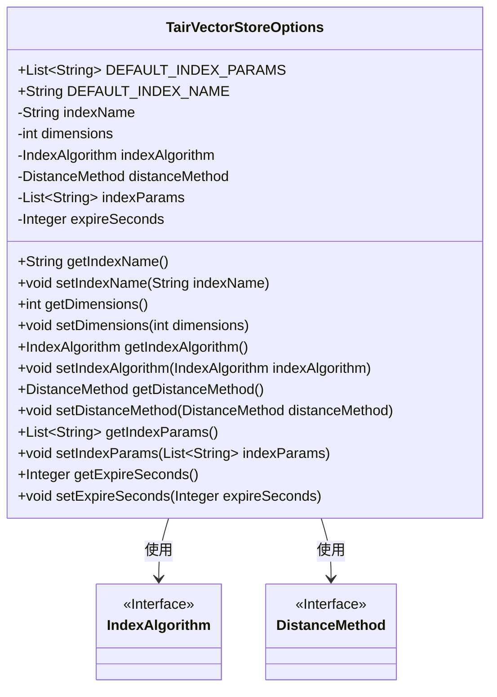

# 基础信息

|      |      |
|------|------|
| 名称 | TairVectorStoreOptions |
| 编码语言 | .java |
| 代码路径 | spring-ai-alibaba/community/vector-stores/spring-ai-alibaba-starter-tair-store/src/main/java/com/alibaba/cloud/ai/vectorstore/tair/TairVectorStoreOptions.java |
| 包名 | com.alibaba.cloud.ai.vectorstore.tair |
| 依赖项 | ['com.aliyun.tair.tairvector.params.DistanceMethod', 'com.aliyun.tair.tairvector.params.IndexAlgorithm', 'java.util.Arrays', 'java.util.List'] |
| 概述说明 | TairVectorStoreOptions类定义向量存储的默认参数，如索引名、维度等。 |

# 说明

TairVectorStoreOptions类用于定义向量存储的默认参数，主要包含索引名、向量维度、使用的算法、距离计算方法以及过期时间等关键配置。这些参数共同决定了向量存储的行为和性能，确保存储系统能够高效地处理和检索向量数据。

# 类列表 Class Summary

| 名称   | 类型  | 说明 |
|-------|------|-------------|
| TairVectorStoreOptions | class | TairVectorStoreOptions类定义了向量存储的默认参数，包括索引名、维度、算法、距离方法和过期时间。 |

## 类 TairVectorStoreOptions

|      |      |
|------|------|
| 访问范围 | public |
| 类型 | class |
| 名称 | TairVectorStoreOptions |
| 说明 | TairVectorStoreOptions类定义了向量存储的默认参数，包括索引名、维度、算法、距离方法和过期时间。 |

### UML类图

**描述**：`TairVectorStoreOptions` 类用于配置向量存储的选项，包括索引名称、向量维度、索引算法、距离计算方法、索引参数和过期时间。该类通过 `IndexAlgorithm` 和 `DistanceMethod` 接口来定义索引算法和距离计算方法，提供了对这些配置项的获取和设置方法。

### 内部方法调用关系图

```mermaid
graph TD
    A["类TairVectorStoreOptions"]
    B["常量: List<String> DEFAULT_INDEX_PARAMS"]
    C["常量: String DEFAULT_INDEX_NAME"]
    D["属性: String indexName"]
    E["属性: int dimensions"]
    F["属性: IndexAlgorithm indexAlgorithm"]
    G["属性: DistanceMethod distanceMethod"]
    H["属性: List<String> indexParams"]
    I["属性: Integer expireSeconds"]
    J["方法: String getIndexName()"]
    K["方法: void setIndexName(String indexName)"]
    L["方法: int getDimensions()"]
    M["方法: void setDimensions(int dimensions)"]
    N["方法: IndexAlgorithm getIndexAlgorithm()"]
    O["方法: void setIndexAlgorithm(IndexAlgorithm indexAlgorithm)"]
    P["方法: DistanceMethod getDistanceMethod()"]
    Q["方法: void setDistanceMethod(DistanceMethod distanceMethod)"]
    R["方法: List<String> getIndexParams()"]
    S["方法: void setIndexParams(List<String> indexParams)"]
    T["方法: Integer getExpireSeconds()"]
    U["方法: void setExpireSeconds(Integer expireSeconds)"]

    A --> B
    A --> C
    A --> D
    A --> E
    A --> F
    A --> G
    A --> H
    A --> I
    A --> J
    A --> K
    A --> L
    A --> M
    A --> N
    A --> O
    A --> P
    A --> Q
    A --> R
    A --> S
    A --> T
    A --> U
```

这段代码定义了一个名为 `TairVectorStoreOptions` 的类，用于配置向量存储的索引参数。类中包含多个属性，如索引名称、向量维度、索引算法、距离计算方法等，并提供了相应的getter和setter方法来访问和修改这些属性。代码还定义了两个常量，分别表示默认的索引参数和索引名称。该类的主要作用是管理向量存储的配置选项，确保索引的创建和查询过程能够根据用户需求进行定制。

### 字段列表 Field List

| 名称  | 类型  | 说明 |
|-------|-------|------|
| dimensions = 1536 | int | 私有整型变量dimensions，初始值为1536。 |
| expireSeconds = 600 | Integer | 私有整型变量expireSeconds默认值为600。 |
| distanceMethod = DistanceMethod.L2 | DistanceMethod | 私有变量distanceMethod设置为L2距离方法。 |
| indexAlgorithm = IndexAlgorithm.HNSW | IndexAlgorithm | 私有变量indexAlgorithm使用HNSW索引算法。 |
| DEFAULT_INDEX_NAME = "spring_ai_tair_vector_store" | String | 定义常量DEFAULT_INDEX_NAME，值为"spring_ai_tair_vector_store"。 |
| indexParams = DEFAULT_INDEX_PARAMS | List<String> | 私有列表indexParams初始化为默认索引参数。 |
| indexName = DEFAULT_INDEX_NAME | String | 私有字符串变量indexName初始化为DEFAULT_INDEX_NAME。 |
| DEFAULT_INDEX_PARAMS = Arrays.asList("ef_construct", "100", "M", "16") | List<String> | 默认索引参数为ef_construct、100、M、16。 |

### 方法列表 Method List

| 名称  | 类型  | 说明 |
|-------|-------|------|
| setDistanceMethod | void | 设置距离计算方法的方法。 |
| getIndexAlgorithm | IndexAlgorithm | 该方法返回当前对象的索引算法实例。 |
| getExpireSeconds | Integer | 返回过期秒数的整数值。 |
| getDistanceMethod | DistanceMethod | 获取距离方法实例。 |
| getIndexParams | List<String> | 该方法返回一个字符串列表类型的索引参数。 |
| setDimensions | void | 设置对象维度的方法。 |
| setExpireSeconds | void | 设置过期秒数的方法。 |
| getIndexName | String | 该方法返回字符串类型的indexName变量值。 |
| getDimensions | int | 方法getDimensions返回整型变量dimensions的值。 |
| setIndexParams | void | 设置索引参数的方法。 |
| setIndexName | void | 设置索引名称的方法，将传入的indexName赋值给当前对象的indexName属性。 |
| setIndexAlgorithm | void | 设置索引算法的方法，将传入的索引算法赋值给当前对象。 |

