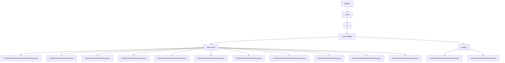

# 基础信息

|      |      |
|------|------|
| 名称 | alibaba |
| 编码语言 | .java |
| 代码路径 | spring-ai-alibaba/spring-ai-alibaba-autoconfigure/src/main/java/com/alibaba |
| 包名 | spring-ai-alibaba.spring-ai-alibaba-autoconfigure.src.main.java.com.alibaba |
| 概述说明 | Spring AI Alibaba子模块集成阿里云DashScope AI服务，支持音频、图像、语音、聊天等功能，简化AI集成。另一模块通过Nacos动态配置提示模板工厂，提升系统灵活性和可维护性。 |

# 说明

## 概述

该代码模块是Spring AI Alibaba项目中的一个子模块，主要包含两个核心功能：与阿里云DashScope AI服务的集成以及基于Nacos的动态提示模板工厂创建功能。模块通过一系列配置类和工具类，提供了对DashScope多种AI功能的支持，包括音频转录、图像处理、语音合成、聊天、嵌入、重排等功能。同时，模块还通过自动配置类实现了基于Nacos的动态提示模板工厂创建功能，提升了系统的灵活性、可配置性和可维护性。

## 主要业务场景

1. **DashScope AI服务集成**：
   - **音频转录**：通过`DashScopeAudioTranscriptionProperties`类，用户可以配置和管理音频转录过程中的各种参数，确保转录任务能够顺利进行。
   - **图像处理**：`DashScopeImageProperties`类用于管理图像处理相关的设置，包括默认模型和启用状态，确保系统在不同场景下能够高效运行。
   - **语音合成**：`DashScopeSpeechSynthesisProperties`类定义了语音合成的属性和默认选项，允许用户灵活调整音色、语速、音量等参数，以满足不同的应用需求。
   - **聊天功能**：`DashScopeChatProperties`类用于配置聊天客户端，支持默认模型和温度参数的设置，确保聊天交互能够按照预设条件进行。
   - **嵌入功能**：`DashScopeEmbeddingProperties`类管理和配置嵌入功能，支持启用状态、元数据模式和嵌入选项的灵活配置。
   - **重排功能**：`DashScopeRerankProperties`类用于配置重排模型，支持设置返回文档数量和是否返回原始文档内容。
   - **连接管理**：通过`DashScopeConnectionUtils`和`DashScopeConnectionProperties`类，用户可以解析和管理连接属性，如API密钥、基础URL、读取超时时间等，确保系统的可维护性和安全性。
   - **自动配置**：`DashScopeAutoConfiguration`类集成了多种AI模型，支持聊天、图像、语音等多种功能，通过自动配置简化了模型的使用流程，提升开发效率。

2. **基于Nacos的动态提示模板工厂创建**：
   - **动态配置管理**：通过Nacos配置信息，动态决定是否生成提示模板工厂，适应不同环境下的需求。
   - **灵活性增强**：支持在不同环境下灵活启用或禁用提示模板功能，确保系统的可扩展性。
   - **默认配置**：在默认状态下，提示模板功能未启用，需通过Nacos配置手动开启，避免不必要的资源消耗。
   - **简化维护**：通过自动配置机制，减少了手动配置的复杂性，提升了系统的可维护性。

该模块适用于需要快速集成AI能力的应用场景，帮助开发者轻松实现智能化功能，同时通过动态配置管理提升了系统的灵活性和可维护性。

### 包内部结构视图

该流程图展示了`spring-ai-alibaba`项目中`autoconfigure`模块的层级结构。从`alibaba`开始，逐步展开到`cloud`、`ai`、`autoconfigure`，并进一步细分为`dashscope`和`prompt`两个子模块。`dashscope`模块包含多个属性配置类和工具类，而`prompt`模块则包含与提示模板相关的自动配置类和属性类。

# 文件列表 File List

| 名称   | 类型  | 说明 |
|-------|------|-------------|
| [cloud](cloud/_module.md) | package | Spring AI Alibaba子模块集成阿里云DashScope AI服务，支持音频、图像、语音、聊天等功能，简化AI集成。另一模块通过Nacos动态配置提示模板工厂，提升系统灵活性和可维护性。 |

