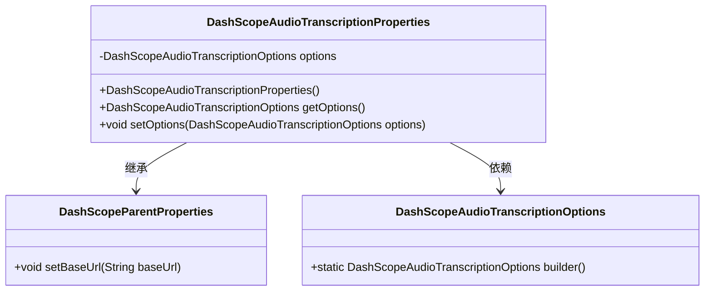
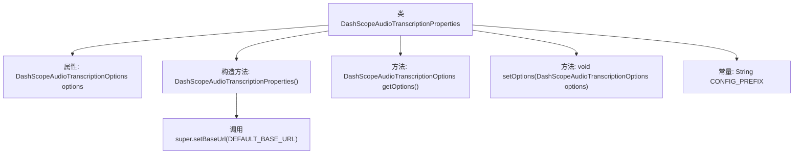

# 基础信息

|      |      |
|------|------|
| 名称 | DashScopeAudioTranscriptionProperties |
| 编码语言 | .java |
| 代码路径 | spring-ai-alibaba/spring-ai-alibaba-autoconfigure/src/main/java/com/alibaba/cloud/ai/autoconfigure/dashscope/DashScopeAudioTranscriptionProperties.java |
| 包名 | com.alibaba.cloud.ai.autoconfigure.dashscope |
| 依赖项 | ['com.alibaba.cloud.ai.dashscope.audio.DashScopeAudioTranscriptionOptions', 'org.springframework.boot.context.properties.ConfigurationProperties', 'org.springframework.boot.context.properties.NestedConfigurationProperty', 'com.alibaba.cloud.ai.dashscope.common.DashScopeApiConstants.DEFAULT_BASE_URL'] |
| 概述说明 | 配置类管理阿里云DashScope音频转录的属性和选项。 |

# 说明

配置类用于管理阿里云DashScope音频转录的属性和选项。该类提供了对音频转录过程中所需的各种参数和设置的集中管理，确保转录任务的顺利进行。通过配置类，用户可以灵活地调整转录的详细选项，以满足不同的需求和应用场景。

# 类列表 Class Summary

| 名称   | 类型  | 说明 |
|-------|------|-------------|
| DashScopeAudioTranscriptionProperties | class | 配置类用于管理阿里云DashScope音频转录的属性和选项。 |

## 类 DashScopeAudioTranscriptionProperties

|      |      |
|------|------|
| 访问范围 | @ConfigurationProperties(DashScopeAudioTranscriptionProperties.CONFIG_PREFIX);public |
| 类型 | class |
| 名称 | DashScopeAudioTranscriptionProperties |
| 说明 | 配置类用于管理阿里云DashScope音频转录的属性和选项。 |

### UML类图

这段代码定义了一个名为 `DashScopeAudioTranscriptionProperties` 的类，它继承了 `DashScopeParentProperties` 类，并包含一个 `DashScopeAudioTranscriptionOptions` 类型的私有成员 `options`。该类通过构造函数初始化 `options` 并设置默认的 `baseUrl`，同时提供了获取和设置 `options` 的方法。`DashScopeAudioTranscriptionOptions` 类提供了一个静态的 `builder` 方法用于创建实例。整体上，该类用于配置和管理音频转录的相关属性。

### 内部方法调用关系图

这段代码定义了一个名为`DashScopeAudioTranscriptionProperties`的类，继承自`DashScopeParentProperties`。该类包含一个嵌套配置属性`options`，并提供了构造方法和getter/setter方法。构造方法中调用了父类的`setBaseUrl`方法，设置了默认的`BASE_URL`。该类还定义了一个常量`CONFIG_PREFIX`，用于标识Spring AI Alibaba的配置前缀。

### 字段列表 Field List

| 名称  | 类型  | 说明 |
|-------|-------|------|
| CONFIG_PREFIX = "spring.ai.dashscope.audio.transcription" | String | 定义音频转录配置前缀为spring.ai.dashscope.audio.transcription。 |
| options = DashScopeAudioTranscriptionOptions.builder().build() | DashScopeAudioTranscriptionOptions | 嵌套配置属性包含DashScope音频转录选项的默认构建实例。 |

### 方法列表 Method List

| 名称  | 类型  | 说明 |
|-------|-------|------|
| setOptions | void | 设置音频转录选项。 |
| getOptions | DashScopeAudioTranscriptionOptions | 获取DashScope音频转录配置选项的方法。 |

