# 基础信息

|      |      |
|------|------|
| 名称 | DashScopeAutoConfiguration |
| 编码语言 | .java |
| 代码路径 | spring-ai-alibaba/spring-ai-alibaba-autoconfigure/src/main/java/com/alibaba/cloud/ai/autoconfigure/dashscope/DashScopeAutoConfiguration.java |
| 包名 | com.alibaba.cloud.ai.autoconfigure.dashscope |
| 依赖项 | ['com.alibaba.cloud.ai.dashscope.api', 'com.alibaba.cloud.ai.dashscope.audio.DashScopeAudioTranscriptionModel', 'com.alibaba.cloud.ai.dashscope.audio.DashScopeSpeechSynthesisModel', 'com.alibaba.cloud.ai.dashscope.chat.DashScopeChatModel', 'com.alibaba.cloud.ai.dashscope.embedding.DashScopeEmbeddingModel', 'com.alibaba.cloud.ai.dashscope.image.DashScopeImageModel', 'com.alibaba.cloud.ai.dashscope.rerank.DashScopeRerankModel', 'io.micrometer.observation.ObservationRegistry', 'org.springframework.ai.autoconfigure.retry.SpringAiRetryAutoConfiguration', 'org.springframework.ai.chat.observation.ChatModelObservationConvention', 'org.springframework.ai.embedding.observation.EmbeddingModelObservationConvention', 'org.springframework.ai.image.observation.ImageModelObservationConvention', 'org.springframework.ai.model.function.DefaultFunctionCallbackResolver', 'org.springframework.ai.model.function.FunctionCallback', 'org.springframework.ai.model.function.FunctionCallbackResolver', 'org.springframework.beans.factory.ObjectProvider', 'org.springframework.boot.autoconfigure.AutoConfiguration', 'org.springframework.boot.autoconfigure.ImportAutoConfiguration', 'org.springframework.boot.autoconfigure.condition.ConditionalOnClass', 'org.springframework.boot.autoconfigure.condition.ConditionalOnMissingBean', 'org.springframework.boot.autoconfigure.condition.ConditionalOnProperty', 'org.springframework.boot.autoconfigure.web.client.RestClientAutoConfiguration', 'org.springframework.boot.autoconfigure.web.reactive.function.client.WebClientAutoConfiguration', 'org.springframework.boot.context.properties.EnableConfigurationProperties', 'org.springframework.boot.web.client.ClientHttpRequestFactories', 'org.springframework.boot.web.client.ClientHttpRequestFactorySettings', 'org.springframework.boot.web.client.RestClientCustomizer', 'org.springframework.context.ApplicationContext', 'org.springframework.context.annotation.Bean', 'org.springframework.context.annotation.Configuration', 'org.springframework.retry.support.RetryTemplate', 'org.springframework.web.client.ResponseErrorHandler', 'org.springframework.web.client.RestClient', 'org.springframework.web.reactive.function.client.WebClient', 'java.time.Duration', 'java.util.List', 'com.alibaba.cloud.ai.autoconfigure.dashscope.DashScopeConnectionUtils.resolveConnectionProperties'] |
| 概述说明 | DashScope类集成AI模型，支持聊天、图像、语音功能。 |

# 说明

DashScope自动配置类是一个集成多种AI模型的工具，支持聊天、图像、语音等多种功能。它通过自动配置简化了模型的使用流程，使得开发者能够轻松调用不同AI能力，提升开发效率。该工具适用于多种应用场景，帮助用户快速实现智能化功能。

# 类列表 Class Summary

| 名称   | 类型  | 说明 |
|-------|------|-------------|
| DashScopeAutoConfiguration | class | DashScope自动配置类，集成多种AI模型，支持聊天、图像、语音等功能。 |

## 类 DashScopeAutoConfiguration

|      |      |
|------|------|
| 访问范围 | @ConditionalOnClass(DashScopeApi.class);@AutoConfiguration(after = {;		RestClientAutoConfiguration.class,;		WebClientAutoConfiguration.class,;		SpringAiRetryAutoConfiguration.class});@ImportAutoConfiguration(classes = {;		SpringAiRetryAutoConfiguration.class,;		RestClientAutoConfiguration.class,;		WebClientAutoConfiguration.class;});@EnableConfigurationProperties({;		DashScopeConnectionProperties.class,;		DashScopeChatProperties.class,;		DashScopeImageProperties.class,;		DashScopeSpeechSynthesisProperties.class,;		DashScopeAudioTranscriptionProperties.class,;		DashScopeEmbeddingProperties.class,;		DashScopeRerankProperties.class;});public |
| 类型 | class |
| 名称 | DashScopeAutoConfiguration |
| 说明 | DashScope自动配置类，集成多种AI模型，支持聊天、图像、语音等功能。 |

### UML类图

```mermaid
classDiagram
    class DashScopeAutoConfiguration {
        +RestClientCustomizer restClientCustomizer(DashScopeConnectionProperties commonProperties)
        +FunctionCallbackResolver springAiFunctionManager(ApplicationContext context)
    }

    class DashScopeChatConfiguration {
        +DashScopeChatModel dashscopeChatModel(DashScopeConnectionProperties commonProperties, DashScopeChatProperties chatProperties, RestClient.Builder restClientBuilder, WebClient.Builder webClientBuilder, List~FunctionCallback~ toolFunctionCallbacks, FunctionCallbackResolver functionCallbackResolver, RetryTemplate retryTemplate, ResponseErrorHandler responseErrorHandler, ObjectProvider~ObservationRegistry~ observationRegistry, ObjectProvider~ChatModelObservationConvention~ observationConvention)
        +DashScopeAgentApi dashscopeAgentApi(DashScopeConnectionProperties commonProperties, DashScopeChatProperties chatProperties, RestClient.Builder restClientBuilder, WebClient.Builder webClientBuilder, ResponseErrorHandler responseErrorHandler)
    }

    class DashScopeImageConfiguration {
        +DashScopeImageModel dashScopeImageModel(DashScopeConnectionProperties commonProperties, DashScopeImageProperties imageProperties, RestClient.Builder restClientBuilder, WebClient.Builder webClientBuilder, RetryTemplate retryTemplate, ResponseErrorHandler responseErrorHandler)
    }

    class DashScopeEmbeddingConfiguration {
        +DashScopeEmbeddingModel dashscopeEmbeddingModel(DashScopeConnectionProperties commonProperties, DashScopeEmbeddingProperties embeddingProperties, RestClient.Builder restClientBuilder, WebClient.Builder webClientBuilder, RetryTemplate retryTemplate, ResponseErrorHandler responseErrorHandler, ObjectProvider~ObservationRegistry~ observationRegistry, ObjectProvider~EmbeddingModelObservationConvention~ observationConvention)
    }

    class DashScopeSpeechSynthesisConfiguration {
        +DashScopeSpeechSynthesisModel dashScopeSpeechSynthesisModel(DashScopeConnectionProperties commonProperties, DashScopeSpeechSynthesisProperties speechSynthesisProperties, RetryTemplate retryTemplate)
    }

    class DashScopeAudioTranscriptionConfiguration {
        +DashScopeAudioTranscriptionModel dashScopeAudioTranscriptionModel(DashScopeConnectionProperties commonProperties, DashScopeAudioTranscriptionProperties audioTranscriptionProperties, RetryTemplate retryTemplate)
    }

    class DashScopeRerankConfiguration {
        +DashScopeRerankModel dashscopeRerankModel(DashScopeConnectionProperties commonProperties, DashScopeRerankProperties rerankProperties, RestClient.Builder restClientBuilder, WebClient.Builder webClientBuilder, RetryTemplate retryTemplate, ResponseErrorHandler responseErrorHandler)
    }

    DashScopeAutoConfiguration --> DashScopeChatConfiguration : 包含
    DashScopeAutoConfiguration --> DashScopeImageConfiguration : 包含
    DashScopeAutoConfiguration --> DashScopeEmbeddingConfiguration : 包含
    DashScopeAutoConfiguration --> DashScopeSpeechSynthesisConfiguration : 包含
    DashScopeAutoConfiguration --> DashScopeAudioTranscriptionConfiguration : 包含
    DashScopeAutoConfiguration --> DashScopeRerankConfiguration : 包含
```

**描述：**  
`DashScopeAutoConfiguration` 是一个自动配置类，用于配置与阿里云DashScope相关的多种服务，包括聊天、图像处理、语音合成、音频转录、嵌入模型和重排模型等。该类通过多个内部配置类（如 `DashScopeChatConfiguration`、`DashScopeImageConfiguration` 等）来分别处理不同服务的配置。每个内部配置类负责创建相应的模型或API实例，并根据属性配置进行初始化。

### 内部方法调用关系图

```mermaid
graph TD
    A["类DashScopeAutoConfiguration"]
    B["@ConditionalOnClass(DashScopeApi.class)"]
    C["@AutoConfiguration(after = {RestClientAutoConfiguration.class, WebClientAutoConfiguration.class, SpringAiRetryAutoConfiguration.class})"]
    D["@ImportAutoConfiguration(classes = {SpringAiRetryAutoConfiguration.class, RestClientAutoConfiguration.class, WebClientAutoConfiguration.class})"]
    E["@EnableConfigurationProperties({DashScopeConnectionProperties.class, DashScopeChatProperties.class, DashScopeImageProperties.class, DashScopeSpeechSynthesisProperties.class, DashScopeAudioTranscriptionProperties.class, DashScopeEmbeddingProperties.class, DashScopeRerankProperties.class})"]
    F["@Bean RestClientCustomizer restClientCustomizer(DashScopeConnectionProperties commonProperties)"]
    G["@Bean @ConditionalOnMissingBean FunctionCallbackResolver springAiFunctionManager(ApplicationContext context)"]
    H["内部类DashScopeChatConfiguration"]
    I["@Configuration @ConditionalOnProperty(prefix = DashScopeChatProperties.CONFIG_PREFIX, name = 'enabled', havingValue = 'true', matchIfMissing = true)"]
    J["@Bean @ConditionalOnMissingBean DashScopeChatModel dashscopeChatModel(...)"]
    K["内部类DashScopeImageConfiguration"]
    L["@Configuration @ConditionalOnProperty(prefix = DashScopeImageProperties.CONFIG_PREFIX, name = 'enabled', havingValue = 'true', matchIfMissing = true)"]
    M["@Bean @ConditionalOnMissingBean DashScopeImageModel dashScopeImageModel(...)"]
    N["内部类DashScopeEmbeddingConfiguration"]
    O["@Configuration @ConditionalOnProperty(prefix = DashScopeEmbeddingProperties.CONFIG_PREFIX, name = 'enabled', havingValue = 'true', matchIfMissing = true)"]
    P["@Bean @ConditionalOnMissingBean DashScopeEmbeddingModel dashscopeEmbeddingModel(...)"]
    Q["内部类DashScopeSpeechSynthesisConfiguration"]
    R["@Configuration @ConditionalOnProperty(prefix = DashScopeSpeechSynthesisProperties.CONFIG_PREFIX, name = 'enabled', havingValue = 'true', matchIfMissing = true)"]
    S["@Bean @ConditionalOnMissingBean DashScopeSpeechSynthesisModel dashScopeSpeechSynthesisModel(...)"]
    T["内部类DashScopeAudioTranscriptionConfiguration"]
    U["@Configuration @ConditionalOnProperty(prefix = DashScopeAudioTranscriptionProperties.CONFIG_PREFIX, name = 'enabled', havingValue = 'true', matchIfMissing = true)"]
    V["@Bean @ConditionalOnMissingBean DashScopeAudioTranscriptionModel dashScopeAudioTranscriptionModel(...)"]
    W["内部类DashScopeRerankConfiguration"]
    X["@Configuration @ConditionalOnProperty(prefix = DashScopeRerankProperties.CONFIG_PREFIX, name = 'enabled', havingValue = 'true', matchIfMissing = true)"]
    Y["@Bean @ConditionalOnMissingBean DashScopeRerankModel dashscopeRerankModel(...)"]

    A --> B
    A --> C
    A --> D
    A --> E
    A --> F
    A --> G
    A --> H
    H --> I
    I --> J
    A --> K
    K --> L
    L --> M
    A --> N
    N --> O
    O --> P
    A --> Q
    Q --> R
    R --> S
    A --> T
    T --> U
    U --> V
    A --> W
    W --> X
    X --> Y
```

这段代码是一个Spring Boot自动配置类，名为`DashScopeAutoConfiguration`，用于配置与阿里云DashScope API相关的各种服务。它通过条件注解（如`@ConditionalOnClass`和`@ConditionalOnProperty`）来控制不同服务的加载，并根据配置属性生成相应的Bean。类中包含多个内部配置类，分别用于配置聊天、图像、嵌入、语音合成、音频转录和重排等功能。每个内部配置类都通过`@Bean`注解生成相应的服务模型，并使用`RestClient`和`WebClient`进行HTTP通信。

### 字段列表 Field List

| 名称  | 类型  | 说明 |
|-------|-------|------|

### 方法列表 Method List

| 名称  | 类型  | 说明 |
|-------|-------|------|
| restClientCustomizer | RestClientCustomizer | 创建RestClientCustomizer，设置请求工厂读取超时。 |
| springAiFunctionManager | FunctionCallbackResolver | 创建Spring AI函数管理器，默认回调解析器，并设置应用上下文。 |

