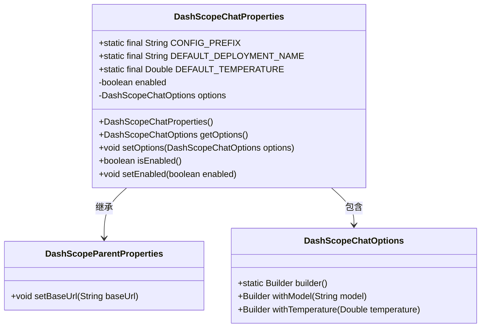
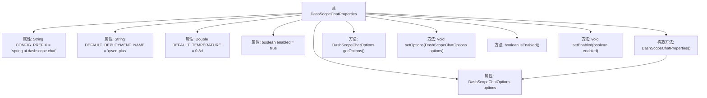

# 基础信息

|      |      |
|------|------|
| 名称 | DashScopeChatProperties |
| 编码语言 | .java |
| 代码路径 | spring-ai-alibaba/spring-ai-alibaba-autoconfigure/src/main/java/com/alibaba/cloud/ai/autoconfigure/dashscope/DashScopeChatProperties.java |
| 包名 | com.alibaba.cloud.ai.autoconfigure.dashscope |
| 依赖项 | ['com.alibaba.cloud.ai.dashscope.chat.DashScopeChatOptions', 'org.springframework.boot.context.properties.ConfigurationProperties', 'org.springframework.boot.context.properties.NestedConfigurationProperty', 'com.alibaba.cloud.ai.dashscope.common.DashScopeApiConstants.DEFAULT_BASE_URL'] |
| 概述说明 | DashScopeChatProperties类配置Spring AI Alibaba的DashScope聊天客户端，含默认模型和温度设置。 |

# 说明

DashScopeChatProperties类用于配置Spring AI Alibaba的DashScope聊天客户端。该类包含了默认的模型设置和温度参数，确保聊天客户端在初始化时具备预定义的模型和温度值，以便在后续的聊天交互中能够按照预设条件进行工作。

# 类列表 Class Summary

| 名称   | 类型  | 说明 |
|-------|------|-------------|
| DashScopeChatProperties | class | DashScopeChatProperties类配置Spring AI Alibaba的DashScope聊天客户端，包含默认模型和温度设置。 |

## 类 DashScopeChatProperties

|      |      |
|------|------|
| 访问范围 | @ConfigurationProperties(DashScopeChatProperties.CONFIG_PREFIX);public |
| 类型 | class |
| 名称 | DashScopeChatProperties |
| 说明 | DashScopeChatProperties类配置Spring AI Alibaba的DashScope聊天客户端，包含默认模型和温度设置。 |

### UML类图

**描述：**  
`DashScopeChatProperties` 类继承自 `DashScopeParentProperties`，并包含一个 `DashScopeChatOptions` 对象。该类用于配置 Spring AI Alibaba 的 DashScope 聊天客户端，提供了默认的模型名称和温度值，并允许通过 `setOptions` 和 `setEnabled` 方法动态调整配置。`DashScopeChatOptions` 类用于构建聊天选项，支持设置模型和温度参数。

### 内部方法调用关系图

这段代码定义了一个名为 `DashScopeChatProperties` 的类，该类继承自 `DashScopeParentProperties`。它包含了一些静态常量和实例属性，如 `CONFIG_PREFIX`、`DEFAULT_DEPLOYMENT_NAME`、`DEFAULT_TEMPERATURE` 和 `enabled`。类中定义了一个嵌套配置属性 `options`，并通过构造方法初始化了 `options` 和 `baseUrl`。此外，类还提供了获取和设置 `options` 和 `enabled` 属性的方法。该类的设计主要用于配置和管理 DashScope 聊天客户端的相关属性。

### 字段列表 Field List

| 名称  | 类型  | 说明 |
|-------|-------|------|
| CONFIG_PREFIX = "spring.ai.dashscope.chat" | String | 配置前缀为spring.ai.dashscope.chat。 |
| enabled = true | boolean | 布尔变量enabled初始值为true。 |
| DEFAULT_TEMPERATURE = 0.8d | Double | 定义默认温度值为0.8的静态常量。 |
| DEFAULT_DEPLOYMENT_NAME = "qwen-plus" | String | 定义常量DEFAULT_DEPLOYMENT_NAME，值为"qwen-plus"。 |
| options = DashScopeChatOptions.builder()		.withModel(DEFAULT_DEPLOYMENT_NAME)		.withTemperature(DEFAULT_TEMPERATURE)		.build() | DashScopeChatOptions | 配置DashScopeChatOptions，使用默认模型和温度参数。 |

### 方法列表 Method List

| 名称  | 类型  | 说明 |
|-------|-------|------|
| setOptions | void | 设置DashScopeChatOptions选项。 |
| isEnabled | boolean | 该方法返回布尔值，表示当前对象是否启用。 |
| setEnabled | void | 该方法用于设置对象的启用状态，参数为布尔值。 |
| getOptions | DashScopeChatOptions | 获取当前DashScopeChatOptions配置选项。 |

