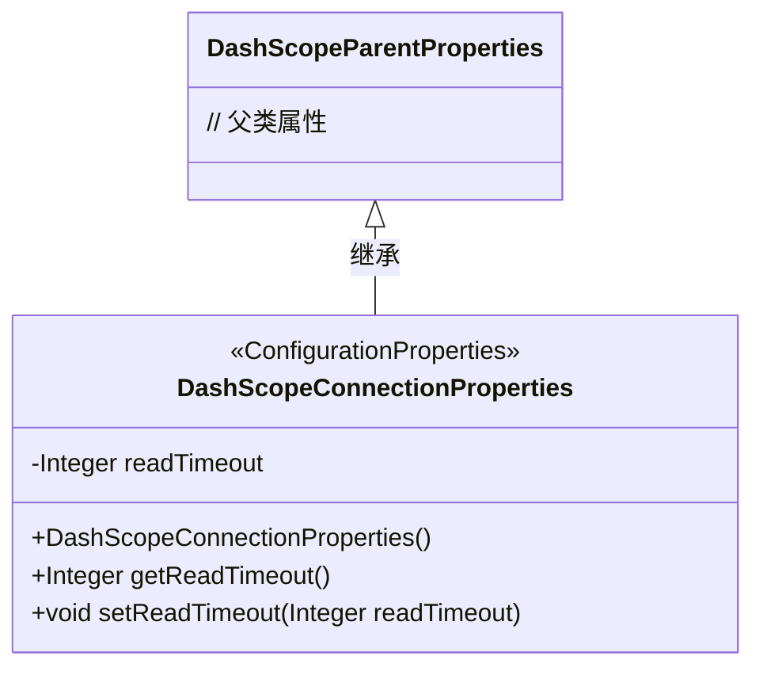
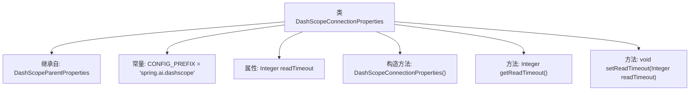

# 基础信息

|      |      |
|------|------|
| 名称 | DashScopeConnectionProperties |
| 编码语言 | .java |
| 代码路径 | spring-ai-alibaba/spring-ai-alibaba-autoconfigure/src/main/java/com/alibaba/cloud/ai/autoconfigure/dashscope/DashScopeConnectionProperties.java |
| 包名 | com.alibaba.cloud.ai.autoconfigure.dashscope |
| 依赖项 | ['org.springframework.boot.context.properties.ConfigurationProperties', 'com.alibaba.cloud.ai.dashscope.common.DashScopeApiConstants.DEFAULT_BASE_URL', 'com.alibaba.cloud.ai.dashscope.common.DashScopeApiConstants.DEFAULT_READ_TIMEOUT'] |
| 概述说明 | DashScopeConnectionProperties类配置读取超时和基础URL。 |

# 说明

DashScopeConnectionProperties类用于配置连接属性，主要包括读取超时时间和基础URL。读取超时时间决定了在连接过程中等待响应的最大时长，确保系统不会无限期等待。基础URL则指定了连接的服务器地址，为后续的API调用提供统一的入口点。通过这两个配置项，可以灵活调整连接行为，确保系统在不同网络环境下稳定运行。

# 类列表 Class Summary

| 名称   | 类型  | 说明 |
|-------|------|-------------|
| DashScopeConnectionProperties | class | DashScopeConnectionProperties类配置读取超时和基础URL。 |

## 类 DashScopeConnectionProperties

|      |      |
|------|------|
| 访问范围 | @ConfigurationProperties(DashScopeConnectionProperties.CONFIG_PREFIX);public |
| 类型 | class |
| 名称 | DashScopeConnectionProperties |
| 说明 | DashScopeConnectionProperties类配置读取超时和基础URL。 |

### UML类图

这段代码定义了一个名为 `DashScopeConnectionProperties` 的类，它继承自 `DashScopeParentProperties` 类。`DashScopeConnectionProperties` 类通过 `@ConfigurationProperties` 注解标记为配置属性类，并且包含一个 `readTimeout` 属性，该属性用于设置读取超时时间。类中提供了默认构造函数，初始化了 `readTimeout` 属性，并提供了相应的 getter 和 setter 方法。该类的主要作用是管理与 DashScope 连接相关的配置属性。

### 内部方法调用关系图

这段代码定义了一个名为 `DashScopeConnectionProperties` 的类，它继承自 `DashScopeParentProperties` 类。该类包含一个常量 `CONFIG_PREFIX`，用于指定配置前缀。类中定义了一个 `readTimeout` 属性，并通过构造方法初始化该属性。此外，类还提供了 `getReadTimeout` 和 `setReadTimeout` 方法，分别用于获取和设置 `readTimeout` 属性的值。这段代码主要用于配置和管理与 DashScope 连接相关的属性。

### 字段列表 Field List

| 名称  | 类型  | 说明 |
|-------|-------|------|
| CONFIG_PREFIX = "spring.ai.dashscope" | String | 定义常量CONFIG_PREFIX，值为"spring.ai.dashscope"。 |
| readTimeout | Integer | 私有整型变量，用于设置读取超时时间。 |

### 方法列表 Method List

| 名称  | 类型  | 说明 |
|-------|-------|------|
| getReadTimeout | Integer | 获取读取超时时间的整数值。 |
| setReadTimeout | void | 设置读取超时时间的方法，参数为整数类型。 |

