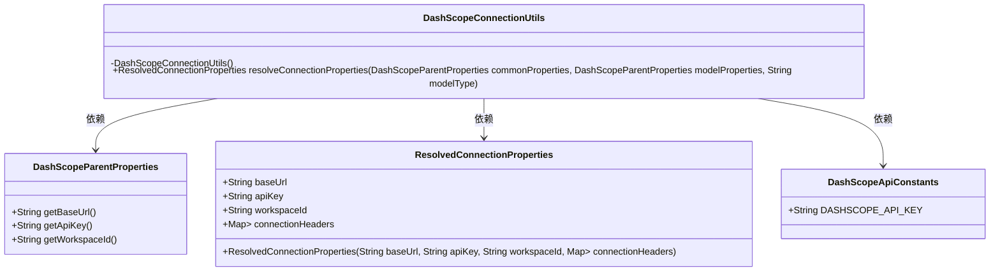
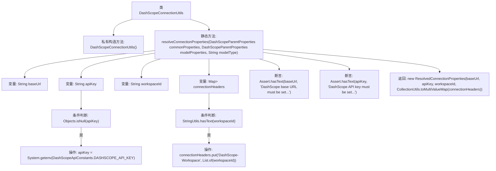

# 基础信息

|      |      |
|------|------|
| 名称 | DashScopeConnectionUtils |
| 编码语言 | .java |
| 代码路径 | spring-ai-alibaba/spring-ai-alibaba-autoconfigure/src/main/java/com/alibaba/cloud/ai/autoconfigure/dashscope/DashScopeConnectionUtils.java |
| 包名 | com.alibaba.cloud.ai.autoconfigure.dashscope |
| 依赖项 | ['java.util.HashMap', 'java.util.List', 'java.util.Map', 'java.util.Objects', 'com.alibaba.cloud.ai.dashscope.common.DashScopeApiConstants', 'org.jetbrains.annotations.NotNull', 'org.springframework.util.Assert', 'org.springframework.util.CollectionUtils', 'org.springframework.util.StringUtils'] |
| 概述说明 | DashScopeConnectionUtils类解析连接属性，支持从环境获取apiKey。 |

# 说明

DashScopeConnectionUtils类的主要功能是解析连接属性，具体包括baseUrl、apiKey和workspaceId。该类支持从系统环境中获取apiKey，确保连接属性的灵活配置和安全性。通过这种方式，开发者可以方便地管理和使用这些关键连接信息，提升系统的可维护性和可扩展性。

# 类列表 Class Summary

| 名称   | 类型  | 说明 |
|-------|------|-------------|
| DashScopeConnectionUtils | class | DashScopeConnectionUtils类用于解析连接属性，包括baseUrl、apiKey和workspaceId，支持从系统环境获取apiKey。 |

## 类 DashScopeConnectionUtils

|      |      |
|------|------|
| 访问范围 | public final |
| 类型 | class |
| 名称 | DashScopeConnectionUtils |
| 说明 | DashScopeConnectionUtils类用于解析连接属性，包括baseUrl、apiKey和workspaceId，支持从系统环境获取apiKey。 |

### UML类图

这段代码定义了一个工具类 `DashScopeConnectionUtils`，用于解析连接属性。它依赖于 `DashScopeParentProperties` 类来获取基础URL、API密钥和工作区ID，并将这些属性封装到 `ResolvedConnectionProperties` 类中。代码还通过系统环境变量获取API密钥，并确保基础URL和API密钥不为空。整个过程展示了如何从多个来源解析和验证连接属性，并最终返回一个包含所有必要信息的对象。

### 内部方法调用关系图

这段代码是 `DashScopeConnectionUtils` 类中的一个静态方法 `resolveConnectionProperties`，用于解析连接属性。方法首先从 `modelProperties` 和 `commonProperties` 中获取 `baseUrl`、`apiKey` 和 `workspaceId`，如果 `modelProperties` 中没有设置，则从 `commonProperties` 中获取。接着，如果 `workspaceId` 存在，则将其添加到 `connectionHeaders` 中。如果 `apiKey` 为空，则尝试从系统环境变量中获取。最后，方法会进行两次断言，确保 `baseUrl` 和 `apiKey` 已设置，并返回一个 `ResolvedConnectionProperties` 对象。

### 字段列表 Field List

| 名称  | 类型  | 说明 |
|-------|-------|------|

### 方法列表 Method List

| 名称  | 类型  | 说明 |
|-------|-------|------|
| resolveConnectionProperties | ResolvedConnectionProperties | 解析DashScope连接属性，合并通用与模型属性，验证必填项。 |

