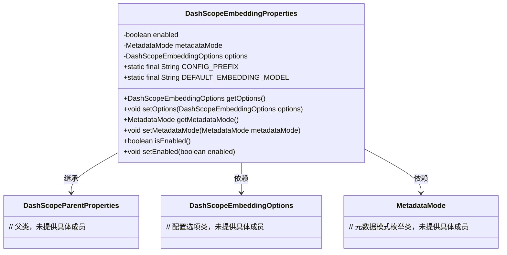
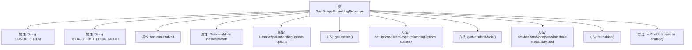

# 基础信息

|      |      |
|------|------|
| 名称 | DashScopeEmbeddingProperties |
| 编码语言 | .java |
| 代码路径 | spring-ai-alibaba/spring-ai-alibaba-autoconfigure/src/main/java/com/alibaba/cloud/ai/autoconfigure/dashscope/DashScopeEmbeddingProperties.java |
| 包名 | com.alibaba.cloud.ai.autoconfigure.dashscope |
| 依赖项 | ['com.alibaba.cloud.ai.dashscope.embedding.DashScopeEmbeddingOptions', 'org.springframework.ai.document.MetadataMode', 'org.springframework.boot.context.properties.ConfigurationProperties', 'org.springframework.boot.context.properties.NestedConfigurationProperty'] |
| 概述说明 | DashScope嵌入属性类涵盖启用状态、元数据模式和嵌入选项配置。 |

# 说明

DashScope嵌入属性类是一个用于管理和配置嵌入功能的核心组件。该类主要包含三个关键属性：启用状态，用于控制嵌入功能的激活与关闭；元数据模式，用于定义嵌入过程中元数据的处理方式；嵌入选项配置，用于设置嵌入功能的具体参数和选项。这些属性共同作用，确保嵌入功能能够根据需求进行灵活配置和高效运行。

# 类列表 Class Summary

| 名称   | 类型  | 说明 |
|-------|------|-------------|
| DashScopeEmbeddingProperties | class | DashScope嵌入属性类，包含启用状态、元数据模式和嵌入选项配置。 |

## 类 DashScopeEmbeddingProperties

|      |      |
|------|------|
| 访问范围 | @ConfigurationProperties(DashScopeEmbeddingProperties.CONFIG_PREFIX);public |
| 类型 | class |
| 名称 | DashScopeEmbeddingProperties |
| 说明 | DashScope嵌入属性类，包含启用状态、元数据模式和嵌入选项配置。 |

### UML类图

**描述**：`DashScopeEmbeddingProperties` 类是一个配置属性类，用于管理 DashScope 嵌入客户端的配置。它继承了 `DashScopeParentProperties` 类，并依赖于 `DashScopeEmbeddingOptions` 和 `MetadataMode` 类来存储和操作嵌入选项及元数据模式。该类提供了对启用状态、元数据模式和嵌入选项的访问和修改方法。

### 内部方法调用关系图

这段代码定义了一个名为`DashScopeEmbeddingProperties`的类，用于配置和管理DashScope嵌入相关的属性。类中包含了一些静态常量、布尔类型的`enabled`属性、`MetadataMode`枚举类型的`metadataMode`属性，以及`DashScopeEmbeddingOptions`类型的`options`属性。类中还提供了这些属性的getter和setter方法，用于获取和设置相应的属性值。

### 字段列表 Field List

| 名称  | 类型  | 说明 |
|-------|-------|------|
| CONFIG_PREFIX = "spring.ai.dashscope.embedding" | String | 配置前缀为spring.ai.dashscope.embedding的静态常量。 |
| enabled = true | boolean | 私有布尔变量enabled默认值为true。 |
| DEFAULT_EMBEDDING_MODEL = "text-embedding-v1" | String | 定义默认嵌入模型为"text-embedding-v1"。 |
| metadataMode = MetadataMode.EMBED | MetadataMode | 私有变量metadataMode设置为嵌入模式。 |
| options = DashScopeEmbeddingOptions.builder()		.withModel(DEFAULT_EMBEDDING_MODEL)		.build() | DashScopeEmbeddingOptions | 嵌套配置属性包含默认嵌入模型的DashScopeEmbeddingOptions实例。 |

### 方法列表 Method List

| 名称  | 类型  | 说明 |
|-------|-------|------|
| setMetadataMode | void | 设置元数据模式的方法。 |
| setOptions | void | 设置DashScope嵌入选项的方法。 |
| getMetadataMode | MetadataMode | 获取当前元数据模式的方法。 |
| setEnabled | void | 设置启用状态的公共方法。 |
| isEnabled | boolean | 该方法返回布尔值，表示当前对象是否启用。 |
| getOptions | DashScopeEmbeddingOptions | 获取DashScopeEmbeddingOptions配置选项的方法。 |

