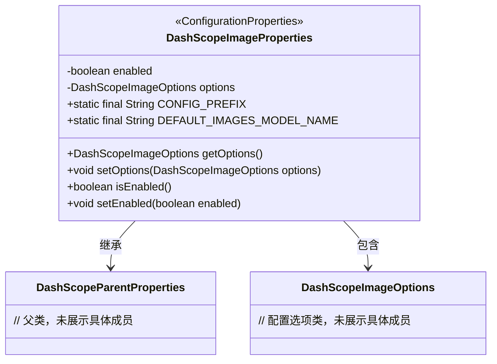
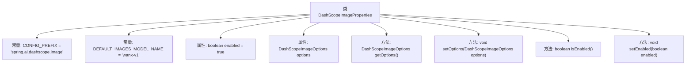

# 基础信息

|      |      |
|------|------|
| 名称 | DashScopeImageProperties |
| 编码语言 | .java |
| 代码路径 | spring-ai-alibaba/spring-ai-alibaba-autoconfigure/src/main/java/com/alibaba/cloud/ai/autoconfigure/dashscope/DashScopeImageProperties.java |
| 包名 | com.alibaba.cloud.ai.autoconfigure.dashscope |
| 依赖项 | ['com.alibaba.cloud.ai.dashscope.image.DashScopeImageOptions', 'org.springframework.boot.context.properties.ConfigurationProperties', 'org.springframework.boot.context.properties.NestedConfigurationProperty'] |
| 概述说明 | DashScope图像配置类包含默认模型和启用状态信息。 |

# 说明

DashScope图像配置类是一个用于管理图像处理相关设置的类，主要包含两个关键属性：默认模型和启用状态。默认模型属性指定了在图像处理过程中使用的默认算法或模型，确保在没有明确指定时仍能使用合适的处理方式。启用状态属性则用于控制图像处理功能的开启或关闭，用户可以根据需求灵活调整该状态以启用或禁用相关功能。该类旨在提供一种简便的方式来配置和管理图像处理的核心参数，确保系统在不同场景下能够高效运行。

# 类列表 Class Summary

| 名称   | 类型  | 说明 |
|-------|------|-------------|
| DashScopeImageProperties | class | DashScope图像配置类，包含默认模型和启用状态。 |

## 类 DashScopeImageProperties

|      |      |
|------|------|
| 访问范围 | @ConfigurationProperties(DashScopeImageProperties.CONFIG_PREFIX);public |
| 类型 | class |
| 名称 | DashScopeImageProperties |
| 说明 | DashScope图像配置类，包含默认模型和启用状态。 |

### UML类图

这段代码定义了一个名为 `DashScopeImageProperties` 的配置属性类，继承自 `DashScopeParentProperties`，并包含一个 `DashScopeImageOptions` 类型的嵌套配置属性。该类通过 `@ConfigurationProperties` 注解与 Spring 配置文件中的 `spring.ai.dashscope.image` 前缀绑定，提供了对 DashScope 图像生成服务的配置支持。主要功能包括启用/禁用服务、设置默认模型名称以及配置选项。

### 内部方法调用关系图

这段代码定义了一个名为 `DashScopeImageProperties` 的类，该类继承自 `DashScopeParentProperties`。类中包含了两个常量 `CONFIG_PREFIX` 和 `DEFAULT_IMAGES_MODEL_NAME`，分别用于配置前缀和默认的模型名称。类中还定义了一个布尔类型的属性 `enabled` 和一个 `DashScopeImageOptions` 类型的属性 `options`，并提供了相应的 getter 和 setter 方法。该类主要用于配置和管理与 DashScope 图像生成相关的属性。

### 字段列表 Field List

| 名称  | 类型  | 说明 |
|-------|-------|------|
| CONFIG_PREFIX = "spring.ai.dashscope.image" | String | 定义配置前缀为"spring.ai.dashscope.image"的常量。 |
| options = DashScopeImageOptions.builder()		.withModel(DEFAULT_IMAGES_MODEL_NAME)		.withN(1)		.build() | DashScopeImageOptions | 配置DashScope图像选项，使用默认模型并生成1张图像。 |
| DEFAULT_IMAGES_MODEL_NAME = "wanx-v1" | String | 默认图像模型名称为"wanx-v1"。 |
| enabled = true | boolean | 私有布尔变量enabled默认值为true。 |

### 方法列表 Method List

| 名称  | 类型  | 说明 |
|-------|-------|------|
| setEnabled | void | 设置对象启用状态的公共方法。 |
| isEnabled | boolean | 该方法返回布尔值，表示当前对象的启用状态。 |
| getOptions | DashScopeImageOptions | 获取DashScopeImageOptions对象的方法。 |
| setOptions | void | 设置DashScope图像处理选项。 |

