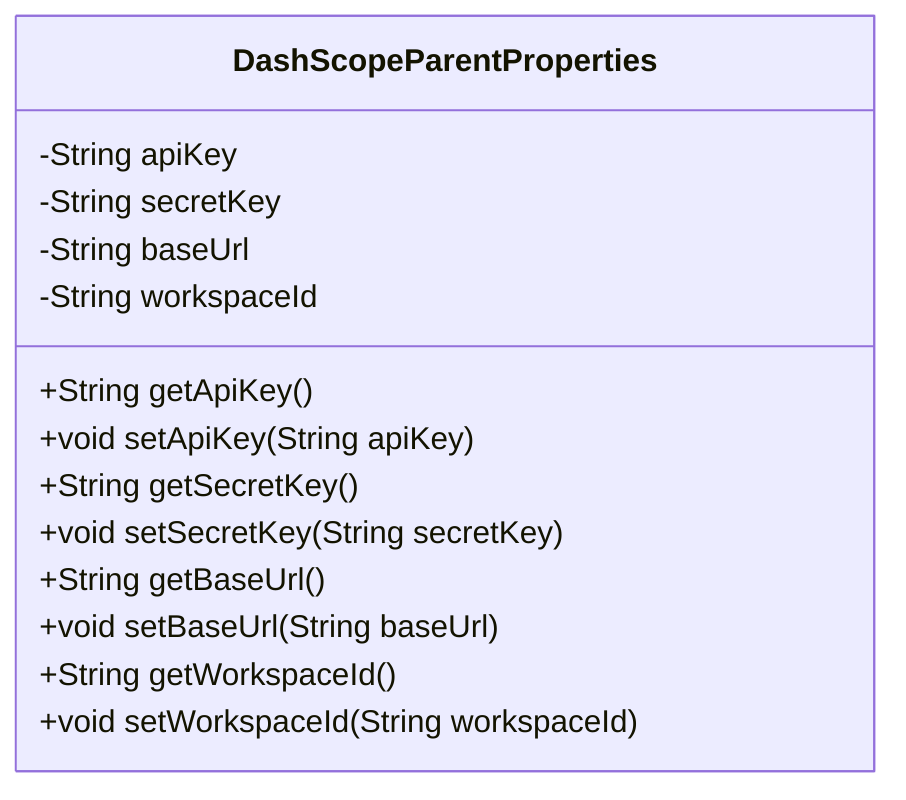
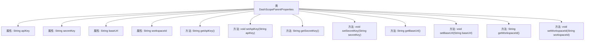

# 基础信息

|      |      |
|------|------|
| 名称 | DashScopeParentProperties |
| 编码语言 | .java |
| 代码路径 | spring-ai-alibaba/spring-ai-alibaba-autoconfigure/src/main/java/com/alibaba/cloud/ai/autoconfigure/dashscope/DashScopeParentProperties.java |
| 包名 | com.alibaba.cloud.ai.autoconfigure.dashscope |
| 依赖项 | [] |
| 概述说明 | DashScopeParentProperties类包含apiKey等属性及其getter和setter方法。 |

# 说明

DashScopeParentProperties类定义了四个关键属性：apiKey、secretKey、baseUrl和workspaceId。这些属性分别用于存储API密钥、密钥、基础URL和工作区ID。类中为每个属性提供了getter和setter方法，用于获取和设置这些属性的值。这种设计使得类的使用者能够方便地访问和修改这些关键信息，确保了类的灵活性和可扩展性。

# 类列表 Class Summary

| 名称   | 类型  | 说明 |
|-------|------|-------------|
| DashScopeParentProperties | class | DashScopeParentProperties类包含apiKey、secretKey、baseUrl和workspaceId属性及其getter和setter方法。 |

## 类 DashScopeParentProperties

|      |      |
|------|------|
| 访问范围 | None |
| 类型 | class |
| 名称 | DashScopeParentProperties |
| 说明 | DashScopeParentProperties类包含apiKey、secretKey、baseUrl和workspaceId属性及其getter和setter方法。 |

### UML类图

这段代码定义了一个名为 `DashScopeParentProperties` 的类，该类包含四个私有属性：`apiKey`、`secretKey`、`baseUrl` 和 `workspaceId`。每个属性都有对应的 `getter` 和 `setter` 方法，用于获取和设置这些属性的值。这个类的主要作用是封装与管理API相关的配置信息，确保这些信息可以通过公共方法进行访问和修改。

### 内部方法调用关系图

这段代码定义了一个名为`DashScopeParentProperties`的类，包含四个私有属性：`apiKey`、`secretKey`、`baseUrl`和`workspaceId`。每个属性都有对应的getter和setter方法，用于获取和设置这些属性的值。类的主要作用是封装这些属性，并提供访问和修改它们的接口。通过这种封装，可以确保属性的访问和修改是可控的，同时提高了代码的可维护性和安全性。

### 字段列表 Field List

| 名称  | 类型  | 说明 |
|-------|-------|------|
| baseUrl | String | 定义一个私有字符串变量baseUrl。 |
| secretKey | String | 声明了一个私有字符串变量secretKey。 |
| workspaceId | String | 私有字符串变量workspaceId。 |
| apiKey | String | 定义了一个私有的字符串变量apiKey。 |

### 方法列表 Method List

| 名称  | 类型  | 说明 |
|-------|-------|------|
| setWorkspaceId | void | 设置工作区ID的方法。 |
| setApiKey | void | 设置API密钥的方法，将传入值赋给实例变量apiKey。 |
| getSecretKey | String | 获取密钥的方法，返回存储的密钥值。 |
| setSecretKey | void | 设置密钥方法，将输入密钥赋值给类成员变量。 |
| getWorkspaceId | String | 获取工作区ID的方法。 |
| getApiKey | String | 获取API密钥的方法。 |
| setBaseUrl | void | 设置基础URL的方法。 |
| getBaseUrl | String | 该方法返回baseUrl的字符串值。 |

