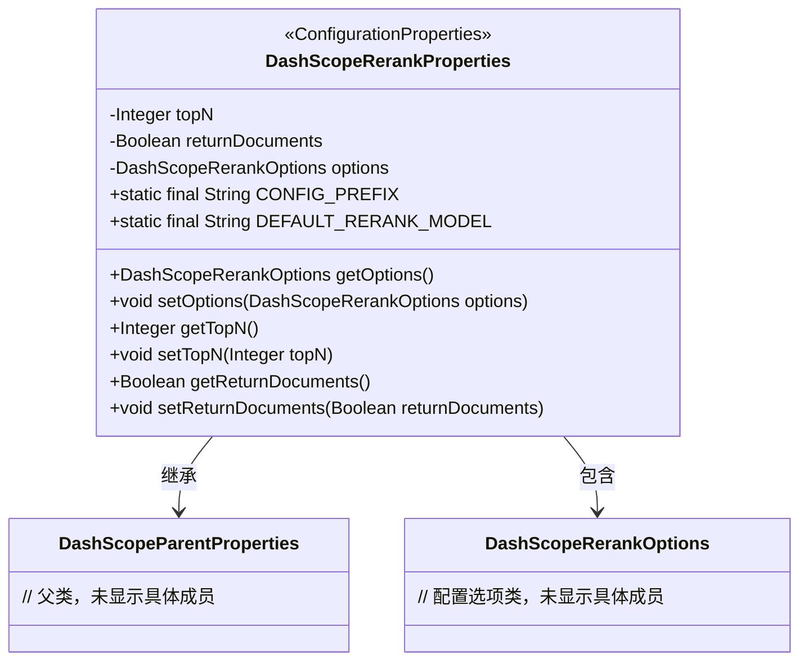
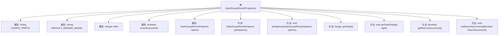

# 基础信息

|      |      |
|------|------|
| 名称 | DashScopeRerankProperties |
| 编码语言 | .java |
| 代码路径 | spring-ai-alibaba/spring-ai-alibaba-autoconfigure/src/main/java/com/alibaba/cloud/ai/autoconfigure/dashscope/DashScopeRerankProperties.java |
| 包名 | com.alibaba.cloud.ai.autoconfigure.dashscope |
| 依赖项 | ['com.alibaba.cloud.ai.dashscope.rerank.DashScopeRerankOptions', 'org.springframework.boot.context.properties.ConfigurationProperties', 'org.springframework.boot.context.properties.NestedConfigurationProperty'] |
| 概述说明 | DashScopeRerankProperties类配置Spring AI Alibaba重排模型，默认模型为gte-rerank，支持设置topN和返回原始文档选项。 |

# 说明

DashScopeRerankProperties类用于配置Spring AI Alibaba的重排模型，默认使用gte-rerank模型。该类支持设置topN参数，用于指定返回的文档数量，同时提供返回原始文档的选项，以便用户根据需要选择是否返回原始文档内容。

# 类列表 Class Summary

| 名称   | 类型  | 说明 |
|-------|------|-------------|
| DashScopeRerankProperties | class | DashScopeRerankProperties类配置Spring AI Alibaba重排模型，默认模型为gte-rerank，支持设置topN和返回原始文档选项。 |

## 类 DashScopeRerankProperties

|      |      |
|------|------|
| 访问范围 | @ConfigurationProperties(DashScopeRerankProperties.CONFIG_PREFIX);public |
| 类型 | class |
| 名称 | DashScopeRerankProperties |
| 说明 | DashScopeRerankProperties类配置Spring AI Alibaba重排模型，默认模型为gte-rerank，支持设置topN和返回原始文档选项。 |

### UML类图

**描述**：`DashScopeRerankProperties` 类是一个配置属性类，继承自 `DashScopeParentProperties`，并包含 `DashScopeRerankOptions` 类型的配置选项。该类定义了用于重排模型的配置参数，如 `topN`、`returnDocuments` 和 `options`，并提供了相应的 getter 和 setter 方法。该类通过 `@ConfigurationProperties` 注解与 Spring 配置绑定，前缀为 `spring.ai.dashscope.rerank`。

### 内部方法调用关系图

**描述：**
`DashScopeRerankProperties` 类是一个配置类，用于管理 DashScope 重排相关的属性。它包含多个属性，如 `CONFIG_PREFIX`、`DEFAULT_RERANK_MODEL`、`topN`、`returnDocuments` 和 `options`，并提供了相应的 getter 和 setter 方法。这些方法用于获取和设置这些属性的值，以便在 Spring AI Alibaba 配置中使用。

### 字段列表 Field List

| 名称  | 类型  | 说明 |
|-------|-------|------|
| returnDocuments = false | Boolean | 设置返回文档标志为假。 |
| topN = 5 | Integer | 定义私有整型变量topN，初始值为5。 |
| options = DashScopeRerankOptions.builder().withModel(DEFAULT_RERANK_MODEL).build() | DashScopeRerankOptions | 配置属性包含默认模型的重排序选项。 |
| CONFIG_PREFIX = "spring.ai.dashscope.rerank" | String | 定义静态常量CONFIG_PREFIX，值为"spring.ai.dashscope.rerank"。 |
| DEFAULT_RERANK_MODEL = "gte-rerank" | String | DEFAULT_RERANK_MODEL定义为"gte-rerank"。 |

### 方法列表 Method List

| 名称  | 类型  | 说明 |
|-------|-------|------|
| getReturnDocuments | Boolean | 该方法返回布尔值，表示是否返回文档。 |
| setTopN | void | 设置topN参数的方法。 |
| setReturnDocuments | void | 设置返回文档的布尔值。 |
| setOptions | void | 该方法用于设置DashScopeRerankOptions选项。 |
| getOptions | DashScopeRerankOptions | 获取当前DashScopeRerankOptions实例的配置选项。 |
| getTopN | Integer | 获取topN整数值的方法。 |

