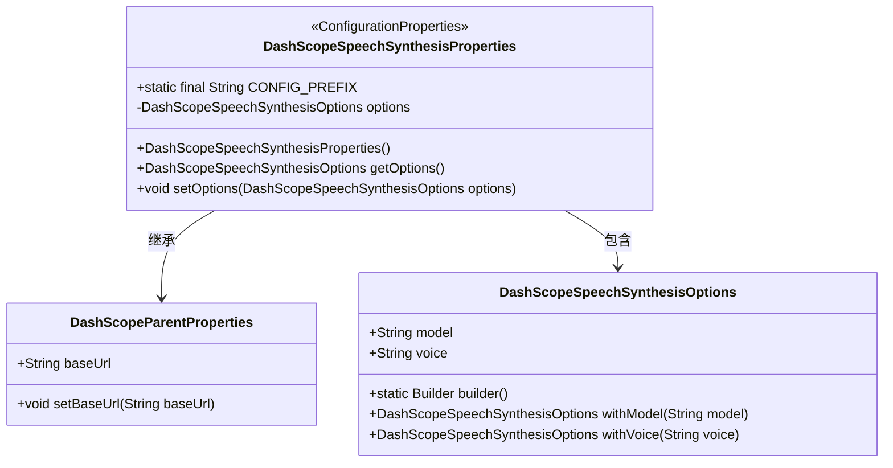
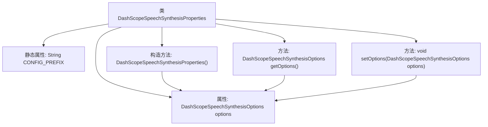

# 基础信息

|      |      |
|------|------|
| 名称 | DashScopeSpeechSynthesisProperties |
| 编码语言 | .java |
| 代码路径 | spring-ai-alibaba/spring-ai-alibaba-autoconfigure/src/main/java/com/alibaba/cloud/ai/autoconfigure/dashscope/DashScopeSpeechSynthesisProperties.java |
| 包名 | com.alibaba.cloud.ai.autoconfigure.dashscope |
| 依赖项 | ['com.alibaba.cloud.ai.dashscope.audio.DashScopeSpeechSynthesisOptions', 'org.springframework.boot.context.properties.ConfigurationProperties', 'org.springframework.boot.context.properties.NestedConfigurationProperty', 'com.alibaba.cloud.ai.dashscope.common.DashScopeApiConstants.DEFAULT_BASE_URL'] |
| 概述说明 | Spring AI Alibaba配置类定义语音合成属性和默认选项。 |

# 说明

Spring AI Alibaba配置类主要用于定义语音合成的属性和默认选项。该配置类包含了与语音合成相关的关键参数和设置，确保系统在调用语音合成功能时能够按照预定的默认值进行操作。通过该配置类，用户可以灵活地调整语音合成的各项属性，如音色、语速、音量等，以满足不同的应用场景需求。配置类的设计旨在简化语音合成的集成过程，提供一致且可配置的接口，提升开发效率和系统稳定性。

# 类列表 Class Summary

| 名称   | 类型  | 说明 |
|-------|------|-------------|
| DashScopeSpeechSynthesisProperties | class | Spring AI Alibaba配置类，定义语音合成属性和默认选项。 |

## 类 DashScopeSpeechSynthesisProperties

|      |      |
|------|------|
| 访问范围 | @ConfigurationProperties(DashScopeSpeechSynthesisProperties.CONFIG_PREFIX);public |
| 类型 | class |
| 名称 | DashScopeSpeechSynthesisProperties |
| 说明 | Spring AI Alibaba配置类，定义语音合成属性和默认选项。 |

### UML类图

**描述**：`DashScopeSpeechSynthesisProperties` 类继承自 `DashScopeParentProperties`，并包含一个 `DashScopeSpeechSynthesisOptions` 类型的嵌套配置属性。该类通过 `@ConfigurationProperties` 注解与 Spring 配置文件进行绑定，用于管理语音合成的配置选项。`DashScopeSpeechSynthesisOptions` 类提供了构建和设置语音合成选项的方法。

### 内部方法调用关系图

该流程图描述了`DashScopeSpeechSynthesisProperties`类的结构及其内部关系。类中包含一个静态属性`CONFIG_PREFIX`，用于定义配置前缀。`options`属性是一个嵌套配置属性，通过构造方法进行初始化，并提供了`getOptions`和`setOptions`方法来获取和设置该属性。构造方法在初始化时调用了父类的`setBaseUrl`方法，确保基础URL的正确设置。

### 字段列表 Field List

| 名称  | 类型  | 说明 |
|-------|-------|------|
| CONFIG_PREFIX = "spring.ai.dashscope.audio.synthesis" | String | 定义配置前缀字符串"spring.ai.dashscope.audio.synthesis"。 |
| options = DashScopeSpeechSynthesisOptions.builder()		.withModel("cosyvoice-v1")		.withVoice("longhua")		.build() | DashScopeSpeechSynthesisOptions | 配置DashScope语音合成选项，使用模型cosyvoice-v1和声音longhua。 |

### 方法列表 Method List

| 名称  | 类型  | 说明 |
|-------|-------|------|
| setOptions | void | 设置DashScope语音合成选项的方法。 |
| getOptions | DashScopeSpeechSynthesisOptions | 获取DashScope语音合成配置选项的方法。 |

