# 基础信息

|      |      |
|------|------|
| 名称 | dashscope |
| 编码语言 | .java |
| 代码路径 | spring-ai-alibaba/spring-ai-alibaba-autoconfigure/src/main/java/com/alibaba/cloud/ai/autoconfigure/dashscope |
| 包名 | spring-ai-alibaba.spring-ai-alibaba-autoconfigure.src.main.java.com.alibaba.cloud.ai.autoconfigure.dashscope |
| 概述说明 | 阿里云DashScope配置类管理音频、图像、聊天等AI功能，提供灵活参数设置，确保系统高效运行。 |

# 说明

## 概述

该代码模块是Spring AI Alibaba项目中的一个子模块，专注于与阿里云DashScope AI服务的集成。模块通过一系列配置类和工具类，提供了对DashScope多种AI功能的支持，包括音频转录、图像处理、语音合成、聊天、嵌入、重排等功能。模块的设计旨在简化AI服务的集成过程，提供灵活且可扩展的配置选项，确保开发者能够方便地调用和管理这些AI能力。

## 主要业务场景

1. **音频转录**：通过`DashScopeAudioTranscriptionProperties`类，用户可以配置和管理音频转录过程中的各种参数，确保转录任务能够顺利进行。
2. **图像处理**：`DashScopeImageProperties`类用于管理图像处理相关的设置，包括默认模型和启用状态，确保系统在不同场景下能够高效运行。
3. **语音合成**：`DashScopeSpeechSynthesisProperties`类定义了语音合成的属性和默认选项，允许用户灵活调整音色、语速、音量等参数，以满足不同的应用需求。
4. **聊天功能**：`DashScopeChatProperties`类用于配置聊天客户端，支持默认模型和温度参数的设置，确保聊天交互能够按照预设条件进行。
5. **嵌入功能**：`DashScopeEmbeddingProperties`类管理和配置嵌入功能，支持启用状态、元数据模式和嵌入选项的灵活配置。
6. **重排功能**：`DashScopeRerankProperties`类用于配置重排模型，支持设置返回文档数量和是否返回原始文档内容。
7. **连接管理**：通过`DashScopeConnectionUtils`和`DashScopeConnectionProperties`类，用户可以解析和管理连接属性，如API密钥、基础URL、读取超时时间等，确保系统的可维护性和安全性。
8. **自动配置**：`DashScopeAutoConfiguration`类集成了多种AI模型，支持聊天、图像、语音等多种功能，通过自动配置简化了模型的使用流程，提升开发效率。

该模块适用于需要快速集成AI能力的应用场景，帮助开发者轻松实现智能化功能。

### 包内部结构视图

```mermaid
graph TD
    dashscope --> DashScopeAudioTranscriptionProperties.java
    dashscope --> DashScopeConnectionUtils.java
    dashscope --> DashScopeImageProperties.java
    dashscope --> DashScopeParentProperties.java
    dashscope --> DashScopeConnectionProperties.java
    dashscope --> ResolvedConnectionProperties.java
    dashscope --> DashScopeRerankProperties.java
    dashscope --> DashScopeSpeechSynthesisProperties.java
    dashscope --> DashScopeChatProperties.java
    dashscope --> DashScopeEmbeddingProperties.java
    dashscope --> DashScopeAutoConfiguration.java
```

该流程图展示了`dashscope`目录下的多个配置文件之间的关系。每个文件都直接隶属于`dashscope`目录，且文件之间没有层级嵌套关系。这些文件主要用于配置和管理与阿里云AI服务相关的属性，如音频转录、图像处理、语音合成等。

# 文件列表 File List

| 名称   | 类型  | 说明 |
|-------|------|-------------|
| [DashScopeAutoConfiguration.java](DashScopeAutoConfiguration.md) | file | DashScope类集成AI模型，支持聊天、图像、语音功能。 |
| [DashScopeChatProperties.java](DashScopeChatProperties.md) | file | DashScopeChatProperties类配置Spring AI Alibaba的DashScope聊天客户端，含默认模型和温度设置。 |
| [ResolvedConnectionProperties.java](ResolvedConnectionProperties.md) | file | 无内容可总结。 |
| [DashScopeParentProperties.java](DashScopeParentProperties.md) | file | DashScopeParentProperties类包含apiKey等属性及其getter和setter方法。 |
| [DashScopeAudioTranscriptionProperties.java](DashScopeAudioTranscriptionProperties.md) | file | 配置类管理阿里云DashScope音频转录的属性和选项。 |
| [DashScopeConnectionUtils.java](DashScopeConnectionUtils.md) | file | DashScopeConnectionUtils类解析连接属性，支持从环境获取apiKey。 |
| [DashScopeEmbeddingProperties.java](DashScopeEmbeddingProperties.md) | file | DashScope嵌入属性类涵盖启用状态、元数据模式和嵌入选项配置。 |
| [DashScopeSpeechSynthesisProperties.java](DashScopeSpeechSynthesisProperties.md) | file | Spring AI Alibaba配置类定义语音合成属性和默认选项。 |
| [DashScopeRerankProperties.java](DashScopeRerankProperties.md) | file | DashScopeRerankProperties类配置Spring AI Alibaba重排模型，默认模型为gte-rerank，支持设置topN和返回原始文档选项。 |
| [DashScopeConnectionProperties.java](DashScopeConnectionProperties.md) | file | DashScopeConnectionProperties类配置读取超时和基础URL。 |
| [DashScopeImageProperties.java](DashScopeImageProperties.md) | file | DashScope图像配置类包含默认模型和启用状态信息。 |

