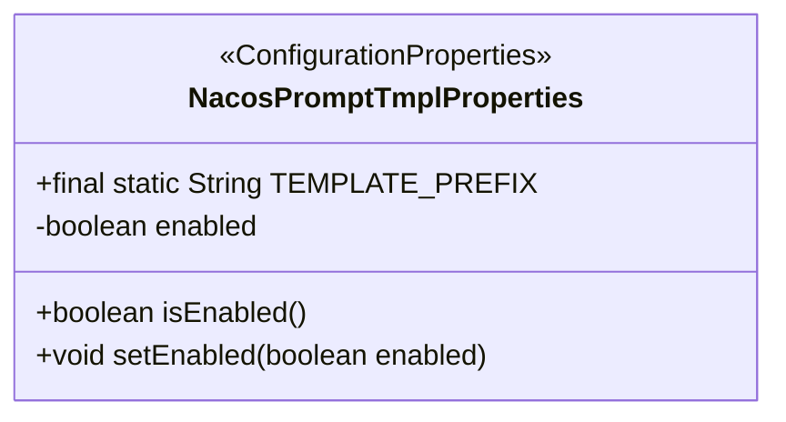
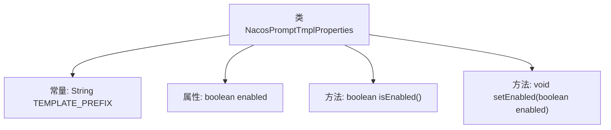

# 基础信息

|      |      |
|------|------|
| 名称 | NacosPromptTmplProperties |
| 编码语言 | .java |
| 代码路径 | spring-ai-alibaba/spring-ai-alibaba-autoconfigure/src/main/java/com/alibaba/cloud/ai/autoconfigure/prompt/NacosPromptTmplProperties.java |
| 包名 | com.alibaba.cloud.ai.autoconfigure.prompt |
| 依赖项 | ['org.springframework.boot.context.properties.ConfigurationProperties'] |
| 概述说明 | NacosPromptTmplProperties类配置Nacos提示模板，默认未启用。 |

# 说明

NacosPromptTmplProperties类用于配置Nacos提示模板，目前默认状态下该功能未启用。

# 类列表 Class Summary

| 名称   | 类型  | 说明 |
|-------|------|-------------|
| NacosPromptTmplProperties | class | NacosPromptTmplProperties类配置Nacos提示模板，默认未启用。 |

## 类 NacosPromptTmplProperties

|      |      |
|------|------|
| 访问范围 | @ConfigurationProperties(NacosPromptTmplProperties.TEMPLATE_PREFIX);public |
| 类型 | class |
| 名称 | NacosPromptTmplProperties |
| 说明 | NacosPromptTmplProperties类配置Nacos提示模板，默认未启用。 |

### UML类图

**描述：**  
`NacosPromptTmplProperties` 类是一个配置属性类，用于管理与 Nacos 提示模板相关的配置。它包含一个静态常量 `TEMPLATE_PREFIX`，用于定义配置前缀，以及一个布尔类型的 `enabled` 属性，用于标识是否启用该配置。类中提供了 `isEnabled` 和 `setEnabled` 方法，分别用于获取和设置 `enabled` 属性的值。该类通过 `@ConfigurationProperties` 注解与外部配置绑定。

### 内部方法调用关系图

这段代码定义了一个名为`NacosPromptTmplProperties`的类，用于配置Nacos提示模板的属性。类中包含一个常量`TEMPLATE_PREFIX`，表示配置属性的前缀。类中还有一个布尔类型的属性`enabled`，默认值为`false`，表示是否启用该配置。类中提供了`isEnabled()`和`setEnabled(boolean enabled)`两个方法，分别用于获取和设置`enabled`属性的值。通过`@ConfigurationProperties`注解，该类可以与外部的配置文件进行绑定，实现动态配置。

### 字段列表 Field List

| 名称  | 类型  | 说明 |
|-------|-------|------|
| TEMPLATE_PREFIX = "spring.ai.nacos.prompt.template" | String | 定义了静态常量TEMPLATE_PREFIX，值为"spring.ai.nacos.prompt.template"。 |
| enabled = false | boolean | 私有布尔变量enabled初始值为false。 |

### 方法列表 Method List

| 名称  | 类型  | 说明 |
|-------|-------|------|
| isEnabled | boolean | 该方法返回布尔值，表示是否启用。 |
| setEnabled | void | 该方法用于设置对象启用状态，接受布尔值参数。 |

