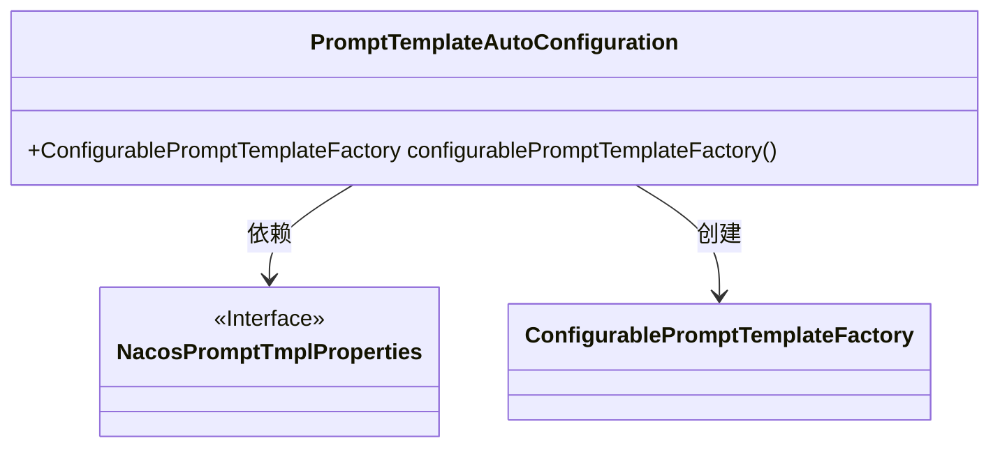
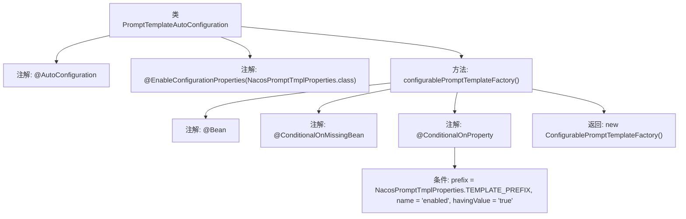

# 基础信息

|      |      |
|------|------|
| 名称 | PromptTemplateAutoConfiguration |
| 编码语言 | .java |
| 代码路径 | spring-ai-alibaba/spring-ai-alibaba-autoconfigure/src/main/java/com/alibaba/cloud/ai/autoconfigure/prompt/PromptTemplateAutoConfiguration.java |
| 包名 | com.alibaba.cloud.ai.autoconfigure.prompt |
| 依赖项 | ['com.alibaba.cloud.ai.prompt.ConfigurablePromptTemplateFactory', 'org.springframework.boot.autoconfigure.AutoConfiguration', 'org.springframework.boot.autoconfigure.condition.ConditionalOnMissingBean', 'org.springframework.boot.autoconfigure.condition.ConditionalOnProperty', 'org.springframework.boot.context.properties.EnableConfigurationProperties', 'org.springframework.context.annotation.Bean'] |
| 概述说明 | 自动配置类启用Nacos属性并条件创建提示模板工厂。 |

# 说明

自动配置类通过启用Nacos属性，实现了在特定条件下创建提示模板工厂的功能。该配置类根据Nacos的配置信息，动态决定是否生成提示模板工厂，从而确保系统在不同环境下的灵活性和可配置性。这一机制简化了配置管理，提升了系统的可维护性和扩展性。

# 类列表 Class Summary

| 名称   | 类型  | 说明 |
|-------|------|-------------|
| PromptTemplateAutoConfiguration | class | 自动配置类，启用Nacos属性，条件创建提示模板工厂。 |

## 类 PromptTemplateAutoConfiguration

|      |      |
|------|------|
| 访问范围 | @AutoConfiguration;@EnableConfigurationProperties(NacosPromptTmplProperties.class);public |
| 类型 | class |
| 名称 | PromptTemplateAutoConfiguration |
| 说明 | 自动配置类，启用Nacos属性，条件创建提示模板工厂。 |

### UML类图

**描述：**  
`PromptTemplateAutoConfiguration` 是一个自动配置类，依赖于 `NacosPromptTmplProperties` 接口，并在特定条件下创建 `ConfigurablePromptTemplateFactory` 实例。该类通过 `@ConditionalOnProperty` 注解确保只有在配置属性 `nacos.prompt.template.enabled` 为 `true` 时才会创建 `ConfigurablePromptTemplateFactory` 实例。

### 内部方法调用关系图

这段代码是一个Spring Boot自动配置类，名为`PromptTemplateAutoConfiguration`。该类通过`@AutoConfiguration`和`@EnableConfigurationProperties`注解启用自动配置，并绑定`NacosPromptTmplProperties`类的配置属性。`configurablePromptTemplateFactory()`方法是一个Bean定义方法，仅在`NacosPromptTmplProperties.TEMPLATE_PREFIX`前缀下的`enabled`属性为`true`时，才会创建并返回一个`ConfigurablePromptTemplateFactory`实例。

### 字段列表 Field List

| 名称  | 类型  | 说明 |
|-------|-------|------|

### 方法列表 Method List

| 名称  | 类型  | 说明 |
|-------|-------|------|
| configurablePromptTemplateFactory | ConfigurablePromptTemplateFactory | 条件创建可配置提示模板工厂，需满足特定属性。 |

