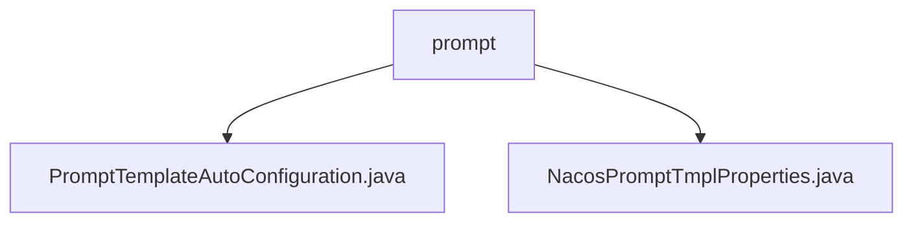

# 基础信息

|      |      |
|------|------|
| 名称 | prompt |
| 编码语言 | .java |
| 代码路径 | spring-ai-alibaba/spring-ai-alibaba-autoconfigure/src/main/java/com/alibaba/cloud/ai/autoconfigure/prompt |
| 包名 | spring-ai-alibaba.spring-ai-alibaba-autoconfigure.src.main.java.com.alibaba.cloud.ai.autoconfigure.prompt |
| 概述说明 | 自动配置类通过Nacos属性动态生成提示模板工厂，提升系统灵活性和可维护性。 |

# 说明

## 概述
该代码模块通过自动配置类实现了基于Nacos的动态提示模板工厂创建功能。核心组件包括`PromptTemplateAutoConfiguration`和`NacosPromptTmplProperties`，前者负责根据Nacos配置动态生成提示模板工厂，后者用于配置Nacos提示模板的相关属性。该模块的设计旨在提升系统的灵活性、可配置性和可维护性，同时简化了配置管理流程。

## 主要业务场景
1. **动态配置管理**：通过Nacos配置信息，动态决定是否生成提示模板工厂，适应不同环境下的需求。
2. **灵活性增强**：支持在不同环境下灵活启用或禁用提示模板功能，确保系统的可扩展性。
3. **默认配置**：在默认状态下，提示模板功能未启用，需通过Nacos配置手动开启，避免不必要的资源消耗。
4. **简化维护**：通过自动配置机制，减少了手动配置的复杂性，提升了系统的可维护性。

### 包内部结构视图

这段流程图展示了在`prompt`文件夹下的两个文件：`PromptTemplateAutoConfiguration.java`和`NacosPromptTmplProperties.java`。这两个文件都属于自动配置类，用于在Spring AI Alibaba项目中处理与提示模板相关的配置和属性。

# 文件列表 File List

| 名称   | 类型  | 说明 |
|-------|------|-------------|
| [NacosPromptTmplProperties.java](NacosPromptTmplProperties.md) | file | NacosPromptTmplProperties类配置Nacos提示模板，默认未启用。 |
| [PromptTemplateAutoConfiguration.java](PromptTemplateAutoConfiguration.md) | file | 自动配置类启用Nacos属性并条件创建提示模板工厂。 |

