# 基础信息

|      |      |
|------|------|
| 名称 | cloud |
| 编码语言 | .java |
| 代码路径 | spring-ai-alibaba/spring-ai-alibaba-core/src/main/java/com/alibaba/cloud |
| 包名 | spring-ai-alibaba.spring-ai-alibaba-core.src.main.java.com.alibaba.cloud |
| 概述说明 | Agent类定义call和stream方法，支持同步和异步与聊天模型交互。文档处理模块提供JSON和文本文档解析功能。文档重排模块处理请求、响应及元数据管理。AI工具集涵盖语音、图像、文档处理等功能。提示模板模块支持动态生成和管理。评估模块自动化评估学生答案质量。检索与重排序模块优化检索结果相关性和系统性能。SentenceSplitter类按句子分割文本。 |

# 说明

## 概述

该代码模块是一个多功能AI工具集，基于阿里云DashScope服务，涵盖了语音合成、音频转录、图像生成、文档管理、聊天模型、嵌入模型、文档重排序等多种功能。模块通过多个核心类和配置选项，提供了灵活且高效的API调用机制，支持REST和WebSocket等多种通信方式。模块的设计目标是实现与DashScope API的无缝集成，确保在各种复杂的AI应用场景中能够高效处理请求和响应。

## 主要业务场景

1. **语音合成与音频转录**：
   - 通过`DashScopeSpeechSynthesisModel`和`DashScopeAudioTranscriptionModel`类，支持语音合成和音频转录功能，适用于实时语音输出和大规模音频数据处理的场景。
   - 配置选项包括模型选择、音量调节、语速设置、词汇ID、短语ID等，确保转录和合成的精确性。

2. **图像生成**：
   - `DashScopeImageModel`类支持通过外部API生成图像，用户可以通过`DashScopeImageOptions`类配置图像数量、尺寸、艺术风格等参数。
   - 内置重试机制，确保API调用的稳定性。

3. **文档管理与检索**：
   - `DashScopeDocumentRetriever`和`DashScopeDocumentRetrievalAdvisor`类负责文档的存储、检索和引用操作，支持同步与异步调用。
   - `DashScopeDocumentTransformer`类提供文档分割功能，支持块大小、重叠大小等参数的配置。

4. **聊天模型与复杂对话管理**：
   - `DashScopeChatModel`类实现了聊天模型的核心功能，支持工具调用和重试模板，确保在多轮对话和复杂任务中的稳定性和可靠性。
   - `DashScopeChatModelObservationConvention`类增强了默认的观察约定，能够根据预设条件自动终止请求序列。

5. **嵌入模型与向量化处理**：
   - `DashScopeEmbeddingModel`类提供了将数据转换为向量表示的嵌入功能，支持多种数据类型的处理。
   - `DashScopeEmbeddingOptions`类允许用户配置模型类型、文本类型和维度等属性。

6. **文档重排序**：
   - `DashScopeRerankModel`类通过调用DashScope API对文档进行重新排序，支持模型参数配置和返回文档数量的指定。
   - 内置重试机制，确保在API调用失败时能够自动重试。

7. **WebSocket通信与实时数据处理**：
   - `DashScopeWebSocketClient`类负责管理WebSocket通信的各个环节，支持文本和二进制数据的传输，适用于实时聊天、在线协作等场景。

8. **API调用与响应管理**：
   - `DashScopeApi`类支持聊天、嵌入、文件上传、文档分割等多种功能，提供灵活的API调用方式。
   - `DashScopeResponseFormat`类支持文本或JSON对象类型的响应格式，确保API返回数据的灵活性和可读性。

这些业务场景共同构成了一个完整的AI工具集，适用于需要高效处理语音、图像、文档等多种数据类型的应用场景。

### 包内部结构视图

```mermaid
graph TD
    ai --> agent
    ai --> document
    ai --> model
    ai --> dashscope
    ai --> prompt
    ai --> evaluation
    ai --> advisor
    ai --> transformer
    agent --> Agent.java
    document --> DocumentWithScore.java
    document --> JsonDocumentParser.java
    document --> TextDocumentParser.java
    document --> DocumentParser.java
    model --> RerankResponseMetadata.java
    model --> RerankRequest.java
    model --> RerankResponse.java
    model --> RerankResultMetadata.java
    model --> RerankOptions.java
    model --> RerankModel.java
    dashscope --> agent
    dashscope --> rag
    dashscope --> common
    dashscope --> observation
    dashscope --> audio
    dashscope --> api
    dashscope --> protocol
    dashscope --> metadata
    dashscope --> chat
    dashscope --> image
    dashscope --> embedding
    dashscope --> rerank
    prompt --> ConfigurablePromptTemplate.java
    prompt --> ConfigurablePromptTemplateFactory.java
    evaluation --> AnswerRelevancyEvaluator.java
    evaluation --> AnswerCorrectnessEvaluator.java
    evaluation --> AnswerFaithfulnessEvaluator.java
    evaluation --> LaajEvaluator.java
    advisor --> RetrievalRerankAdvisor.java
    advisor --> DocumentRetrievalAdvisor.java
    transformer --> splitter
    splitter --> SentenceSplitter.java
```

该流程图展示了Spring AI Alibaba项目中各个模块的层级关系。从根节点`ai`开始，分别连接到`agent`、`document`、`model`、`dashscope`、`prompt`、`evaluation`、`advisor`和`transformer`等子模块。每个子模块进一步细分为具体的类或子模块，如`dashscope`模块下包含`agent`、`rag`、`common`等多个子模块，展示了项目结构的复杂性和模块化设计。

# 文件列表 File List

| 名称   | 类型  | 说明 |
|-------|------|-------------|
| [ai](ai/_module.md) | package | Agent类定义call和stream方法，支持同步和异步与聊天模型交互。文档处理模块提供JSON和文本文档解析功能。文档重排模块处理请求、响应及元数据管理。AI工具集涵盖语音、图像、文档处理等功能。提示模板模块支持动态生成和管理。评估模块自动化评估学生答案质量。检索与重排序模块优化检索结果相关性和系统性能。SentenceSplitter类按句子分割文本。 |

