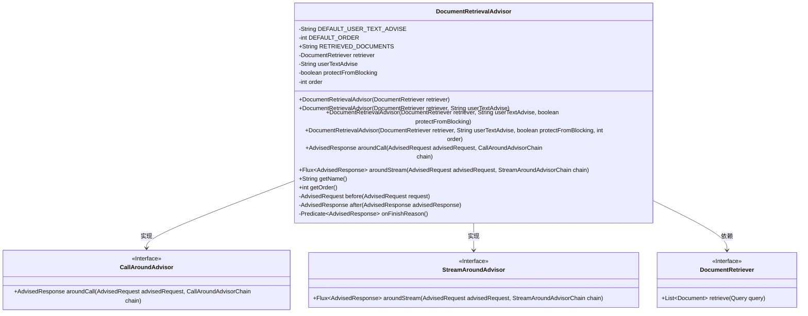

# 基础信息

|      |      |
|------|------|
| 名称 | DocumentRetrievalAdvisor |
| 编码语言 | .java |
| 代码路径 | spring-ai-alibaba/spring-ai-alibaba-core/src/main/java/com/alibaba/cloud/ai/advisor/DocumentRetrievalAdvisor.java |
| 包名 | com.alibaba.cloud.ai.advisor |
| 依赖项 | ['org.springframework.ai.chat.client.advisor.api', 'org.springframework.ai.chat.metadata.ChatResponseMetadata', 'org.springframework.ai.chat.model.ChatResponse', 'org.springframework.ai.document.Document', 'org.springframework.ai.rag.Query', 'org.springframework.ai.rag.retrieval.search.DocumentRetriever', 'org.springframework.util.StringUtils', 'reactor.core.publisher.Flux', 'reactor.core.publisher.Mono', 'reactor.core.scheduler.Schedulers', 'java.util.HashMap', 'java.util.List', 'java.util.Map', 'java.util.Set', 'java.util.function.Predicate', 'java.util.stream.Collectors'] |
| 概述说明 | DocumentRetrievalAdvisor类实现文档检索与响应处理，支持阻塞与非阻塞线程。 |

# 说明

DocumentRetrievalAdvisor类主要负责文档检索与响应处理功能，具备支持阻塞与非阻塞线程的能力。该类通过高效管理线程模式，确保在不同场景下能够灵活处理文档检索任务，提升系统响应速度与资源利用率。其设计旨在优化文档检索流程，同时兼顾线程管理的灵活性与效率，适用于需要高性能文档处理的复杂应用场景。

# 类列表 Class Summary

| 名称   | 类型  | 说明 |
|-------|------|-------------|
| DocumentRetrievalAdvisor | class | DocumentRetrievalAdvisor类实现文档检索与响应处理，支持阻塞与非阻塞线程。 |

## 类 DocumentRetrievalAdvisor

|      |      |
|------|------|
| 访问范围 | public |
| 类型 | class |
| 名称 | DocumentRetrievalAdvisor |
| 说明 | DocumentRetrievalAdvisor类实现文档检索与响应处理，支持阻塞与非阻塞线程。 |

### UML类图

这段代码定义了一个名为 `DocumentRetrievalAdvisor` 的类，该类实现了 `CallAroundAdvisor` 和 `StreamAroundAdvisor` 接口，用于在请求和响应处理过程中插入文档检索逻辑。该类通过 `DocumentRetriever` 接口检索文档，并在请求前后执行特定的处理逻辑。代码中包含了多个构造函数，允许灵活配置文档检索和响应处理的参数。`aroundCall` 和 `aroundStream` 方法分别用于同步和异步处理请求和响应，确保在处理过程中插入文档检索逻辑。

### 内部方法调用关系图

```mermaid
graph TD
    A["类DocumentRetrievalAdvisor"]
    B["实现接口: CallAroundAdvisor, StreamAroundAdvisor"]
    C["常量: DEFAULT_USER_TEXT_ADVISE"]
    D["常量: DEFAULT_ORDER"]
    E["常量: RETRIEVED_DOCUMENTS"]
    F["属性: DocumentRetriever retriever"]
    G["属性: String userTextAdvise"]
    H["属性: boolean protectFromBlocking"]
    I["属性: int order"]
    J["构造方法: DocumentRetrievalAdvisor(DocumentRetriever retriever)"]
    K["构造方法: DocumentRetrievalAdvisor(DocumentRetriever retriever, String userTextAdvise)"]
    L["构造方法: DocumentRetrievalAdvisor(DocumentRetriever retriever, String userTextAdvise, boolean protectFromBlocking)"]
    M["构造方法: DocumentRetrievalAdvisor(DocumentRetriever retriever, String userTextAdvise, boolean protectFromBlocking, int order)"]
    N["方法: aroundCall(AdvisedRequest advisedRequest, CallAroundAdvisorChain chain)"]
    O["方法: aroundStream(AdvisedRequest advisedRequest, StreamAroundAdvisorChain chain)"]
    P["方法: getName()"]
    Q["方法: getOrder()"]
    R["私有方法: before(AdvisedRequest request)"]
    S["私有方法: after(AdvisedResponse advisedResponse)"]
    T["私有方法: onFinishReason()"]

    A --> B
    A --> C
    A --> D
    A --> E
    A --> F
    A --> G
    A --> H
    A --> I
    A --> J
    A --> K
    A --> L
    A --> M
    A --> N
    A --> O
    A --> P
    A --> Q
    A --> R
    A --> S
    A --> T
```

该流程图展示了`DocumentRetrievalAdvisor`类的结构，包括其实现的接口、常量、属性、构造方法以及主要方法。类的主要功能是通过`DocumentRetriever`检索文档，并在请求和响应过程中进行处理。流程图清晰地展示了类内部的函数调用关系，帮助理解代码的执行流程。

### 字段列表 Field List

| 名称  | 类型  | 说明 |
|-------|-------|------|
| protectFromBlocking | boolean | 保护免受阻塞的私有布尔变量。 |
| retriever | DocumentRetriever | 私有且不可变的文档检索器实例。 |
| userTextAdvise | String | 私有字符串变量userTextAdvise。 |
| order | int | 私有整型变量order，用于存储订单信息。 |
| DEFAULT_ORDER = 0 | int | 定义私有静态常量DEFAULT_ORDER，默认值为0。 |
| RETRIEVED_DOCUMENTS = "question_answer_context" | String | 静态字符串变量存储问答上下文信息。 |
| DEFAULT_USER_TEXT_ADVISE = """			Context information is below.			---------------------			{question_answer_context}			---------------------			Given the context and provided history information and not prior knowledge,			reply to the user comment. If the answer is not in the context, inform			the user that you can't answer the question.			""" | String | 默认用户提示：根据上下文和历史信息回复，若无答案则告知无法解答。 |

### 方法列表 Method List

| 名称  | 类型  | 说明 |
|-------|-------|------|
| getName | String | 重写getName方法，返回当前类名。 |
| aroundCall | AdvisedResponse | 重写方法，处理请求前后逻辑并返回响应。 |
| aroundStream | Flux<AdvisedResponse> | 方法处理请求流，支持阻塞和非阻塞线程，返回处理后响应流。 |
| getOrder | int | 重写getOrder方法，返回当前order值。 |
| after | AdvisedResponse | 该方法处理响应，构建元数据并返回新的AdvisedResponse对象。 |
| before | AdvisedRequest | 处理请求前，检索文档并更新上下文和用户参数。 |
| onFinishReason | Predicate<AdvisedResponse> | 该方法检查响应结果中是否存在非空且含完成原因的元数据。 |

