# 基础信息

|      |      |
|------|------|
| 名称 | RetrievalRerankAdvisor |
| 编码语言 | .java |
| 代码路径 | spring-ai-alibaba/spring-ai-alibaba-core/src/main/java/com/alibaba/cloud/ai/advisor/RetrievalRerankAdvisor.java |
| 包名 | com.alibaba.cloud.ai.advisor |
| 依赖项 | ['com.alibaba.cloud.ai.document.DocumentWithScore', 'com.alibaba.cloud.ai.model.RerankModel', 'com.alibaba.cloud.ai.model.RerankRequest', 'com.alibaba.cloud.ai.model.RerankResponse', 'org.slf4j.Logger', 'org.slf4j.LoggerFactory', 'org.springframework.ai.chat.client.advisor.api', 'org.springframework.ai.chat.metadata.ChatResponseMetadata', 'org.springframework.ai.chat.model.ChatResponse', 'org.springframework.ai.document.Document', 'org.springframework.ai.vectorstore.SearchRequest', 'org.springframework.ai.vectorstore.VectorStore', 'org.springframework.ai.vectorstore.filter.Filter', 'org.springframework.ai.vectorstore.filter.FilterExpressionTextParser', 'org.springframework.util.Assert', 'org.springframework.util.CollectionUtils', 'org.springframework.util.StringUtils', 'reactor.core.publisher.Flux', 'reactor.core.publisher.Mono', 'reactor.core.scheduler.Schedulers', 'java.util', 'java.util.function.Predicate', 'java.util.stream.Collectors', 'java.util.stream.Collectors.toList'] |
| 概述说明 | RetrievalRerankAdvisor类实现检索与重排序，支持阻塞与非阻塞线程处理。 |

# 说明

RetrievalRerankAdvisor类实现了检索与重排序功能，支持阻塞与非阻塞线程处理。该类的核心功能包括对检索结果进行重新排序，以提高相关性和准确性。同时，它具备处理多线程任务的能力，能够根据需求选择阻塞或非阻塞方式执行任务，确保系统的高效运行和资源优化。

# 类列表 Class Summary

| 名称   | 类型  | 说明 |
|-------|------|-------------|
| RetrievalRerankAdvisor | class | RetrievalRerankAdvisor类实现检索与重排序功能，支持阻塞与非阻塞线程处理。 |

## 类 RetrievalRerankAdvisor

|      |      |
|------|------|
| 访问范围 | public |
| 类型 | class |
| 名称 | RetrievalRerankAdvisor |
| 说明 | RetrievalRerankAdvisor类实现检索与重排序功能，支持阻塞与非阻塞线程处理。 |

### UML类图

```mermaid
classDiagram
    class RetrievalRerankAdvisor {
        -Logger logger
        -String DEFAULT_USER_TEXT_ADVISE
        -Double DEFAULT_MIN_SCORE
        -int DEFAULT_ORDER
        -VectorStore vectorStore
        -RerankModel rerankModel
        -String userTextAdvise
        -SearchRequest searchRequest
        -Double minScore
        -boolean protectFromBlocking
        -int order
        +String RETRIEVED_DOCUMENTS
        +String FILTER_EXPRESSION
        +String RERANK_SCORE
        +RetrievalRerankAdvisor(VectorStore vectorStore, RerankModel rerankModel)
        +RetrievalRerankAdvisor(VectorStore vectorStore, RerankModel rerankModel, Double score)
        +RetrievalRerankAdvisor(VectorStore vectorStore, RerankModel rerankModel, SearchRequest searchRequest)
        +RetrievalRerankAdvisor(VectorStore vectorStore, RerankModel rerankModel, SearchRequest searchRequest, String userTextAdvise, Double minScore)
        +RetrievalRerankAdvisor(VectorStore vectorStore, RerankModel rerankModel, SearchRequest searchRequest, String userTextAdvise, Double minScore, boolean protectFromBlocking)
        +RetrievalRerankAdvisor(VectorStore vectorStore, RerankModel rerankModel, SearchRequest searchRequest, String userTextAdvise, Double minScore, boolean protectFromBlocking, int order)
        +AdvisedResponse aroundCall(AdvisedRequest advisedRequest, CallAroundAdvisorChain chain)
        +Flux~AdvisedResponse~ aroundStream(AdvisedRequest advisedRequest, StreamAroundAdvisorChain chain)
        +String getName()
        +int getOrder()
        -Filter.Expression doGetFilterExpression(Map~String, Object~ context)
        -List~Document~ doRerank(AdvisedRequest request, List~Document~ documents)
        -AdvisedRequest before(AdvisedRequest request)
        -AdvisedResponse after(AdvisedResponse advisedResponse)
        -Predicate~AdvisedResponse~ onFinishReason()
    }

    class CallAroundAdvisor {
        <<Interface>>
        +AdvisedResponse aroundCall(AdvisedRequest advisedRequest, CallAroundAdvisorChain chain)
    }

    class StreamAroundAdvisor {
        <<Interface>>
        +Flux~AdvisedResponse~ aroundStream(AdvisedRequest advisedRequest, StreamAroundAdvisorChain chain)
    }

    class VectorStore {
        <<Interface>>
        +List~Document~ similaritySearch(SearchRequest searchRequest)
    }

    class RerankModel {
        <<Interface>>
        +RerankResponse call(RerankRequest rerankRequest)
    }

    class SearchRequest {
        +SearchRequestBuilder builder()
        +SearchRequest from(SearchRequest searchRequest)
        +String getFilterExpression()
    }

    class AdvisedRequest {
        +AdvisedRequestBuilder from(AdvisedRequest advisedRequest)
        +Map~String, Object~ adviseContext()
        +String userText()
        +Map~String, Object~ userParams()
    }

    class AdvisedResponse {
        +ChatResponse response()
        +Map~String, Object~ adviseContext()
    }

    class RerankRequest {
        +String userText()
        +List~Document~ documents()
    }

    class RerankResponse {
        +List~DocumentWithScore~ getResults()
    }

    class Document {
        +String getText()
    }

    class DocumentWithScore {
        +double getScore()
        +Document getOutput()
    }

    class ChatResponse {
        +List~ChatResult~ getResults()
        +ChatResponseMetadata getMetadata()
    }

    class ChatResponseMetadata {
        +ChatResponseMetadataBuilder builder()
        +String getId()
        +String getModel()
        +Usage getUsage()
        +PromptMetadata getPromptMetadata()
        +RateLimit getRateLimit()
        +Set~Map.Entry~String, Object~~ entrySet()
    }

    class ChatResult {
        +ChatResultMetadata getMetadata()
    }

    class ChatResultMetadata {
        +String getFinishReason()
    }

    RetrievalRerankAdvisor --> CallAroundAdvisor : 实现
    RetrievalRerankAdvisor --> StreamAroundAdvisor : 实现
    RetrievalRerankAdvisor --> VectorStore : 依赖
    RetrievalRerankAdvisor --> RerankModel : 依赖
    RetrievalRerankAdvisor --> SearchRequest : 依赖
    RetrievalRerankAdvisor --> AdvisedRequest : 依赖
    RetrievalRerankAdvisor --> AdvisedResponse : 依赖
    RetrievalRerankAdvisor --> RerankRequest : 依赖
    RetrievalRerankAdvisor --> RerankResponse : 依赖
    RetrievalRerankAdvisor --> Document : 依赖
    RetrievalRerankAdvisor --> DocumentWithScore : 依赖
    RetrievalRerankAdvisor --> ChatResponse : 依赖
    RetrievalRerankAdvisor --> ChatResponseMetadata : 依赖
    RetrievalRerankAdvisor --> ChatResult : 依赖
    RetrievalRerankAdvisor --> ChatResultMetadata : 依赖
```

### 描述
`RetrievalRerankAdvisor` 是一个实现了 `CallAroundAdvisor` 和 `StreamAroundAdvisor` 接口的类，用于在请求处理前后执行特定的逻辑。它依赖于 `VectorStore` 和 `RerankModel` 来进行文档的相似性搜索和重排序。该类通过 `aroundCall` 和 `aroundStream` 方法处理请求和响应，并在处理过程中使用 `SearchRequest`、`AdvisedRequest`、`AdvisedResponse` 等类来管理和传递上下文信息。此外，它还处理 `ChatResponse` 和 `ChatResponseMetadata` 以生成最终的响应。

### 内部方法调用关系图

```mermaid
graph TD
    A["类RetrievalRerankAdvisor"]
    B["属性: Logger logger"]
    C["属性: String DEFAULT_USER_TEXT_ADVISE"]
    D["属性: Double DEFAULT_MIN_SCORE"]
    E["属性: int DEFAULT_ORDER"]
    F["属性: VectorStore vectorStore"]
    G["属性: RerankModel rerankModel"]
    H["属性: String userTextAdvise"]
    I["属性: SearchRequest searchRequest"]
    J["属性: Double minScore"]
    K["属性: boolean protectFromBlocking"]
    L["属性: int order"]
    M["常量: String RETRIEVED_DOCUMENTS"]
    N["常量: String FILTER_EXPRESSION"]
    O["常量: String RERANK_SCORE"]
    P["构造方法: RetrievalRerankAdvisor(VectorStore, RerankModel)"]
    Q["构造方法: RetrievalRerankAdvisor(VectorStore, RerankModel, Double)"]
    R["构造方法: RetrievalRerankAdvisor(VectorStore, RerankModel, SearchRequest)"]
    S["构造方法: RetrievalRerankAdvisor(VectorStore, RerankModel, SearchRequest, String, Double)"]
    T["构造方法: RetrievalRerankAdvisor(VectorStore, RerankModel, SearchRequest, String, Double, boolean)"]
    U["构造方法: RetrievalRerankAdvisor(VectorStore, RerankModel, SearchRequest, String, Double, boolean, int)"]
    V["方法: aroundCall(AdvisedRequest, CallAroundAdvisorChain)"]
    W["方法: aroundStream(AdvisedRequest, StreamAroundAdvisorChain)"]
    X["方法: getName()"]
    Y["方法: getOrder()"]
    Z["方法: doGetFilterExpression(Map<String, Object>)"]
    AA["方法: doRerank(AdvisedRequest, List<Document>)"]
    AB["方法: before(AdvisedRequest)"]
    AC["方法: after(AdvisedResponse)"]
    AD["方法: onFinishReason()"]

    A --> B
    A --> C
    A --> D
    A --> E
    A --> F
    A --> G
    A --> H
    A --> I
    A --> J
    A --> K
    A --> L
    A --> M
    A --> N
    A --> O
    A --> P
    A --> Q
    A --> R
    A --> S
    A --> T
    A --> U
    A --> V
    A --> W
    A --> X
    A --> Y
    A --> Z
    A --> AA
    A --> AB
    A --> AC
    A --> AD
```

**描述：**  
`RetrievalRerankAdvisor` 类实现了 `CallAroundAdvisor` 和 `StreamAroundAdvisor` 接口，用于在请求处理前后执行特定逻辑。类中包含多个构造方法，用于初始化不同的属性。主要方法包括 `aroundCall` 和 `aroundStream`，分别在阻塞和非阻塞模式下处理请求。`before` 方法用于在请求处理前进行预处理，如搜索和重排文档，而 `after` 方法用于在请求处理后进行后处理，如构建响应元数据。类中还包含一些辅助方法，如 `doGetFilterExpression` 和 `doRerank`，用于过滤和重排文档。

### 字段列表 Field List

| 名称  | 类型  | 说明 |
|-------|-------|------|
| DEFAULT_USER_TEXT_ADVISE = """			Context information is below.			---------------------			{question_answer_context}			---------------------			Given the context and provided history information and not prior knowledge,			reply to the user comment. If the answer is not in the context, inform			the user that you can't answer the question.			""" | String | 默认用户建议：基于上下文和历史信息回复，若无答案则告知无法解答。 |
| protectFromBlocking | boolean | 保护免受阻塞的私有布尔变量。 |
| vectorStore | VectorStore | 私有成员变量vectorStore类型为VectorStore。 |
| DEFAULT_ORDER = 0 | int | 定义私有静态常量DEFAULT_ORDER，默认值为0。 |
| minScore | Double | 私有不可变双精度浮点数minScore。 |
| RERANK_SCORE = "rerank_score" | String | RERANK_SCORE 是一个静态常量字符串，值为 "rerank_score"。 |
| userTextAdvise | String | 私有且不可变的字符串变量userTextAdvise。 |
| FILTER_EXPRESSION = "qa_filter_expression" | String | FILTER_EXPRESSION定义为静态常量，值为"qa_filter_expression"。 |
| logger = LoggerFactory.getLogger(RetrievalRerankAdvisor.class) | Logger | RetrievalRerankAdvisor类中定义了一个私有的静态日志记录器。 |
| rerankModel | RerankModel | 私有且不可变的RerankModel对象。 |
| DEFAULT_MIN_SCORE = 0.1 | Double | 定义静态常量DEFAULT_MIN_SCORE，默认值为0.1。 |
| searchRequest | SearchRequest | 私有且不可变的SearchRequest对象。 |
| RETRIEVED_DOCUMENTS = "qa_retrieved_documents" | String | 常量RETRIEVED_DOCUMENTS定义为"qa_retrieved_documents"。 |
| order | int | 私有整型变量order，用于存储顺序值。 |

### 方法列表 Method List

| 名称  | 类型  | 说明 |
|-------|-------|------|
| getName | String | 重写getName方法，返回当前类的简单名称。 |
| doGetFilterExpression | Filter.Expression | 根据上下文获取过滤表达式，若无则返回默认值。 |
| aroundCall | AdvisedResponse | 方法处理请求前后调用链，返回响应。 |
| doRerank | List<Document> | 重排文档列表，过滤低分项并排序后返回。 |
| onFinishReason | Predicate<AdvisedResponse> | 方法检查响应结果中是否存在非空元数据且包含完成原因。 |
| after | AdvisedResponse | 修复ChatResponse元数据丢失问题，确保复制ID、模型、使用量等信息。 |
| aroundStream | Flux<AdvisedResponse> | 方法`aroundStream`处理请求流，支持阻塞和非阻塞线程，根据`protectFromBlocking`选择执行方式，并在完成后调用`after`方法。 |
| before | AdvisedRequest | 处理请求：添加建议文本、搜索相似文档、重排文档、生成上下文、更新用户参数。 |
| getOrder | int | 该方法返回当前对象的order属性值。 |

