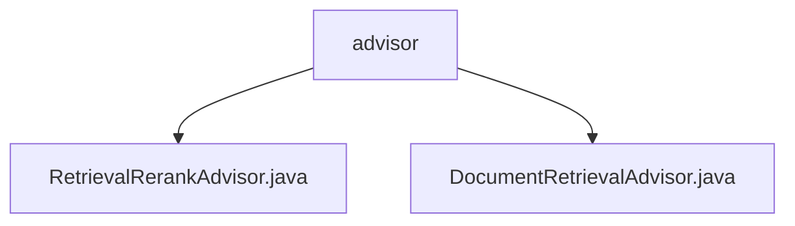

# 基础信息

|      |      |
|------|------|
| 名称 | advisor |
| 编码语言 | .java |
| 代码路径 | spring-ai-alibaba/spring-ai-alibaba-core/src/main/java/com/alibaba/cloud/ai/advisor |
| 包名 | spring-ai-alibaba.spring-ai-alibaba-core.src.main.java.com.alibaba.cloud.ai.advisor |
| 概述说明 | RetrievalRerankAdvisor类实现检索重排序，支持阻塞与非阻塞线程。DocumentRetrievalAdvisor类负责文档检索与响应处理，灵活管理线程模式。 |

# 说明

## 概述
该代码模块主要实现了文档检索与重排序功能，核心目标是提高检索结果的相关性和准确性，同时优化系统资源利用率和响应速度。模块包含两个主要类：`RetrievalRerankAdvisor` 和 `DocumentRetrievalAdvisor`，分别负责检索结果的重排序和文档检索与响应处理。两者均支持阻塞与非阻塞线程处理，能够根据具体需求灵活选择线程模式，确保系统在不同场景下的高效运行。

## 主要业务场景
1. **检索结果重排序**：`RetrievalRerankAdvisor` 类通过对检索结果进行重新排序，提升结果的相关性和准确性，适用于需要高质量检索结果的场景，如推荐系统、搜索引擎等。
2. **文档检索与响应处理**：`DocumentRetrievalAdvisor` 类专注于文档检索任务的高效处理，支持灵活的线程管理模式，适用于需要高性能文档处理的复杂应用场景，如大规模文档管理系统、知识库检索等。
3. **多线程任务管理**：两个类均支持阻塞与非阻塞线程处理，能够根据系统需求选择最优的线程模式，确保任务执行的效率和资源利用率，适用于高并发、高性能要求的应用场景。

### 包内部结构视图

该流程图展示了`advisor`文件夹下的两个Java文件：`RetrievalRerankAdvisor.java`和`DocumentRetrievalAdvisor.java`。这两个文件均位于`advisor`目录中，没有进一步的子目录层级，直接展示了文件与父文件夹的关系。

# 文件列表 File List

| 名称   | 类型  | 说明 |
|-------|------|-------------|
| [DocumentRetrievalAdvisor.java](DocumentRetrievalAdvisor.md) | file | DocumentRetrievalAdvisor类实现文档检索与响应处理，支持阻塞与非阻塞线程。 |
| [RetrievalRerankAdvisor.java](RetrievalRerankAdvisor.md) | file | RetrievalRerankAdvisor类实现检索与重排序，支持阻塞与非阻塞线程处理。 |

