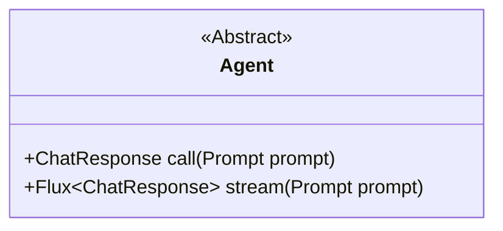
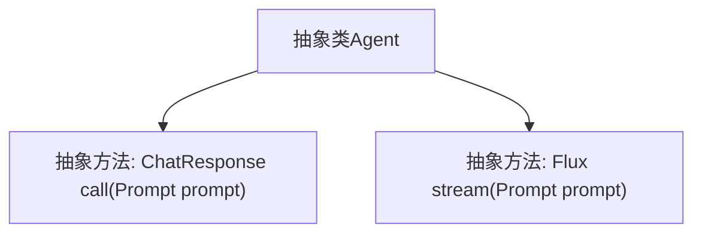

# 基础信息

|      |      |
|------|------|
| 名称 | Agent |
| 编码语言 | .java |
| 代码路径 | spring-ai-alibaba/spring-ai-alibaba-core/src/main/java/com/alibaba/cloud/ai/agent/Agent.java |
| 包名 | com.alibaba.cloud.ai.agent |
| 依赖项 | ['org.springframework.ai.chat.model.ChatResponse', 'org.springframework.ai.chat.prompt.Prompt', 'reactor.core.publisher.Flux'] |
| 概述说明 | 抽象类Agent定义了与聊天模型交互的call和stream方法。 |

# 说明

抽象类Agent定义了两个核心方法，call和stream，用于与聊天模型进行交互。call方法用于同步调用聊天模型，stream方法则用于异步流式处理与聊天模型的交互。这两个方法为开发者提供了灵活的方式来处理与聊天模型的通信，无论是需要即时响应还是持续的数据流。通过抽象类的设计，Agent类为具体的实现提供了统一的接口，便于扩展和定制。

# 类列表 Class Summary

| 名称   | 类型  | 说明 |
|-------|------|-------------|
| Agent | class | 抽象类Agent定义了与聊天模型交互的call和stream方法。 |

## 类 Agent

|      |      |
|------|------|
| 访问范围 | public abstract |
| 类型 | class |
| 名称 | Agent |
| 说明 | 抽象类Agent定义了与聊天模型交互的call和stream方法。 |

### UML类图

这段代码定义了一个名为 `Agent` 的抽象类，其中包含两个抽象方法：`call` 和 `stream`。`call` 方法接收一个 `Prompt` 类型的参数，并返回一个 `ChatResponse` 类型的对象；`stream` 方法同样接收一个 `Prompt` 类型的参数，但返回的是一个 `Flux<ChatResponse>` 类型的流式响应。`Agent` 类被标记为抽象类，意味着它不能被直接实例化，必须由其子类实现这两个抽象方法。这个类图展示了 `Agent` 类的基本结构和其抽象方法的签名。

### 内部方法调用关系图

该流程图描述了一个抽象类 `Agent`，其中包含两个抽象方法：`call` 和 `stream`。`call` 方法接受一个 `Prompt` 对象作为参数，并返回一个 `ChatResponse` 对象；`stream` 方法同样接受一个 `Prompt` 对象，但返回的是一个 `Flux<ChatResponse>` 流式响应。这两个方法都没有具体实现，需要在子类中进行定义。

### 字段列表 Field List

| 名称  | 类型  | 说明 |
|-------|-------|------|

### 方法列表 Method List

| 名称  | 类型  | 说明 |
|-------|-------|------|
| call | ChatResponse | 抽象方法`call`接收`Prompt`参数并返回`ChatResponse`。 |
| stream | Flux<ChatResponse> | 抽象方法stream接收Prompt参数，返回ChatResponse的Flux流。 |

